# ---------------------------------------

# 🔥 SECTION 1 : JavaScript Foundations

# ---------------------------------------

### 📚 Useful JavaScript Interview Resources

- 🔗 **50 Must-Know JavaScript Interview Questions**  
  https://www.greatfrontend.com/blog/50-must-know-javascript-interview-questions-by-ex-interviewers

- 🔗 **JavaScript Interview Questions (GitHub)**  
  https://github.com/sudheerj/javascript-interview-questions?tab=readme-ov-file#how-do-you-change-the-style-of-a-html-element

# 1) Lexical Environment in JavaScript

A **lexical environment** in JavaScript is a data structure that stores variables and functions defined in the current scope, along with references to all outer scopes. It is also known as the **lexical scope**.

The lexical environment is used to resolve variable names. When the JavaScript interpreter encounters a variable name, it first searches for the variable in the lexical environment of the **current scope**.  
If the variable is not found there, the interpreter searches the lexical environment of the **outer scope**, and continues this process until it reaches the **global scope**.  
If the variable is not found anywhere, JavaScript throws a **ReferenceError**.

---

## 🔍 How JavaScript Resolves Variables (Senior-Level Explanation)

When you reference a variable:

1. JS looks in the **current Environment Record**
2. If not found → **Outer Environment**
3. Continues up the chain (**scope chain**)
4. If still not found → **ReferenceError**

---

## ❗ Interview Trick

**Lexical ≠ Runtime**  
Lexical scope is determined **when code is written**, _not when it runs_.

---

## Example

```js
function outer() {
  let x = 10; // stored in outer's environment

  function inner() {
    console.log(x); // JS finds x in outer's lexical environment
  }

  return inner;
}
```

---

# 2) Execution Context in JavaScript

Everything in JavaScript happens inside an **execution context**.

An execution context can be imagined as a **sealed container** inside which JavaScript code runs.  
It is an **abstract concept** that holds information about the environment in which the current code is being executed.

### What is an Execution Context?

An **execution context** is the environment where JavaScript code is **evaluated and executed**.  
It determines:

- Which **variables** are accessible
- Which **functions** are available
- What the value of **`this`** is
- How the code interacts with its surrounding scope

The JavaScript engine creates and manages execution contexts automatically.
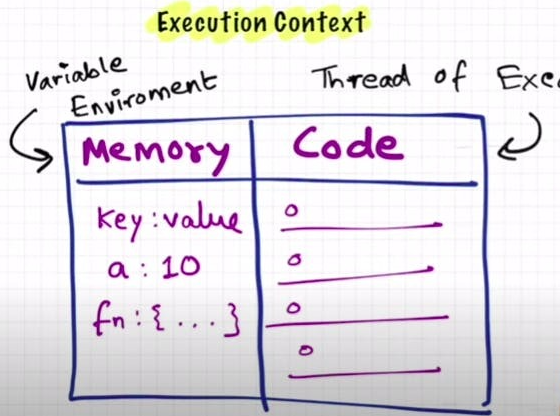
In the container the first component is memory component and the 2nd one is code component

- `Memory component` has all the variables and functions in key value pairs. It is also called Variable environment.

- `Code component` is the place where code is executed one line at a time. It is also called the Thread of Execution.

- `JS is a synchronous, single-threaded language`
- `Synchronous`:- In a specific synchronous order.
- `Single-threaded`:- One command at a time.

---

### Key Idea

> At any point in time, JavaScript code runs **inside exactly one execution context**, and these contexts are managed using the **call stack**.

## Types of Execution Contexts

### **1. Global Execution Context (GEC)**

- The default/base context where all code not inside a function runs.
- Only **one GEC** exists for an entire JavaScript program.
- In a browser, it:
  - Creates the `window` object.
  - Sets `this` to the `window`.

### **2. Function Execution Context (FEC)**

- Created each time a function is **invoked**.
- Every function call gets its **own execution context**.
- Can access its outer scope, but outer scopes cannot access inner scopes.

### **3. Eval Execution Context**

- Created when code inside `eval()` executes.
- Rarely used due to **security** and **performance** concerns.

---

## Execution Stack (Call Stack)

JavaScript manages execution contexts using the **call stack**, which operates on **LIFO (Last-In, First-Out)**:

- When the script loads → GEC is created and pushed onto the bottom of the stack.
- When a function is called → a new FEC is created and pushed to the top.
- JS always executes the context **on top** of the stack.
- After function execution → its FEC is popped off.
- Program ends when the GEC is popped off.

---

## Phases of Execution Context Creation

Each execution context is created in **two phases**:

---

### **1. Creation Phase (Memory Allocation Phase)**

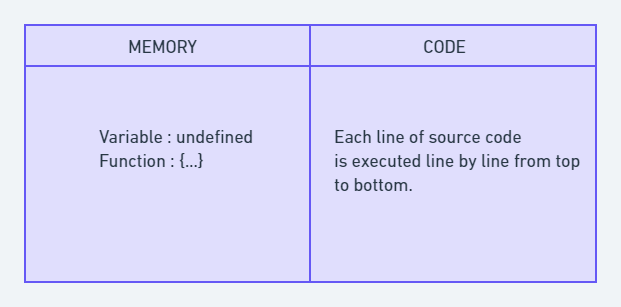
During this phase, the JS engine scans the code and prepares memory:

- **Variable/Lexical Environment is created**
  - Memory allocated for variables and functions.
  - `var` → initialized with `undefined`
  - `let` & `const` → uninitialized (inside the **Temporal Dead Zone**)
  - Function declarations → stored entirely in memory.
- **Scope Chain is established**

  - Defines access from inner → outer scopes.

- **`this` value is determined**

---

### **2. Execution Phase**

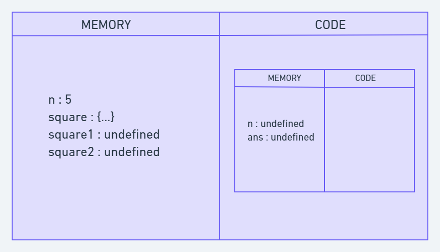
JavaScript executes the code:

- Variables get their **actual values**.
- Functions are executed.
- Each function call creates a **new FEC** and adds it to the call stack.

## `How JS is executed & Call Stack`

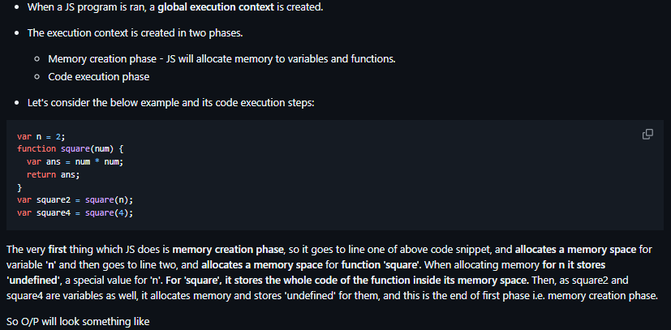
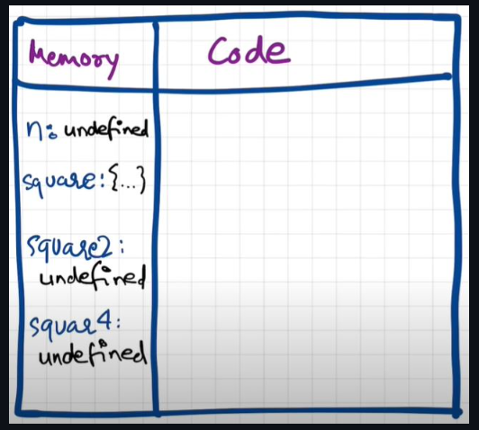
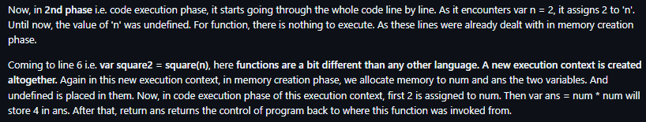
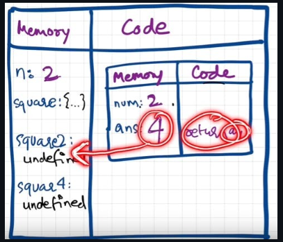

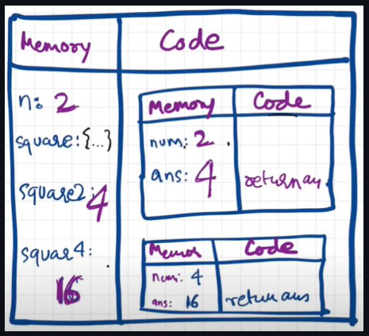


---

# 3) Call Stack & Memory Heap

The JavaScript engine handles many tasks for us, but its two most important jobs are:

1. **Storing and managing data** (variables, objects, functions, etc.)
2. **Keeping track of the order in which code runs**

To accomplish this, JavaScript uses two core components:

---

## 🧠 Memory Heap

A large, free-form storage area where JavaScript **allocates and manages data**.  
This is where variables, objects, and functions live in memory.

---

## 📞 Call Stack

A structure that helps JavaScript **track the execution of code line by line**.  
It tells the engine _where it is_ in the program and _what to run next_.

---

Together, the **Memory Heap** stores information, and the **Call Stack** manages the flow of execution.

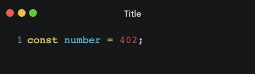
The above code is saying please allocate memory for the number variable and have it point to the value 402 in our memory heap.
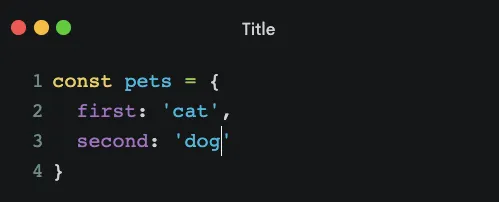
Here we are telling our engine to allocate memory for the pets object and its values. So anytime I call the pets object, it's going to point to a region in our memory heap that has the first and second key pointing to cat and dog.
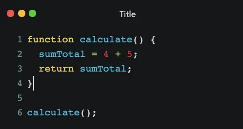
The function above is going to be allocated memory so that anytime we call calculate(), it just looks it up in memory and runs this piece of code.

Every time we run a function we use a call stack. We can think of a call stack as a region in memory that operates in a first in last out mode. So here, it will add the calculate() function on top of the stack. And after we finish running it, it's going to remove it.

## Stack Overflow

Stack overflow happens when we call functions nested inside each, other over and over again. If we just keep adding functions to the stack without popping them off, we will have a stack overflow.
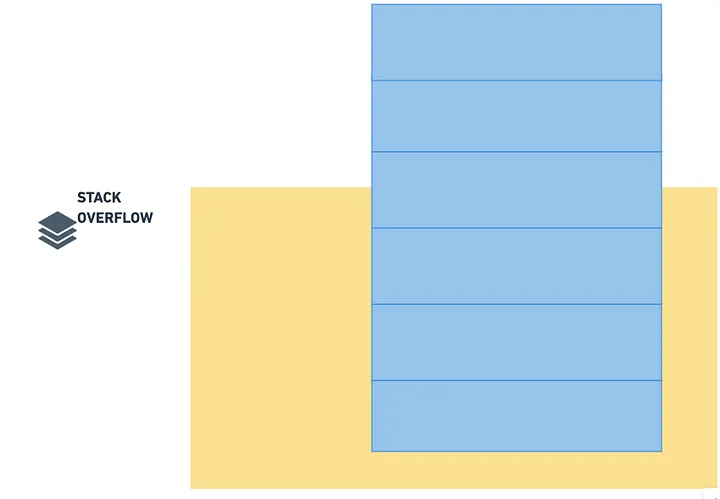
We can create a stack overflow very easily with recursion

## ⚠️ Common Interview Question

Q: Why do we get "Maximum call stack size exceeded"?

A: Infinite recursion or excessive nesting fills the stack.
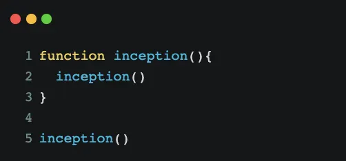

---

# 4) Interpreter vs Compiler vs JIT Compiler

When working with programming languages, it’s important to understand **how code gets executed**. There are three major approaches: **Interpreters**, **Compilers**, and **JIT (Just-In-Time) Compilers**. Each method converts high-level code into machine code differently.

---

## Compiler

The source code is converted into machine code **once** and then gets executed.


### Pros

- If we have a loop that runs many times (e.g., 40 iterations), the code does **not** need to be translated repeatedly.  
  This saves a significant amount of time.
- The converted code is generally **more efficient** because the compiler has more opportunity to optimize.

### Cons

- It takes more time to start the program because the compiler must first translate the entire source code.

## Interpreter

Interpreters are quick. There is no compilation step before execution—  
they translate the **first line** and immediately execute it.


### Pros

- **Fast start-up times** are a key characteristic of interpreters.  
  This is why early web browsers used JavaScript interpreters.

### Cons

- When running the same code multiple times (e.g., inside a loop),  
  the interpreter must **translate the same code repeatedly**, slowing execution.
- The code is generally **less efficient** than compiled code because there is less opportunity for optimization.

## JIT (Just-In-Time) Compiler

In a JIT compiler, we have a component called a **monitor** (or **profiler**) that watches the code as it runs and performs several tasks:

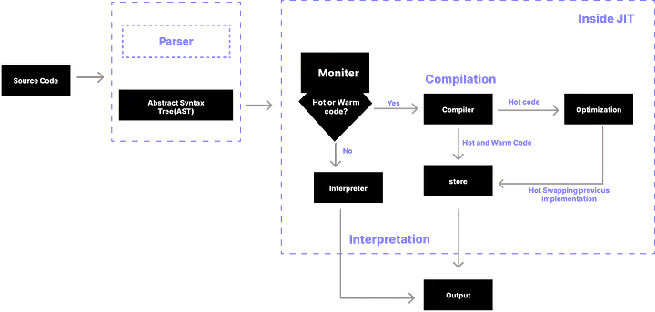

# JavaScript JIT Compilation Flow (V8 Engine)

This document explains how JavaScript code is executed internally using a **Parser + Interpreter + JIT Compiler** model, as implemented in engines like **V8**.

---

## 1️⃣ Source Code → Parser → AST

### Source Code

```javascript
function add(a, b) {
  return a + b;
}
```

- This is the JavaScript code written by the developer.

### Parser

- Reads the source code.
- Performs **syntax validation**.
- Converts the code into an **Abstract Syntax Tree (AST)**.

### Abstract Syntax Tree (AST)

- A tree-based structural representation of the code.
- Functions, variables, loops, and operators become nodes.
- **Not executable** by itself.

📌 **Why AST?**  
AST allows the JavaScript engine to understand, analyze, and optimize code structurally before execution.

---

## 2️⃣ Monitor (Profiler)

After the AST is created, execution begins under continuous monitoring.

### Monitor (a.k.a Profiler)

- Observes runtime behavior of the code.
- Tracks:

  - Frequently called functions
  - Repeating loops
  - Execution patterns

- Classifies code as:
  - ❄️ **Cold** – rarely executed or only once
    - Initialization code
    - One-time setup logic
  - 🌤 **Warm** – executed multiple times
    - Functions triggered occasionally
    - Loops that run a moderate number of times
  - 🔥 **Hot** – executed very frequently
    - Tight loops
    - Frequently called functions
    - Core business logic

📌 **Hot code** usually includes loops and frequently invoked functions.

> **JavaScript engines** classify code as `cold`, `warm`, or `hot` based on execution frequency, and only hot code is JIT-compiled to machine code for maximum performance.

## 3️⃣ Decision: Hot or Warm Code?

At runtime, the engine decides:

- ❌ **Not hot/warm**  
  → Sent to the **Interpreter**

- ✅ **Hot or warm**  
  → Sent to the **Compiler**

This decision point is critical to performance.

---

## 4️⃣ Interpreter (Ignition in V8)

### Interpreter

- Executes code **line by line**.
- Very fast startup.
- No heavy optimizations.

Used for:

- Cold code
- One-time execution paths

📌 This is why JavaScript applications **start quickly**.

---

## 5️⃣ Compiler (TurboFan in V8)

When code becomes hot or warm:

### Compiler

- Converts frequently executed code into **machine code**.
- Happens **at runtime** → this is **Just-In-Time (JIT)** compilation.
- Generates highly optimized native code.

📌 **Key Insight**  
Even if a loop runs thousands of times, **no re-translation is required**:

- The hot loop is compiled **once**
- The optimized machine code is reused

---

## 6️⃣ Optimization Phase

After compilation, further optimizations are applied:

### Optimization

- Removes unnecessary checks
- Inlines functions
- Optimizes based on:
  - Data types
  - Execution patterns

📌 This is why JavaScript can achieve performance close to compiled languages in hot paths.

---

## 7️⃣ Store + Hot Swapping

### Store

- Optimized machine code is stored for reuse.

### Hot Swapping

- The engine replaces the interpreted version with the optimized version.
- Happens **without stopping execution**.

📌 This seamless replacement is why it’s called **Just-In-Time** compilation.

---

## 8️⃣ Output

- Final output is produced.
- Execution continues using:
  - Interpreter for cold code
  - Optimized machine code for hot code

---

## 🔁 Big Picture Summary

JavaScript execution uses **all three stages** together:

| Stage        | Role                       |
| ------------ | -------------------------- |
| Parser       | Converts source code → AST |
| Interpreter  | Fast startup execution     |
| JIT Compiler | Optimizes hot code         |

---

### ✅ Final Takeaway

JavaScript is:

- **Synchronous**
- **Single-threaded**
- **Interpreted + Compiled (JIT)**

This hybrid approach gives JavaScript both **fast startup** and **high performance**.

1. **Identifies hot or warm parts of the code**  
   (e.g., repetitive or frequently executed sections).

2. **Transforms those components into machine code during runtime.**

3. **Optimizes the generated machine code.**

4. **Hot-swaps** the previous implementation with the optimized version.

---

In short, a **Just-In-Time compiler** is a combination of both an **interpreter** and a **compiler**.

---

# 5) JavaScript Event Loop

The event loop is a core concept in JavaScript that enables **non-blocking, asynchronous behavior**.  
JavaScript is **single-threaded**, meaning it can run only one piece of code at a time.  
The event loop ensures tasks run in the correct order, allowing asynchronous programming to work smoothly.

---

## Components of the Event Loop

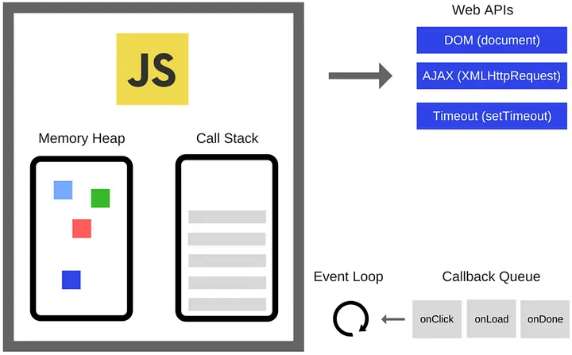

### **1. Call Stack**

- Tracks function calls.
- When a function is invoked, it is **pushed** onto the stack.
- When it finishes, it is **popped** off.

### **2. Web APIs**

- Provided by the browser (or Node.js environment).
- Handle asynchronous operations like:
  - `setTimeout`
  - DOM events
  - HTTP requests (e.g., `fetch`)

### **3. Task Queue (Callback Queue)**

- Stores tasks waiting to run **after the call stack is empty**.
- Includes callbacks from:
  - `setTimeout`
  - `setInterval`
  - DOM event listeners

### **4. Microtask Queue**

- A high-priority queue for:
  - Promise callbacks (`.then`, `.catch`, `.finally`)
  - `queueMicrotask`
  - `MutationObserver`
- **Executed before** the regular task queue.

### **5. Event Loop**

- Continuously checks:
  - Is the call stack empty?
  - Are there microtasks to run?
  - Are there macrotasks waiting?
- Moves tasks from the queues onto the call stack when ready.

---

## How It Works (Simple Analogy)

- **Your Main Task (Call Stack):**  
  JavaScript executes code line-by-line, like following steps in a recipe.

- **Waiting Tasks (Event Queue):**  
  Long-running tasks (timers, network requests) are sent to wait in a queue instead of blocking execution.

- **The Manager (Event Loop):**  
  Constantly checks:
  - Is the call stack empty?
  - Are there tasks waiting?
  - If yes, move a task from the queue to the stack.

---

## Types of Tasks in JavaScript

### **1. Synchronous Tasks**

- Execute immediately on the call stack.  
  Examples: variable declarations, direct function calls.

### **2. Microtasks (High Priority)**

- Promise callbacks
- `queueMicrotask`
- `MutationObserver`

### **3. Macrotasks (Lower Priority)**

- `setTimeout`
- `setInterval`
- DOM events
- `setImmediate` (Node.js)

---

## Order of Execution

1. **Execute all synchronous tasks** on the call stack.
2. **Run all microtasks** in the microtask queue.
3. **Run one macrotask** from the macrotask queue.
4. **Repeat** the cycle.

---

# 6) Hoisting in JavaScript

Hoisting in JavaScript is a behavior where **declarations** (for functions, variables, and classes) are conceptually moved to the **top of their scope** during the compilation phase—before the code is executed.  
This means you can sometimes use a function or variable _before_ it appears in the code.

---

## Hoisting Behavior Summary

| Declaration Type           | Hoisting Behavior                                          | Initial Value if Accessed Early              | Error Type if Accessed Too Early                |
| -------------------------- | ---------------------------------------------------------- | -------------------------------------------- | ----------------------------------------------- |
| **var**                    | Declaration hoisted to top of function/global scope        | `undefined`                                  | None (returns `undefined`)                      |
| **let** / **const**        | Hoisted to block scope but _not initialized_ (in TDZ)      | _Uninitialized_                              | `ReferenceError`                                |
| **function (declaration)** | Name **and full function body** hoisted                    | Entire function definition                   | None (callable before definition)               |
| **function (expression)**  | Only variable name hoisted; assignment not hoisted         | `undefined` (var), uninitialized (let/const) | `TypeError` (var), `ReferenceError` (let/const) |
| **class**                  | Hoisted but not initialized (similar to let/const, in TDZ) | _Uninitialized_                              | `ReferenceError`                                |

---

## Examples

### **1. `var` Hoisting**

Accessing a `var` variable before declaration results in `undefined`:

```javascript
console.log(myVar); // Output: undefined
var myVar = "Hello World";
```

The JavaScript engine interprets it like:

```javascript
var myVar; // Declaration hoisted and initialized with undefined
console.log(myVar); // Output: undefined
myVar = "Hello World"; // Assignment stays in place
```

### **2. `let and const` Hoisting (Temporal Dead Zone)**

Variables declared with let or const are hoisted but remain uninitialized, causing a ReferenceError if accessed too early:

```javascript
console.log(myLet); // ReferenceError: Cannot access 'myLet' before initialization
let myLet = "Hello World";
```

### **3. `Function Declaration` Hoisting**

Function declarations can be called before they appear in the code:

```javascript
sayHello(); // Output: "Hello there!"

function sayHello() {
  console.log("Hello there!");
}
```

---

# 7) Execution Context / Call Stack

The **execution context** defines the environment in which JavaScript code is executed.

Key points:

- Every time a function is called, JavaScript creates a **new execution context** for that function.
- These execution contexts are managed using the **call stack**.
- Nested or inner function calls are placed **on top of the stack**.
- When a function finishes execution, it is **popped off** the stack.

### Example

```javascript
function getName() {
  console.log("Rakim Cornwall");
}
```

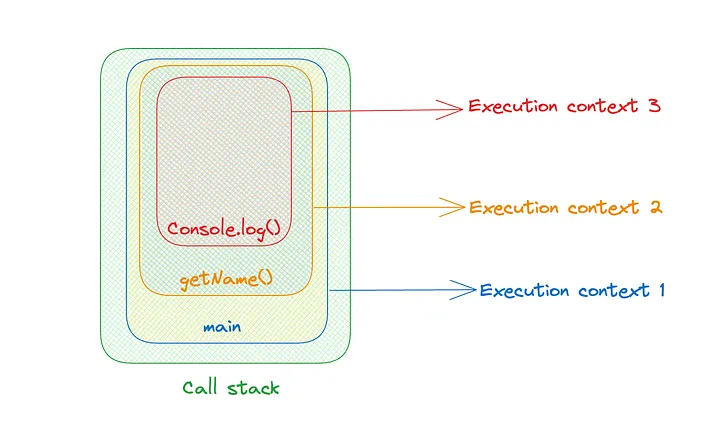
In other words, the inner most function is loaded on the top of the stack and is popped out first.
Once the inner most function returns the subsequent parent function on the stack gets executed,
This recursively continues until the stack is empty.
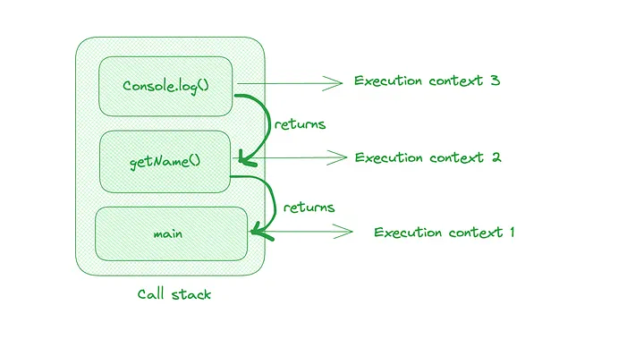

---

## Execution Context in JavaScript

An **execution context** is the environment in which JavaScript code is executed.  
It contains information about:

- The **current scope**
- The **variables** accessible in that scope
- The **functions** that can be accessed

Each time a function is called, JavaScript creates a **new execution context**.  
This context exists only while the function runs and is destroyed when the function returns.

---

## Types of Execution Contexts

### **1. Global Execution Context**

- Created when the JavaScript engine starts.
- Represents the global scope.
- Contains global variables, functions, and the global object (`window` in browsers, `global` in Node.js).

### **2. Function Execution Context**

- Created **each time a function is called**.
- Contains:
  - The function’s **scope**
  - The function’s **local variables**
  - Any **inner functions**
  - Arguments passed to the function

---

## How Execution Context Works

1. When a function is called, a **new execution context** is created.
2. This execution context is **pushed onto the call stack**.
3. JavaScript executes the code inside that context.
4. When the function finishes, its execution context is **popped off the stack**.
5. JavaScript returns to the previous execution context.

---

## The Call Stack

The call stack keeps track of all active execution contexts.  
It ensures JavaScript always knows _where it is_ during program execution.

- The **top of the stack** represents the currently running function.
- When nested functions are called, each one is added **on top of the stack**.
- When they finish, they are removed one by one.

---

### Example

```javascript
function getName() {
  console.log("Rakim Cornwall");
}

getName();
```

---

# 8) Scope

Scope refers to the visibility of variables, functions, and objects within a particular part of the code during runtime.

### Types of Scope

Scope can be broadly divided into two parts:

- **Global Scope**
- **Local Scope**

## 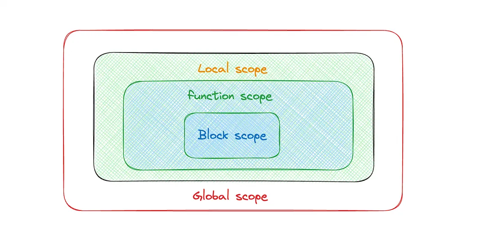

## Global Scope

- Variables declared in the global scope can be accessed from anywhere inside the code.
- Anything declared outside a function using **var** automatically becomes part of the global scope.
- Anything declared outside a function using **let** does **not** become part of the global scope because `let` maintains block-level scope.

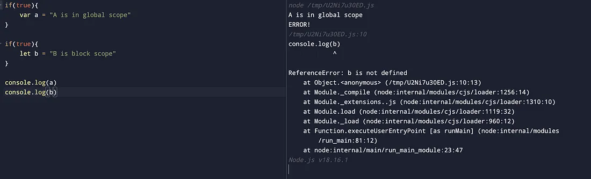
Variable outside function scope acts as global scope.

## 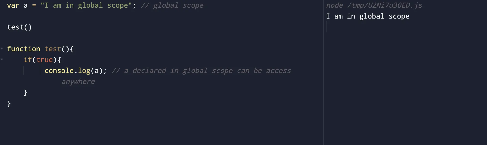

Globally declared “a” variable can be access anywhere in the code.

## Local Scope

Local scope refers to the visibility or accessibility of variables within a **specific function or block**.  
Both **function scope** and **block scope** are types of local scope.

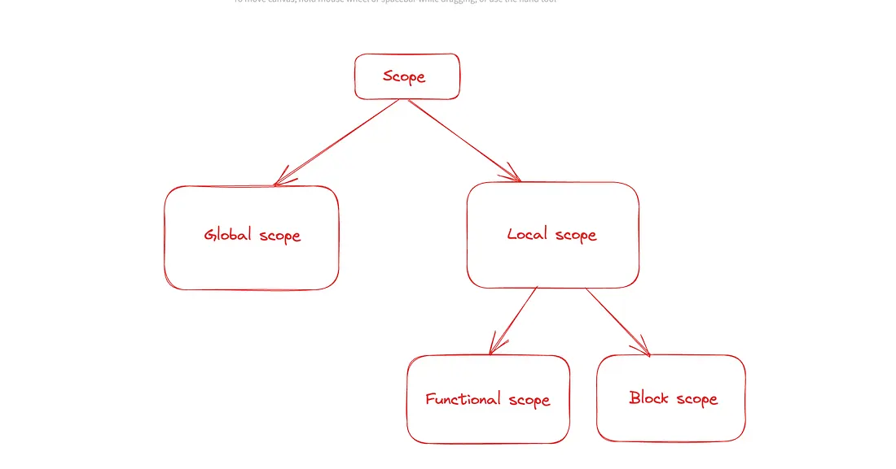

### Function Scope

- Anything declared inside a function using **var** is in the function scope.
- Anything inside a block (`if`, `else`, `for`) declared using **var** is still considered part of the **function scope**.
- A `var` variable inside a block is accessible anywhere within the entire function.
- If a variable is declared with VAR even with in a block, it gets declared as function scope.(same is not the case with let and const)
  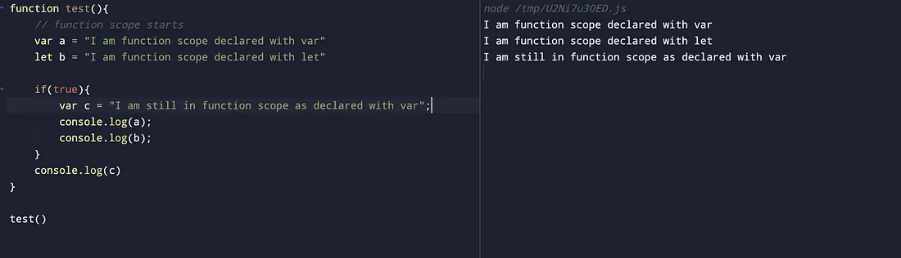
- If a variable is declared with LET/ CONST within a block scope it will not be accessible outside that block. (let/ cost are block scoped)
  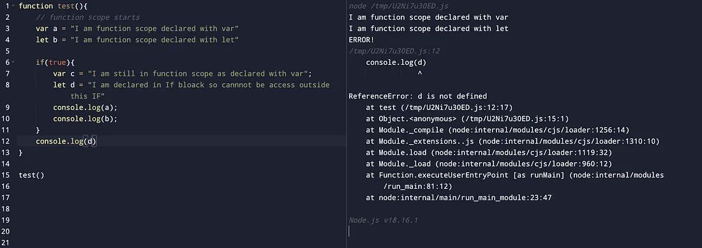

### Block Scope

- Anything inside a block (`if`, `else`, `for`, `switch`) declared using **let** or **const** is in the **block scope**.
- Variables declared with `let` or `const` inside a block cannot be accessed outside that block.
- Their accessibility is confined to the block where they were declared.
- If a variable is declared with LET within a block scope it will not be accessible outside that block.
  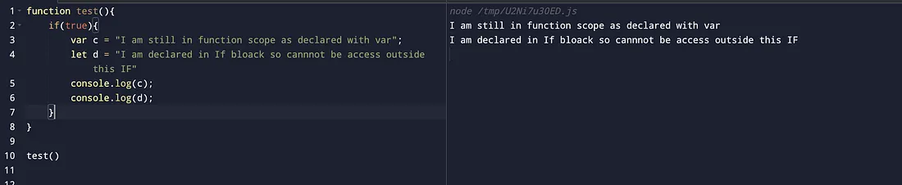
  c, d can be accessed within test as both are in function scope.
  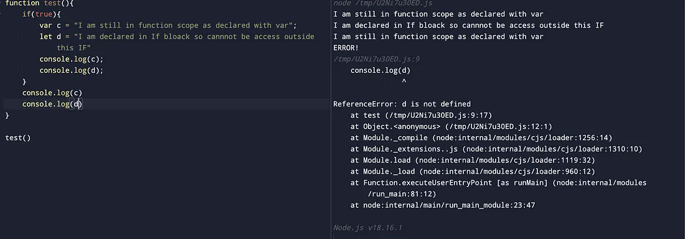
  “d” variable being a let cannot be access outside block statement

---

## var vs const / let

- **var** is function-scoped and accessible throughout the function.
- **let** and **const** are block-scoped and cannot be accessed outside the block where they are declared.
- Use **var** only if you need access outside the block.
- Use **let** and **const** to avoid issues like accidental redeclaration.
  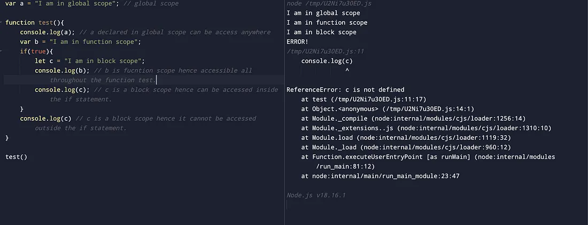

---

# 7) Context (“this”)

- “this” can be remembered as: **"Under which object was I declared?"**
- If not declared under any object, the default context is the **global window object**.
- The place where something is declared determines its `this` value.
- To change the value of `this`, you can use **bind**, **call**, or **apply** to bind another object.

Certain scenarios where this will refer to a particular context:

- “this” points to global context:When a function is called standalone the function is in the global context. as all functions by default are registered under the global window object.
  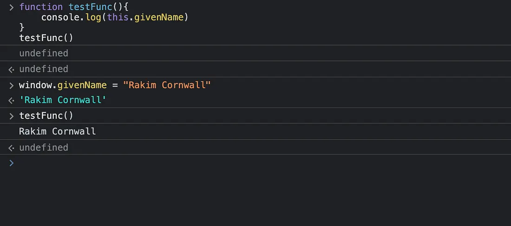
  Here testFunc’s is declared in global context which means this will point to the global window object.Hence, since givenName is not declared on global window object it returns undefined.
- “this” points to object context: When a function is declared with in an object. this would point to that object itself.
  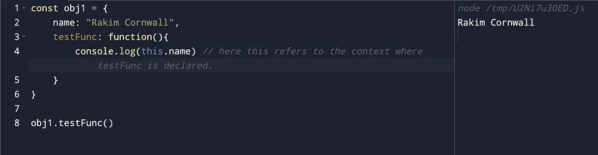
  Here testFunc’s is declared in Object context which means this will point to the object obj1.when testFunc is called , for the value of this it will refer to the obj1’s context.It will get the value of name hence the name is printed.

---

# 8) Lexical scope

When you define a variable or function inside a block or function, they are accessible within that block or function and any nested blocks or functions within it.
Lexical scope is closely related to closures. If a function returns another function the nested function can access the variables arguments of the lexically scoped parent functions.
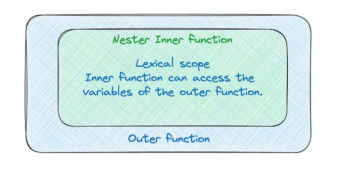
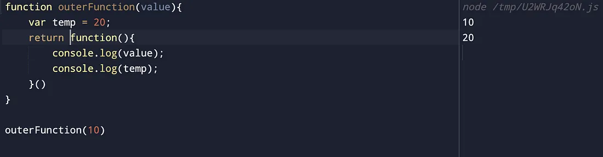

---

# 9) Shadowing

## 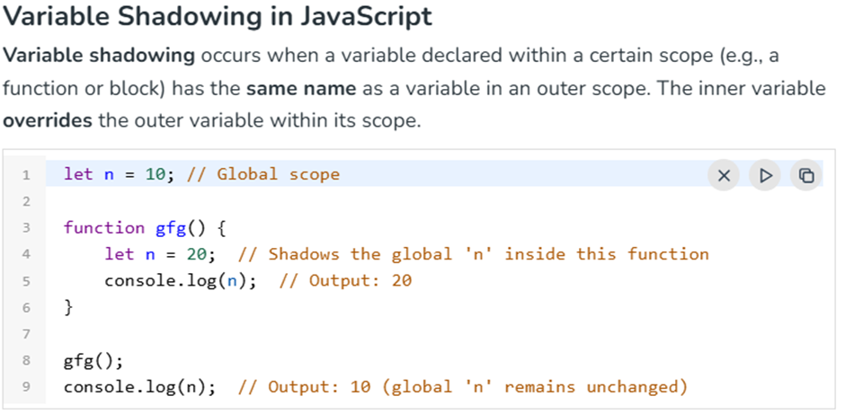

# 10) Temporal Dead Zone (TDZ)

The **Temporal Dead Zone (TDZ)** is a behavior in JavaScript that occurs when declaring variables using **let** and **const**.  
It refers to the period between **entering the scope** and the **actual declaration** of the variable.  
During this period, the variable **cannot be accessed** and will throw a **ReferenceError** if used.

### Examples

```javascript
console.log(myVar); // undefined
var myVar = 5;
console.log(myVar); // 5

console.log(myLet); // ReferenceError: Cannot access 'myLet' before initialization
let myLet = 10;
console.log(myLet); // 10

console.log(myConst); // ReferenceError: Cannot access 'myConst' before initialization
const myConst = 15;
console.log(myConst); // 15
```

# ---------------------------------------

# 🚀 SECTION 2: VARIABLES & DATA TYPES

# ---------------------------------------

# 11) Primitive vs Reference Types (Deep Explanation)

## JavaScript has **7 primitive types**:

| Primitive     | Notes                              |
| ------------- | ---------------------------------- |
| **number**    | floating point, IEEE-754 quirks    |
| **string**    | immutable                          |
| **boolean**   | true/false                         |
| **undefined** | variable declared but not assigned |
| **null**      | intentional empty value            |
| **symbol**    | unique values                      |
| **bigint**    | large integers                     |

---

## ✅ Important Characteristics of Primitives

- Stored directly in the **stack** (conceptual model)
- **Immutable** (operations create new values, not modify existing ones)
- Compared **by value**

---

## 📌 Reference Types

- objects
- arrays
- functions

### Characteristics:

- Stored in the **heap** (dynamic memory)
- Variables hold a **reference/pointer** to the memory location
- Compared **by reference**, not by value

### Example:

```javascript
const a = { x: 1 };
const b = { x: 1 };

console.log(a === b); // false (different references)
```

# 12) Coercion in JavaScript

Coercion is the **automatic type conversion** that occurs in JavaScript when performing operations involving values of different types.  
Type conversion means transforming a value from one type to another (e.g., number → string).

JavaScript supports two kinds of type conversion:

- **Implicit Type Conversion (Coercion)** → done automatically by JavaScript.
- **Explicit Type Conversion (Type Casting)** → done manually by the developer.

---

## What is Implicit Type Conversion (Coercion)?

JavaScript is a **weakly typed language**, meaning it allows operations between different types.  
When such operations occur, JavaScript attempts to **coerce one value's type** so the operation can still proceed.

### Example 1: Number + String

```javascript
const sum = 35 + "hello";

console.log(sum); // "35hello"
console.log(typeof sum); // string
```

Well here, Instead of JavaScript throwing an error, it coerces the type of one value to fit the type of the other value so that the operation can be carried out.

In this case, using the + sign with a number and a string, the number is coerced to a string, then the + sign is used for a concatenation operation.

```javascript
const times = 35 * "hello";

console.log(times);
// NaN
```

Here, we use times \* for a number and a string. There's no operation with strings that involves multiplication, so here, the ideal coercion is from string to number (as numbers have compatible operations with multiplication).

But since a string (in this case, "hello") is converted to a number (which is NaN) and that number is multiplied by 35, the final result is NaN.

## What is Explicit Type Conversion (Type Casting)?

Explicit type conversion (also known as **type casting**) is when **you**, the developer, intentionally convert a value from one type to another.  
This is often done to ensure an operation behaves as expected.

To perform explicit conversions, JavaScript provides **type constructors** such as:

- `String()`
- `Number()`
- `Boolean()`
- `BigInt()`
- `Object()`

### Example: Converting a Number to a String

```javascript
const number = 30;

const numberConvert = String(number);

console.log(numberConvert);
// "30"

console.log(typeof numberConvert);
// string
```

---

# 13) == vs === in JavaScript

In JavaScript, the main difference between `==` and `===` is:

- `==` performs **type coercion** before comparison.
- `===` compares both **value and type** without coercion.

---

## == (Loose Equality)

The **loose equality** operator attempts to convert both values to a common type before comparing them.

### Characteristics:

- **Type Coercion:** Yes (automatic)
- Can produce surprising or unpredictable results.

### Examples:

```javascript
5 == "5"; // true  → "5" converted to 5
true == 1; // true  → true converted to 1
null == undefined; // true
0 == false; // true  → false converted to 0
```

## === (Strict Equality)

The strict equality operator does not perform type conversion.

### Characteristics:

- **Type Coercion:** No
- Compares both value and type

### Examples:

```javascript
5 === "5"; // false → number vs string
true === 1; // false
null === undefined; // false
0 === false; // false
```

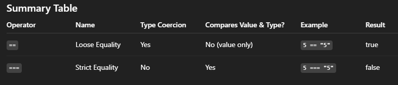

# 14) null, undefined, NaN, Infinity

## undefined

Variable is declared but not assigned

- Default function parameter value

- Missing object property

- Missing array element

```javascript
let a;
console.log(a); // undefined
```

## null

null is a primitive value that represents an intentional absence of any object value or an empty value. Programmers explicitly assign null to a variable to indicate that the variable has no value.

```javascript
let user = null;

typeof null → "object"   (historic bug)
typeof undefined → "undefined"
```

## NaN

Meaning: Invalid Number

NaN stands for "Not a Number". It is a special numeric value that represents the result of an invalid or mathematically undefined operation that was intended to produce a number.

```javascript
Number("abc") → NaN
0 / 0 → NaN
```

## Infinity 

Infinity is a special numeric value representing a number that is greater than the maximum possible number that the programming environment can handle. It is the mathematical concept of infinity, \(\infty \).

# 15) Pass-by-value vs Pass-by-reference

✔ JavaScript always passes values, not references

When passing objects → the value is a reference pointer.

### Pass by value

Pass by value means when a variable is assigned to another variable, the value stored in the variable is copied into the new variable. They are independent of each other, each occupying its own memory space.

```javascript
let a = 10;
let b = a;

a = 20;

console.log(a); // Outputs: 20
console.log(b); // Outputs: 10

///////////////////////////////////////////////////////

let num = 10;

function modifyValue(value) {
  value = 20; // Modifies the local copy
}

modifyValue(num);
console.log(num); // Output: 10 (original value is preserved)
```

In this example, we first declare a variable a and set it equal to 10. We then declare another variable b and set it equal to a. At this point, both a and b are 10. However, when we change the value of a to 20, b remains 10 because the value was passed by value - meaning the value 10 was copied to b when it was declared, and changes to a do not affect b

### Pass by Reference

While JavaScript is primarily a “pass by value” language, it uses a concept called “pass by reference” when dealing with objects (including arrays and functions).

When an object is created in JavaScript, it is stored in a memory space, and the variable associated with it stores the memory address or reference where the object is stored.

If you assign this object variable to another variable, it does not copy the object. Instead, it copies the reference to the object. Both variables now point to the same memory space, which means changes through one variable are reflected when accessing the object through the other variable.

```javascript
let obj1 = { value: 10 };
let obj2 = obj1;

obj1.value = 20;

console.log(obj1.value); // Outputs: 20
console.log(obj2.value); // Outputs: 20

///////////////////////////////////////////////////////
let myObj = { value: 10 };

function modifyObject(obj) {
  obj.value = 20; // Mutates the original object
}

modifyObject(myObj);
console.log(myObj.value); // Output: 20 (original object is modified)
```

In this example, obj1 and obj2 are both references to the same object. When we change obj1.value to 20, the change is reflected in obj2.value because both obj1 and obj2 point to the same memory space - the object { value: 20 }.

# 16) Boxing / Autoboxing

In JavaScript, autoboxing is the automatic conversion of a primitive value (like a string, number, or boolean) into a temporary "wrapper" object when you try to access a property or method on it. Unboxing is the reverse process, where a wrapper object is converted back into its primitive value when a primitive is expected

## Boxing in JavaScript

## Boxing (Auto-Boxing) in JavaScript

In JavaScript, **primitive data types** (like string, number, boolean) are **not objects**, so technically they **should not** have methods or properties.

But they _do_.  
For example:

```javascript
var car = "ford";

console.log(car); // "ford"
console.log(car.length); // 4
```

## Autoboxing in JavaScript

JavaScript primitives (string, number, boolean, null, undefined, symbol) do not inherently have methods or properties. However, JavaScript's autoboxing feature allows them to behave as if they do

How it works:

- When you try to use a property or method on a primitive value, the JavaScript engine automatically:
- Creates a temporary instance of the corresponding built-in wrapper object (String, Number, or Boolean).
- The method is called on this temporary object.
  The result is returned, and the temporary object is immediately discarded (garbage collected).

```javascript
const name = "John"; // Primitive string
console.log(name.length); // Autoboxing happens here
console.log(name.toUpperCase()); // Autoboxing happens here
```

Behind the scenes, when name.toUpperCase() is called, JavaScript temporarily treats "John" as new String("John") to access the toUpperCase() method.

## Unboxing in JavaScript

Unboxing is the process of converting an object wrapper back to its basic, primitive value. This happens automatically (implicitly) when JavaScript needs a primitive value for an operation, such as in arithmetic operations, comparisons, or type coercion
How it works:

- JavaScript engine calls the internal ToPrimitive() abstract operation, which often uses the object's valueOf() or toString() methods to retrieve the underlying primitive value.

```javascript
const numObj = new Number(5); // A Number object, not a primitive
const sum = numObj + 10; // Unboxing happens here
console.log(sum); // Output: 15
```

# 17) Pure vs Impure

The primary difference is that a pure function always produces the same output for the same input and has no side effects, whereas an impure function may produce different results or modify external state.

## Pure Functions

Pure functions are a core concept in functional programming, known for their predictability and reliability.

- **Predictable Output**: Given the exact same inputs (arguments), a pure function will always return the exact same result, every time.
- **No Side Effects :** They do not modify anything outside their own scope. This means no changing global variables, no DOM manipulation, no console logging, and no making API calls. -**Benefits:** They are easy to test, debug, and reason about. They also enable performance optimizations like memoization (caching results).
  Example:

```javascript
// A pure function
function add(a, b) {
  return a + b;
}

console.log(add(2, 3)); // Always outputs 5
```

## Impure Functions

Impure functions have the opposite characteristics, allowing for interaction with the outside world, which is necessary for most real-world applications.

- **Unpredictable Output:** The output may change even with the same input arguments, because it might depend on external factors like the current time or a random number.
- **Side Effects:** They interact with or modify the external environment.
- **Use Cases:** Necessary for operations like making network requests (fetch), working with the browser's APIs (e.g., window or document), and modifying application state.

```javascript
// Impure function due to using an external variable
let total = 0;
function addToTotal(value) {
  total += value; // Mutates an external variable (side effect)
  return total;
}

console.log(addToTotal(5)); // First call outputs 5
console.log(addToTotal(5)); // Second call outputs 10 (different output for the same input)

// Impure function due to an unpredictable source
function getRandomNumber() {
  return Math.random(); // Uses an external, unpredictable source
}

console.log(getRandomNumber()); // Different output every time
```

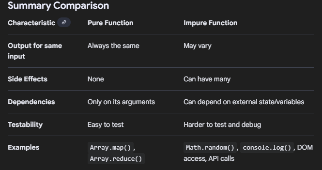

# 18) Context Binding

Context binding in JavaScript refers to the process of setting the value of the this keyword within a function's execution to a specific object. This is crucial because the value of this is dynamic and typically depends on how or where a function is called, not where it is defined.

There are four primary ways this is bound in JavaScript:

1. **Default (Window/Global) Binding:** When a function is called as a standalone function without any other binding rules applied, this refers to the global object (e.g., window in a browser). In strict mode, this will be undefined instead.
2. **Implicit Binding:** When a function is invoked as a method of an object (using dot notation), this implicitly binds to the object immediately to the left of the dot at the call site.
3. **Explicit Binding:** You can explicitly force a function to use a specific object as its context using the call(), apply(), and bind() methods.
4. **new Binding:** When a function is used as a constructor with the new keyword, JavaScript creates a new object and binds this to that newly created instance.

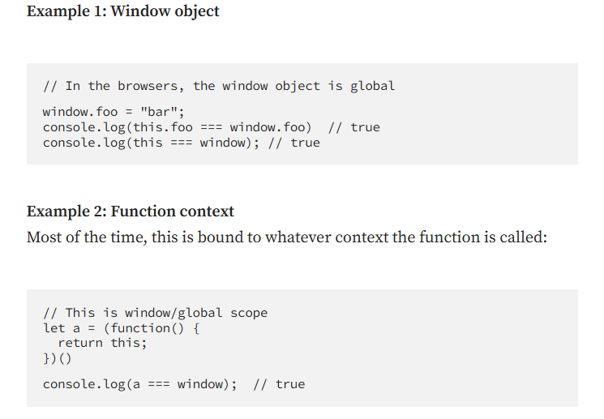
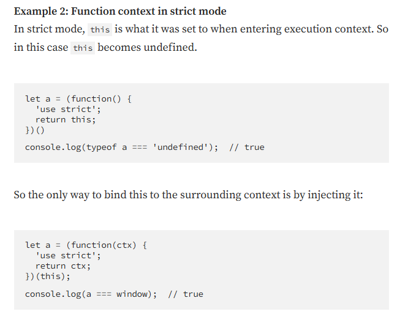
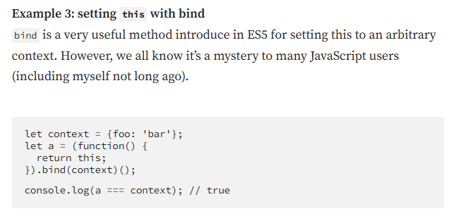
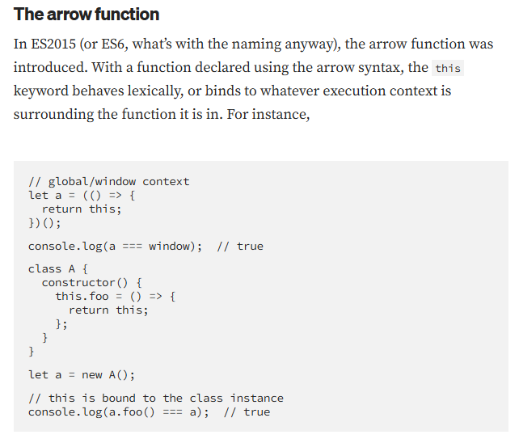
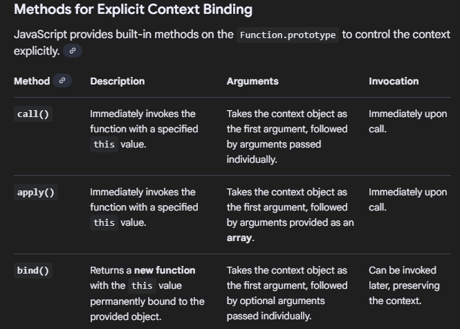

# 19) This

this is a runtime binding created when a function is invoked.

❗ this is NOT determined by where the function is defined,
it is determined by how the function is called.

JavaScript determines the value of `this` using **four binding rules**, evaluated in the following **priority order**:

1. **new binding**
2. **explicit binding**
3. **implicit binding**
4. **default binding**

## ✅ 1. Default Binding

### Non-Strict Mode

```javascript
function show() {
  console.log(this);
}
show(); // window (in browser)

//////////////  STRICT MODE  ////////////
("use strict");
function show() {
  console.log(this);
}
show(); // undefined
```

## ✅ 2. Implicit Binding

When a function is called as a method of an object:

```javascript
const user = {
  name: "Alice",
  greet() {
    console.log(this.name);
  },
};

user.greet(); // Alice

Here, this → user
```

## ✅ 3. Explicit Binding (call, apply, bind)

### call

```javascript
function greet(city) {
  console.log(this.name, city);
}

greet.call({ name: "Bob" }, "Delhi");
```

### apply

```javascript
greet.apply({ name: "Bob" }, ["Delhi"]);
```

Difference

- call → arguments individually

- apply → arguments as array

### bind

```javascript
const boundFn = greet.bind({ name: "Bob" });
boundFn("Delhi");
```

- Does NOT invoke immediately

- Returns a new function

- Permanently binds this

## ✅ 4. new Binding

```javascript
function Person(name) {
  this.name = name;
}

const p = new Person("Alice");
```

What new does internally:

- Creates empty object {}

- Sets prototype

- Binds this to new object

- Returns object

# 20) Object in JS

Everything in JS (except primitives) is an object.
An object consists of:

- Properties (key → value)
- An internal [[Prototype]] pointer

```javascript
const obj = { a: 1 };

/// internally
obj = {
  a: 1,
  [[Prototype]] → Object.prototype
}
```

### Prototypal Inheritance

Objects inherit properties from other objects through a prototype chain.

```javascript
const animal = {
  eats: true,
};

const dog = {
  barks: true,
};

dog.__proto__ = animal;
console.log(dog.eats); // true

/// explaination
JS lookup:

- dog → no eats
- animal → found
stop

/// Prototype Chain:
dog → animal → Object.prototype → null

```

# 21) `__proto__` vs prototype

## `__proto__`

- `__proto__` is an **accessor property** that exposes an object’s internal `[[Prototype]]`.
- It allows JavaScript to **look up properties and methods** that are not found directly on the object itself.

- Exists on every object
- Points to the object's internal [[Prototype]]
- Used for lookup

## Prototype Lookup

When you access a property on an object:

1. JavaScript first looks on the **object itself**.
2. If not found, it looks at the object’s `__proto__`.
3. This continues up the **prototype chain** until:
   - The property is found, or
   - The chain ends at `null`.

### Example

```javascript
const arr = [];

arr.__proto__ === Array.prototype; // true
Array.prototype.__proto__ === Object.prototype; // true
Object.prototype.__proto__ === null; // true

// explaination
arr does not directly contain array methods like push.
JavaScript finds them via arr.__proto__ → Array.prototype.
```

## prototype

- `prototype` is a property of **constructor functions**.
- It defines the properties and methods that should be **shared** by all instances created from that constructor.
- Methods placed on `prototype` are not duplicated for each object — they are shared via the prototype chain.

### Example

```javascript
function Person() {}

Person.prototype.sayHi = function () {
  console.log("Hi");
};

// When an object is created using new:
const p = new Person();

//Behind the scenes:
p.__proto__ === Person.prototype; // true

// This means:

p does not directly contain sayHi.

JavaScript finds sayHi via p.__proto__, which points to Person.prototype.
```

`prototype` is a property on constructor functions,  
`__proto__` is a pointer on objects created from them.

---

# 22) Constructor Functions

---

Before ES6 classes, **constructor functions** were used to create multiple objects with shared behavior.

---

### Example

```javascript
function Person(name) {
  this.name = name;
}

Person.prototype.sayHi = function () {
  console.log(this.name);
};

const p1 = new Person("Alice");
```

## What Happens Internally When `new` is Used

When `new Person("Alice")` is executed:

1. A new empty object is created.
2. `this` is bound to the new object.
3. The new object’s `__proto__` is set to `Person.prototype`.
4. The object is returned automatically.

# 23) ES6 Classes

---

```javascript
class Person {
  constructor(name) {
    this.name = name;
  }

  sayHi() {
    console.log(this.name);
  }
}
```

### Important Points

- Classes are **syntactic sugar over prototypes**.
- Methods defined in a class are placed on `Person.prototype`.
- Classes run in **strict mode automatically**.

### Inheritance with Classes

```javascript
class Employee extends Person {
  constructor(name, id) {
    super(name);
    this.id = id;
  }
}
```

### Important Points

- extends sets up the prototype chain.

- super() calls the parent class constructor.

- Employee.prototype inherits from Person.prototype.

# 24) Sparse array

In JavaScript, a sparse array is an array that has `holes` meaning some indices do not have any elements defined.

### How to Create Sparse Arrays

Sparse arrays can be created in several ways:

1. Using array literals with missing values:

```javascript
const sparseArr = [1, , 3]; // Hole at index 1
console.log(sparseArr.length); // Output: 3
console.log(Object.keys(sparseArr)); // Output: ['0', '2']
```

2. Using the Array() constructor with a single number argument:

```javascript
const sparseArr = new Array(5); // Creates an array with 5 empty slots
console.log(sparseArr); // Output: [ <5 empty items> ]
console.log(sparseArr.length); // Output: 5
```

3. Assigning a value to an index beyond the current length:

```javascript
const arr = [1, 2];
arr[10] = 100; // Creates holes from index 2 to 9
console.log(arr.length); // Output: 11
```

# 25) Array Methods: `some`, `every`, `find`, `flat`

---

## ✅ `some()` / `every()`

```javascript
nums.some((n) => n > 2); // true
nums.every((n) => n > 0); // true

// Explaination
some() → returns true if at least one element satisfies the condition.

every() → returns true if all elements satisfy the condition.

Stops early, making them efficient.
```

## ✅ `find()`

```javascript
nums.find(n => n > 1); // 2

// Explaination
Returns the first element that matches the condition.

Stops searching once a match is found.
```

## ✅ `flat()`

The `flat()` method is used to **flatten nested arrays** into a single array up to a specified depth.

What is Flattening?

**Flattening** is the process of converting a **nested array** into a **single-level array**.

### Example

```javascript
[1, [2, [3, 4]], 5];
```

### Default Depth (Depth = 1)

If no argument is provided, `flat()` flattens the array by **one level**.

```javascript
const arr = [1, [2, 3], [4, [5, 6]]];

console.log(arr.flat());
// Output: [1, 2, 3, 4, [5, 6]]
```

### Specific Depth

You can pass an integer to specify **how many levels** deep the array should be flattened.

```javascript
const arr = [1, [2, 3], [4, [5, 6]]];

console.log(arr.flat(2));
// Output: [1, 2, 3, 4, 5, 6]
```

### Deep Flattening (All Levels)

To completely flatten an array regardless of nesting depth, use Infinity.

```javascript
const arr = [1, [2, [3, [4, [5]]]]];

console.log(arr.flat(Infinity));
// Output: [1, 2, 3, 4, 5]
```

### Removing Empty Slots (Sparse Arrays)

The flat() method also removes empty slots (holes) from sparse arrays.

```javascript
const sparseArr = [1, , 3, , 5];

console.log(sparseArr.flat());
// Output: [1, 3, 5]
```

# 26) Promise APIs

## Summary Table

| API                    | Resolves When   | Rejects When    | Use Case          |
| ---------------------- | --------------- | --------------- | ----------------- |
| **Promise.all**        | All fulfilled   | First rejection | All-or-nothing    |
| **Promise.allSettled** | All settled     | ❌ Never        | Report results    |
| **Promise.any**        | First fulfilled | All rejected    | Fallback winner   |
| **Promise.race**       | First settled   | First settled   | Timeout / fastest |

---

## 🔥 1. Promise.all

### 📌 Definition

`Promise.all` waits for **all promises to fulfill**.  
If **any promise rejects**, the entire operation **rejects immediately**.

### Syntax

```javascript
Promise.all([p1, p2, p3]);
```

## Promise.all – Rejection Behavior & Use Cases

### Example: All Promises Fulfilled

```javascript
const p1 = Promise.resolve(10);
const p2 = Promise.resolve(20);

Promise.all([p1, p2])
  .then((values) => console.log(values)) // [10, 20]
  .catch((err) => console.log(err));

//////////
✔ Fails fast — rejects immediately on the first rejection

✔ Other promises continue executing, but their results are ignored
```

### Real-World Use Case

✔ Load multiple APIs that must all succeed

```javascript
await Promise.all([
  fetchUser(),
  fetchPermissions(),
  fetchSettings()
]);

////// Interview Trap

❓ Does Promise.all cancel other promises?

❌ No. JavaScript promises are not cancellable by default.
```

## 🔥 2. Promise.allSettled

---

### 📌 Definition

Waits until **all promises settle** (either fulfilled or rejected).

- ✔ Never rejects
- ✔ Returns the **status of each promise**

---

### Syntax

```javascript
Promise.allSettled([p1, p2]);
```

```javascript
const p1 = Promise.resolve(10);
const p2 = Promise.reject("Error");

Promise.allSettled([p1, p2]).then((results) => {
  console.log(results);
});

// Output
[
  { status: "fulfilled", value: 10 },
  { status: "rejected", reason: "Error" },
];

// Interview Tip
Use Promise.allSettled when partial success is acceptable.
```

## 🔥 3. Promise.any

### 📌 Definition

Resolves as soon as any promise fulfills.
Rejects only if all promises reject.

```javascript
Promise.any([p1, p2]);
```

```javascript
Promise.any([Promise.reject("A"), Promise.reject("B")]).catch((err) => {
  console.log(err);
});

// All Fail Case (IMPORTANT)
Promise.any([Promise.reject("A"), Promise.reject("B")]).catch((err) => {
  console.log(err);
});
// All Fail Case O/P
AggregateError: All promises were rejected


```

## Interview Trap

❓ Difference between any and race?

- any → waits for first success
- race → waits for first settle

## 🔥 3. Promise.race

### 📌 Definition

Resolves or rejects with the **first settled promise** (fulfilled or rejected).

---

### Syntax

```javascript
Promise.race([p1, p2]);
```

```javascript
const slow = new Promise((res) => setTimeout(() => res("slow"), 1000));
const fast = new Promise((res) => setTimeout(() => res("fast"), 100));

Promise.race([slow, fast]).then(console.log); // "fast"
```

# 27) Function Composition

Combining multiple functions so the output of one becomes the input of the next.

```
f(g(x))
```

```javascript
const add2 = (x) => x + 2;
const multiply3 = (x) => x * 3;

const result = multiply3(add2(5)); // 21
```

## Composition vs Chaining

### Chaining

```javascript
arr.map().filter().reduce();
```

### Composition

```javascript
const process = compose(reduceFn, filterFn, mapFn);
```

✔ Composition works for any functions, not just arrays.
| Feature | Function Composition | Method Chaining |
|-------|----------------------|-----------------|
| **Paradigm** | Functional Programming | Object-Oriented Programming |
| **Mechanism** | Output of one function is input to the next | Methods are called sequentially on the same object |
| **State** | Uses immutable data and pure functions | Operates on and may modify mutable object state |
| **Output** | Creates a new function | Operates on the initial object instance |

# 28) DOM Tree (Document Object Model)

---

### 📌 What is the DOM?

The **DOM (Document Object Model)** is a **tree representation** of an HTML document where:

- Each HTML element is represented as a **node**
- The browser converts **HTML → DOM**
- JavaScript interacts with the webpage through the **DOM**

---

### Example HTML

```html
<body>
  <div>
    <p>Hello</p>
  </div>
</body>
```

DOM Tree Representation
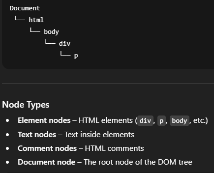

# 29) DOM Manipulation in JavaScript

DOM manipulation is the process of using **JavaScript** to dynamically interact with and modify the **structure**, **style**, and **content** of a web page **after it has loaded**.

This allows developers to build **interactive and dynamic user experiences** without reloading the entire page.

---

### How the DOM Works

- The **DOM (Document Object Model)** represents an HTML document as a **tree of objects (nodes)**.
- Each part of the document is a node, including:
  - HTML elements
  - Attributes
  - Text content
- Each node has its own **properties** and **methods** that JavaScript can access and manipulate.

## Key DOM Manipulation Techniques

## 1. Selecting Elements

You must first access the desired element(s) using methods available on the `document` object.

- **`document.getElementById('idName')`**  
  Selects a single element by its unique ID.  
  _Most efficient for unique elements._

- **`document.querySelector('selector')`**  
  Selects the **first** element that matches a CSS selector  
  (e.g., `#id`, `.class`, `div p`).

- **`document.querySelectorAll('selector')`**  
  Selects **all** matching elements and returns a `NodeList`.

- **`document.getElementsByClassName('className')`**  
  Returns an `HTMLCollection` of elements with the specified class name.

- **`document.getElementsByTagName('tagName')`**  
  Returns an `HTMLCollection` of elements with the given tag name  
  (e.g., `p`, `div`).

---

## 2. Modifying Content and Attributes

Once an element is selected, you can update its content or attributes.

- **`element.innerHTML = 'New Content'`**  
  Gets or sets HTML content inside an element.  
  ⚠️ Use cautiously with untrusted input due to security risks.

- **`element.textContent = 'New Text'`**  
  Gets or sets text content only (ignores HTML).

- **`element.setAttribute('attributeName', 'value')`**  
  Sets an attribute value (e.g., `src`, `href`).

- **`element.removeAttribute('attributeName')`**  
  Removes an attribute from the element.

---

## 3. Modifying Styles and Classes

Using CSS classes is recommended, but inline styles can also be applied.

- **`element.style.propertyName = 'value'`**  
  Sets inline styles using camelCase  
  (e.g., `backgroundColor`).

- **`element.classList.add('className')`**  
  Adds a class.

- **`element.classList.remove('className')`**  
  Removes a class.

- **`element.classList.toggle('className')`**  
  Toggles a class on or off.

---

## 4. Creating and Removing Elements

You can dynamically manage page structure.

- **`document.createElement('tagName')`**  
  Creates a new element in memory.

- **`parentNode.appendChild(childNode')`**  
  Appends a child element to a parent.

- **`element.remove()`**  
  Removes the element from the DOM.

- **`parentNode.removeChild(childNode)`**  
  Removes a specific child from its parent.

---

## 5. Event Handling

JavaScript can respond to user interactions through event listeners.

- **`element.addEventListener('event', functionName)`**  
  Attaches an event listener to an element.

  Common events:

  - `click`
  - `input`
  - `keydown`
  - `submit`

---

# 30)Event Capturing & Bubbling

### Event Flow Phases

When an event occurs in the DOM, it passes through **three phases**:

1. **Capturing Phase (Top → Target)**

   - The event travels from the `document` down to the target element.
   - Used when you want to handle events **before** they reach the target.

2. **Target Phase**

   - The event reaches the actual element that triggered it.

3. **Bubbling Phase (Target → Top)**
   - The event bubbles back up from the target element to the `document`.
   - Most event handling in JavaScript relies on this phase.

---

### Event Listener Syntax

```javascript
element.addEventListener("click", handler, true); // Capturing phase
element.addEventListener("click", handler, false); // Bubbling phase
```

### Event Listener Phase Control

- The **third parameter** of `addEventListener` determines the event phase:
  - `true` → **Capturing phase**
  - `false` → **Bubbling phase**

---

### Default Behavior

- ✔ **Bubbling is enabled by default**
- ❌ **Capturing is disabled** unless explicitly set to `true`

---

### Why This Matters

- **Bubbling** enables patterns like **event delegation**, which improves performance.
- **Capturing** is useful when you need to **intercept events** before child elements handle them.
- Understanding both phases helps you control how events **propagate through the DOM**.

# 31) preventDefault & stopPropagation

### preventDefault

- Stops the **default browser behavior** associated with an event.
- Commonly used with form submissions, links, and context menus.

```javascript
form.addEventListener("submit", (e) => {
  e.preventDefault();
});
```

### stopPropagation

- Stops the event from propagating further through the DOM.

- Prevents both bubbling and capturing beyond the current element.

```javascript
e.stopPropagation();
```

#### Key Difference

- preventDefault() → stops the browser’s default action.
- stopPropagation() → stops the event from moving through the DOM.

# 32) BOM (Browser Object Model)

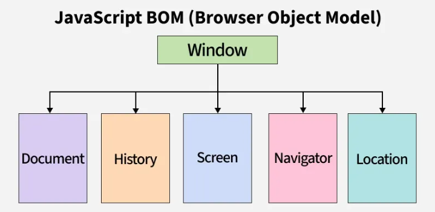
The **Browser Object Model (BOM)** is a collection of objects that allows JavaScript to interact with the **browser and its environment**, beyond just the webpage content.

Unlike the **DOM (Document Object Model)**, which focuses on page structure and content, the BOM deals with everything **outside the page**, such as the browser window, URL, history, and screen.

---

## Key BOM Objects

### window

- The **global object** representing the browser window.
- Provides methods and properties such as:
  - `alert()`, `prompt()`, `confirm()`
  - `setTimeout()`, `setInterval()`
  - Window size: `innerHeight`, `innerWidth`

---

### navigator

- Contains information about the browser and system.
- Examples:
  - Browser name
  - Version
  - Operating system

---

### location

- Represents the current URL.
- Used for redirection and URL manipulation.
- Common methods:
  - `location.assign()`
  - `location.replace()`
  - `location.href`

---

### history

- Provides access to the browser’s session history.
- Allows navigation through visited pages:
  - `history.back()`
  - `history.forward()`
  - `history.go()`

---

### screen

- Contains information about the user’s screen.
- Examples:
  - `screen.width`
  - `screen.height`

---

### console

- Used for debugging and logging.
- Common methods:
  - `console.log()`
  - `console.warn()`
  - `console.error()`

---

## Examples

```javascript
// Display an alert dialog (window.alert() is implied)
alert("Hello, world!");

// Log browser information to the console (window.navigator is implied)
console.log(navigator.userAgent);

// Redirect the user to a different URL (window.location is implied)
location.href = "https://www.example.com";
```

### Summary

- **DOM** → Interacts with webpage content
- **BOM** → Interacts with the browser environment
- The **window** object acts as the root of the BOM

# 33) Cookies

## Cookies & the Secure Flag

Cookies are small **key-value pairs** stored in the browser and are **automatically sent with HTTP requests** to the server.

They are commonly used for:

- Authentication (sessions)
- Personalization
- Tracking
- CSRF protection

---

## 1) Secure Cookie

The **Secure** flag ensures that a cookie is **only sent over HTTPS connections**.

### Example

```http
Set-Cookie: token=abc; Secure;
```

### Why It Matters

#### Without Secure

- Cookie can be sent over **HTTP**
- Vulnerable to **Man-in-the-Middle (MITM)** attacks
- Susceptible to **packet sniffing**

#### With Secure

- ✔ Cookie is **never sent over plain HTTP**
- ✔ Protects against **interception**
- ✔ Enhances **overall security**

## 2) HttpOnly Cookie

---

### 📌 What is HttpOnly?

The **HttpOnly** flag prevents **JavaScript access** to cookies.

```http
Set-Cookie: sessionId=abc; HttpOnly;
```

### What It Blocks

- ❌ `document.cookie`
- ❌ XSS-based token theft

---

### Why It Matters

If an attacker injects malicious JavaScript:

```javascript
document.cookie; // ❌ blocked
```

HttpOnly cookies cannot be accessed via JavaScript, which significantly reduces the risk of session hijacking via XSS attacks.

## 3) SameSite Cookie

### 📌 What is SameSite?

The **SameSite** attribute controls whether cookies are sent with **cross-site requests**.

- Helps prevent **CSRF (Cross-Site Request Forgery)** attacks

```http
Set-Cookie: token=abc; SameSite=Strict;
```

## SameSite Cookie Values

### ✅ SameSite=Strict

```http
SameSite=Strict
```

### Behavior

- ✔ Cookie sent **only for same-site navigation**
- ❌ Not sent on **cross-site requests** (even link clicks)

---

### Pros

- 🔐 **Best security**

---

### Cons

- ❌ May break **user experience** (e.g., external links, redirects)

### ✅ SameSite=Lax (DEFAULT)

```http
SameSite=Lax

```

### Behavior

- ✔ Cookie sent for:

  - Same-site requests
  - Top-level navigation (`GET` requests)

- ❌ Not sent for:
  - Cross-site `POST` requests
  - AJAX requests

---

### Pros

- ✔ Good balance of security & usability
- ✔ Default behavior in modern browsers

### ✅ SameSite=None

```http
SameSite=None; Secure
```

### Behavior

- ✔ Cookie sent in **all contexts**
- ❌ **Least secure**

### Required For

- Third-party cookies
- Embedded iframes
- Cross-domain authentication

⚠ **Must be used with `Secure`**, otherwise browsers will block it.

---

# 34) Tree Shaking

## 🌳 Tree Shaking

**Tree shaking** is a **build-time optimization** technique that removes **unused (dead) code** from the final JavaScript bundle.

The term comes from the idea of **shaking a tree to remove dead leaves** — only the code that is actually used remains.

---

## What Tree Shaking Does

- Eliminates unused modules, functions, or components
- Produces **smaller bundle sizes**
- Results in **faster load times**
- Improves overall **application performance** and **user experience**

---

## Tree Shaking in React & JavaScript

Tree shaking is commonly used in **React applications** and modern JavaScript projects during the **build process** (using tools like Webpack, Rollup, or Vite).

It works by analyzing imports and exports to determine which pieces of code are never used and safely removing them.

---

## Key Points

- ✔ Happens at **build time**, not runtime
- ✔ Requires **ES Modules (import / export)**
- ✔ Relies on **static analysis**
- ✔ Removes dead code automatically

---

### Summary

Tree shaking helps keep JavaScript applications **lean, fast, and efficient** by ensuring only the code that is actually used makes it into the final bundle.

---

## Why ES Modules (ESM) Are Required

Tree shaking relies on **ES Modules (`import` / `export`)** because they are:

- **Statically analyzable**
- Have a fixed structure that bundlers can understand at build time

```javascript
// ES Modules (tree-shakable)
import { add } from "./math.js";
```

## Summary

- Tree shaking removes **unused code**
- Happens at **build time**
- Requires **ES Modules**

## Basic Example

### `math.js`

```javascript
export function add(a, b) {
  return a + b;
}

export function subtract(a, b) {
  return a - b;
}
```

### `app.js`

```javascript
import { add } from "./math.js";

add(2, 3);
```

### `Result After Tree Shaking`

```javascript
function add(a, b) {
  return a + b;
}

add(2, 3);
```

✔ subtract is completely removed from the bundle

✔ Improves performance and bundle size

# 35) SOLID Principles in JavaScript

**SOLID** is a set of five design principles that help you write code that is:

- ✔ Maintainable
- ✔ Scalable
- ✔ Testable
- ✔ Readable

These principles apply even in **dynamic languages like JavaScript**.

---

## S — Single Responsibility Principle (SRP)

### 📌 Definition

A class or module should have **only one reason to change**.

In other words, a unit of code should handle **one responsibility only**.

---

### ❌ Bad Example

```javascript
class UserService {
  createUser(data) {
    // create user
  }

  sendEmail(user) {
    // send email
  }

  logUser(user) {
    console.log(user);
  }
}
```

### Problems

- Too many responsibilities in a single class:

  - Business logic
  - Email handling
  - Logging

- A change in **any one concern** forces modification of the **same class**, increasing coupling and reducing maintainability.

### ✅ Good Example

```javascript
class UserService {
  createUser(data) {}
}

class EmailService {
  sendEmail(user) {}
}

class Logger {
  log(data) {}
}
```

### Benefits

- Each class has a **single responsibility**
- Easier to **test**, **maintain**, and **extend**
- Changes in email or logging do **not** affect user creation logic

## O — Open/Closed Principle (OCP)

### 📌 Definition

Software entities (classes, modules, functions) should be **open for extension** but **closed for modification**.

---

## ❌ Bad Example

```javascript
function calculateDiscount(type, price) {
  if (type === "student") return price * 0.8;
  if (type === "senior") return price * 0.7;
}
```

### Problems

- Adding a new discount requires **modifying existing code**
- Increases the **risk of regressions**
- **Violates the Open/Closed Principle (OCP)**

## ✅ Good Example (Strategy Pattern)

```javascript
class DiscountStrategy {
  apply(price) {}
}

class StudentDiscount extends DiscountStrategy {
  apply(price) {
    return price * 0.8;
  }
}

class SeniorDiscount extends DiscountStrategy {
  apply(price) {
    return price * 0.7;
  }
}
```

### Benefits

- New discounts can be added by creating **new classes**
- Existing code remains **unchanged**
- Easier to **test**, **maintain**, and **extend**

## L — Liskov Substitution Principle (LSP)

The **Liskov Substitution Principle (LSP)** states that if you have a **base class (superclass)** and a **derived class (subclass)**, you should be able to replace the base class with the subclass **without breaking the correctness or expected behavior** of the program.

In simple terms:  
👉 **Subclasses must be usable wherever their parent class is expected.**

---

## ❌ Bad Example (Violates LSP)

```javascript
class Bird {
  fly() {}
}

class Penguin extends Bird {
  fly() {
    throw new Error("Cannot fly");
  }
}
```

### Problem

- `Bird` implies that all birds can fly.
- `Penguin` breaks this expectation.
- Code written to work with `Bird` fails when given a `Penguin`.

❌ Breaks **substitutability** and **expected behavior**, violating the Liskov Substitution Principle.

### ✅ Good Example (Follows LSP)

```javascript
class Bird {}

class FlyingBird extends Bird {
  fly() {}
}

class Penguin extends Bird {
  swim() {}
}
```

### Why This Works

- No false assumptions are made in the base class.
- Subclasses only add behavior they can actually support.
- Each subtype can safely replace its parent without breaking the program.

---

### 🎯 Interview Answer (LSP)

> **If a subclass changes or breaks the expected behavior of its parent class, it violates the Liskov Substitution Principle.**

## I — Interface Segregation Principle (ISP)

### 📌 Definition

Clients should **not be forced to depend on methods they do not use**.

---

### ❌ Bad Example

```javascript
class Worker {
  work() {}
  eat() {}
}
```

### Problem

- Every client of `Worker` is forced to depend on **both** `work()` and `eat()`
- Not all workers require both behaviors
- Creates **unnecessary dependencies**
- Violates the **Interface Segregation Principle (ISP)** by coupling unrelated functionality

## ✅ Good Example (Follows ISP)

```javascript
class Workable {
  work() {}
}

class Eatable {
  eat() {}
}
```

### Why This Works

- Responsibilities are segregated into **small, focused abstractions**
- Clients depend **only on what they actually use**
- Avoids forcing unnecessary methods on consumers
- Improves **flexibility**, **maintainability**, and **testability**

---

🎯 **Interview Answer (ISP)**

> The Interface Segregation Principle states that clients should not be forced to depend on methods they do not use. Smaller, focused interfaces lead to more flexible and maintainable code.

## D — Dependency Inversion Principle (DIP)

### 📌 Definition

High-level modules should **not depend on low-level modules**.  
Both should depend on **abstractions**.

---

### ❌ Bad Example

```javascript
class PaymentService {
  constructor() {
    this.processor = new Stripe();
  }
}
```

### Problems

- High-level `PaymentService` is **tightly coupled** to the `Stripe` implementation
- Hard to **test** because dependencies cannot be easily mocked
- Difficult to **replace or switch** payment providers without modifying existing code

## ✅ Good Example

```javascript
class PaymentService {
  constructor(processor) {
    this.processor = processor;
  }
}
```

### Why This Is Better

- Depends on an **abstraction**, not a concrete implementation
- Payment processors can be **swapped easily**  
  (Stripe, PayPal, Mock, etc.)
- Improves **testability**, **flexibility**, and **extensibility**

---

# 36) Storage is JS

## 1️⃣ `Web Storage`

**Web Storage** allows you to store **key–value pairs** in the browser.

### Key Characteristics

- Data is stored as **strings**
- Storage size ≈ **5–10 MB**
- Data is **not sent to the server** (unlike cookies)
- Faster and more secure for client-side storage

---

## 2️⃣ `localStorage`

### 🔹 Key Features

- Data **persists even after the browser is closed**
- Shared across **all tabs/windows** of the same origin
- **No expiration time**

### 🔹 Example

```javascript
// Set an item
localStorage.setItem("user", "John");

// Get an item
const user = localStorage.getItem("user");

// Remove a specific item
localStorage.removeItem("user");

// Clear all localStorage data
localStorage.clear();
```

## 3️⃣ `sessionStorage`

### 🔹 Key Features

- Data exists **only for the current tab**
- Cleared when the **tab or browser is closed**
- **Not shared** across tabs or windows
- Stores data as **key–value pairs (strings only)**

---

### 🔹 Example

```javascript
// Set an item
sessionStorage.setItem("token", "abc123");

// Get an item
const token = sessionStorage.getItem("token");

// Remove a specific item
sessionStorage.removeItem("token");

// Clear all sessionStorage data
sessionStorage.clear();
```

## localStorage vs Cookies

| Feature               | localStorage       | Cookies                               |
| --------------------- | ------------------ | ------------------------------------- |
| **Sent with request** | ❌ No              | ✅ Yes                                |
| **Size**              | Larger (≈ 5–10 MB) | Smaller (≈ 4 KB)                      |
| **Security**          | Lower              | Higher (can use `HttpOnly`, `Secure`) |

---

## localStorage vs sessionStorage

| Feature                | localStorage                       | sessionStorage                 |
| ---------------------- | ---------------------------------- | ------------------------------ |
| **Lifetime**           | Permanent (until manually cleared) | Tab session only               |
| **Shared across tabs** | ✅ Yes (same origin)               | ❌ No                          |
| **Storage limit**      | ~5–10 MB                           | ~5 MB                          |
| **Auto expiration**    | ❌ No                              | ✅ Yes (on tab/browser close)  |
| **Use case**           | Preferences, auth flags            | Temporary / session-based data |

### Key Takeaways

- ✔ **localStorage** → persistent storage (data remains even after browser close)
- ✔ **sessionStorage** → tab-level storage (cleared when tab closes)
- ✔ Web Storage stores **only strings** → use `JSON.stringify()` / `JSON.parse()`
- ✔ **Avoid storing sensitive data** (tokens, passwords) in localStorage or sessionStorage

---

# 37) Performance optimization

- `Code splitting and Lazy loading`
- `Debounce`
- `Throttle`

### What is `Code Splitting`?

**Code splitting** breaks down a large JavaScript bundle into **smaller chunks**, so only the required code is loaded when needed.  
This reduces the **initial bundle size** and improves application performance.

---

### What is `Lazy Loading`?

**Lazy loading** means loading resources **only when they are required**, instead of loading everything upfront.

✔ Faster initial load  
✔ Reduced bandwidth usage  
✔ Better user experience

---

### Why It Matters (Example)

Consider a React app with the following pages:

- Login
- Dashboard
- Listing

❌ **Without code splitting**  
All pages are bundled into one large JS file.  
Even when the user visits only the Login page, code for Dashboard and Listing is loaded unnecessarily.

✅ **With code splitting & lazy loading**  
Only the Login page code loads initially.  
Dashboard and Listing pages are loaded **on demand** when the user navigates to them.

---

## Dynamic Import in JavaScript

React uses **dynamic `import()`** for code splitting.

```javascript
import("./math").then((math) => {
  console.log(math.add(1, 2));
});

// explaination
import() returns a Promise
The module is loaded only when needed
Enables lazy loading at runtime
```

## Route-Based Code Splitting (Recommended First Step)

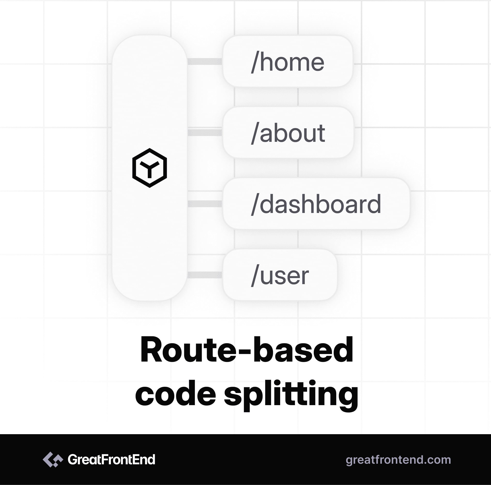
**Route-based code splitting** loads JavaScript code **per route**, instead of bundling the entire app into one file.

```javascript
import { Suspense, lazy } from "react";
import { BrowserRouter as Router, Routes, Route } from "react-router-dom";

const Login = lazy(() => import("./Login"));
const Dashboard = lazy(() => import("./Dashboard"));

const App = () => (
  <Router>
    <Suspense>
      <Routes>
        <Route path="/" element={<Login />} />
        <Route path="/about" element={<Dashboard />} />
      </Routes>
    </Suspense>
  </Router>
);
```

### Why It’s Effective

- Routes are usually **clearly separated**
- Can lead to **maximum bundle size reduction**
- Improves **initial load performance**

### Caution ⚠️

- If multiple routes share a lot of logic, it can cause **code duplication** across bundles
- Shared logic should be extracted into **common/shared chunks**

✔ Best when routes are **distinct**  
❌ Be careful of duplicated code in lazy-loaded routes

---

## Component-Based Code Splitting

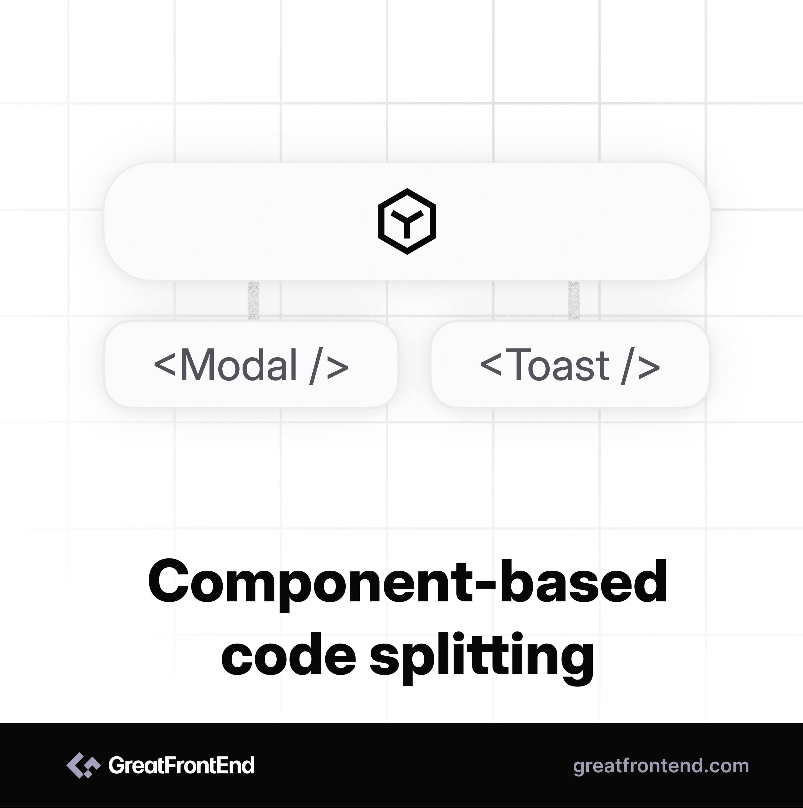
**Component-based code splitting** provides **more granular control** over what gets loaded and when.

```javascript
import { useState, lazy, Suspense } from "react";

const Modal = lazy(() => import("./Modal"));

function App() {
  const [showModal, setShowModal] = useState(false);

  const openModal = () => {
    setShowModal(true);
  };

  const closeModal = () => {
    setShowModal(false);
  };

  return (
    <div>
      <button onClick={openModal}>Open Modal</button>
      {showModal && (
        <Suspense fallback={<div>Loading Modal...</div>}>
          <Modal onClose={closeModal} />
        </Suspense>
      )}
    </div>
  );
}

export default App;
```

In this example, the **Modal** component is lazily loaded using `React.lazy()` and a **dynamic import**.

- The modal is **conditionally rendered** based on the `showModal` state.
- The `openModal` and `closeModal` functions toggle this state.
- The `Suspense` component displays a **loading indicator** while the modal is being loaded asynchronously.

### Why This Improves Performance

- The modal code is loaded **only when the user clicks** the **Open Modal** button.
- Heavy or rarely used components (such as text editors or complex modals) are **not included in the initial bundle**.
- This reduces the **initial load time** and improves overall application performance.

### When to Lazy Load Components

**Ideal candidates:**

- Large components with heavy logic or assets
- Conditional components (modals, charts, dialogs)
- Secondary or non-essential features

**Avoid lazy loading:**

- Headers
- Core layout
- Main content
- Critical dependencies

---

## Why Component-Based Splitting Is Powerful

- Enables **fine-grained performance control**
- Loads **only what the user actually needs**
- Optimizes both **initial render** and **runtime performance**

⚠️ **Balance is key:**

- Lazy load too much → delayed UI
- Lazy load too little → large initial bundle

---

## Key Takeaway

- **Code splitting** → reduces bundle size
- **Lazy loading** → loads code on demand
- **Route-based splitting** → best starting point
- **Component-based splitting** → advanced optimization
- Always balance **performance** with **user experience**

# IMPORTANT FUNCTION / CONCEPT IMPLEMENTATION

- `once(fn)`
- `debounce(fn)`
- `throttle(fn)`
- `flattenArray()`
- `deepClone()`
- `memoize(fn)`
- `closures`

# 38) `once(fn) function`

In JavaScript, a `once` function is a utility that creates a new version of a function that can only be executed a single time. Subsequent calls to the resulting function return the value from the first invocation, ensuring logic runs just once

```javascript
function once(fn) {
  // This variable tracks whether 'fn' has already been called
  let called = false;
  // This variable stores the result of the first function call
  let result;

  return function (...args) {
    // Check if the function has NOT been called yet
    if (!called) {
      // Mark the function as called so it won't run again
      called = true;
      // Call the original function 'fn'
      // - 'this' preserves the calling context
      // - 'args' passes all received arguments
      result = fn.apply(this, args);
    }
    // Always return the stored result
    // (first call computes it, later calls reuse it)
    return result;
  };
}
```

```javascript
function add(a, b) {
  console.log("Function executed");
  return a + b;
}

// Wrap the function so it can only run once
const addOnce = once(add);

console.log(addOnce(2, 3)); // Logs: "Function executed", then 5
console.log(addOnce(10, 20)); // No log, still returns 5
console.log(addOnce(100, 200)); // Still returns 5
```

# 39) `flattenArray()`

**Flattening** is the process of converting a **nested array** into a **single-level array**.

### Using REDUCE function

```javascript
// Function to flatten a nested array into a single-level array
function flattenArray(arr) {
  // reduce() iterates over each element in the array
  return arr.reduce((acc, curr) => {
    // acc → accumulator that holds the flattened result so far
    // curr → current element being processed

    // Check if the current element is an array
    if (Array.isArray(curr)) {
      // If yes, recursively flatten it and concatenate the result
      return acc.concat(flattenArray(curr));
    } else {
      // If not an array, directly add the value to the accumulator
      return acc.concat(curr);
    }
  }, []); // Initial accumulator is an empty array
}

// ✅ Example usage
const nestedArray = [1, [2, [3, 4]], 5];

const result = flattenArray(nestedArray);
console.log(result); // [1, 2, 3, 4, 5]
```
