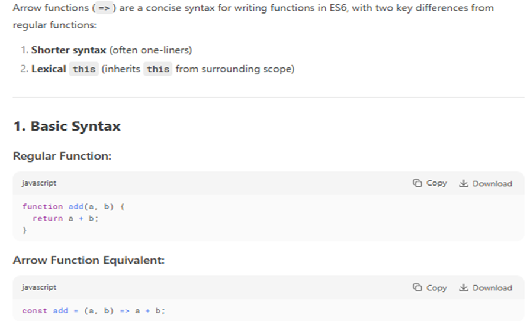

# JAVASCRIPT

---

## VARIABLES


---

## CURRYING

Currying is the process of transforming a function that takes multiple arguments into a series of functions that each take one argument at a time.

- EXAMPLE :-

```
function add(a, b) {
  return a + b;
}
add(2, 3);
```

- 🔁 With Currying:

```
function add(a) {
  return function(b) {
    return a + b;
  };
}
add(2)(3); // 👉 5
```

The curried version lets you call the function one argument at a time.
🧱 Why Use Currying?

1. Reusability: You can create specialized versions of functions.
2. Composition: Works well with functional pipelines.
3. Partial Application: Fix one or more arguments and reuse.
   ```
   const multiply = a => b => a \* b;
   ```

---

## CLOSURE

Closure tab banta hai jab ek inner function, apne outer function ke variables ko yaad rakhta hai even after outer function execution is complete.

👉 JavaScript mein functions ke andar function bana sakte ho, aur inner function outer function ke scope ke variables ko access kar leta hai — yeh hi closure hai.

🔍 Example:

1. Simple closure

   ```
   function outer() {
   let name = "Amit"; // outer variable

   function inner() {
       console.log("Hello " + name); // inner can access outer's variable
   }

   return inner;
   }

   const greet = outer(); // outer() run hua, inner function return hua
   greet(); // ✅ Output: Hello Amit
   ```

2. Data Privacy using Closure:

   ```
   function secretNumber() {
   let number = 42; // private

   return {
   getNumber: function () {
   return number;
   },
   setNumber: function (newNum) {
   number = newNum;
   }
   };
   }

   const secret = secretNumber();
   console.log(secret.getNumber()); // 42
   secret.setNumber(100);
   console.log(secret.getNumber()); // 100
   ```

3. Counter Function (Classic Closure Example)

   ```
   function createCounter() {
   let count = 0; // private variable

   return function () {
   count++;
   console.log(count);
   };
   }

   const counter = createCounter();

   counter(); // 1
   counter(); // 2
   counter(); // 3
   ```

---

# FUNCTION

## 1. First-Class Functions

In JavaScript, functions are first-class citizens, meaning they can:

- Be stored in variables
- Be passed as arguments to other functions
- Be returned from other functions

```
📌 Example:
function greet() {
  return "Hello!";
}

// Storing in a variable
let sayHello = greet;

// Passing as argument
function callFunction(fn) {
  console.log(fn());
}
callFunction(sayHello); // Output: Hello!
```

## 2. Function Expression

A function expression is when a function is assigned to a variable. It can be named or anonymous.

```
(Anonymous Function Expression):

const add = function(a, b) {
  return a + b;
};
```

```
(Named Function Expression):

const multiply = function multiplyNumbers(a, b) {
  return a * b;
};
```

## 3. Function Statement (a.k.a. Function Declaration)

A function statement defines a function with the function keyword, followed by a name.

```
function subtract(a, b) {
  return a - b;
}
```

🔹 Key difference from expression: Function declarations are hoisted, meaning they can be used before they are defined in the code.

## 4. Anonymous Function

An anonymous function is a function without a name. It's often used in function expressions or as arguments to other functions (like callbacks).

```
setTimeout(function() {
  console.log("This is an anonymous function");
}, 1000);

```

## 

---

# Callback Function

## What is a Callback Function?

A callback function is a function that is passed as an argument to another function and executed later.

- A function can accept another function as a parameter.
- Callbacks allow one function to call another at a later time.
- A callback function can execute after another function has finished.

## How Do Callbacks Work in JavaScript?

JavaScript executes code line by line (synchronously), but sometimes we need to delay execution or wait for a task to complete before running the next function. Callbacks help achieve this by passing a function that is executed later.

```
Callbacks for Asynchronous Execution
console.log("Start");
setTimeout(function () {
    console.log("Inside setTimeout");
}, 2000);
console.log("End");
```

Callbacks are widely used in

- API requests (fetching data)
- Reading files (Node.js file system)
- Event listeners (clicks, keyboard inputs)
- Database queries (retrieving data)

- Callbacks in Event Listeners
  - JavaScript is event-driven, and callbacks handle user interactions like clicks and key presses.

example of  EventListener + closure +callback


```
document.getElementById("myButton")
.addEventListener("click", function () {
    console.log("Button clicked!");
});

```

### Callbacks in API Calls (Fetching Data)

Callbacks are useful when retrieving data from APIs.

```
function fetch(callback) {
    fetch("https://jsonplaceholder.typicode.com/todos/1")
        .then(response => response.json())
        .then(data => callback(data))
        .catch(error => console.error("Error:", error));
}

function handle(data) {
    console.log("Fetched Data:", data);
}

fetch(handle);
```

---

# MAP / FILTER / REDUCE


```
var personnel = [
  {
    id: 5,
    name: "Luke Skywalker",
    pilotingScore: 98,
    shootingScore: 56,
    isForceUser: true,
  },
  {
    id: 82,
    name: "Sabine Wren",
    pilotingScore: 73,
    shootingScore: 99,
    isForceUser: false,
  },
  {
    id: 11,
    name: "Caleb Dume",
    pilotingScore: 71,
    shootingScore: 85,
    isForceUser: true,
  },
];

Our objective: get the total score of force users only


```

## 

# Difference Between Microtask Queue and Callback Queue in asynchronous JavaScript


---

# SETTIMEOUT VS SETINTERVAL

## 

# Callback Hell (Pyramid of Doom)

When multiple asynchronous operations depend on each other, callbacks get deeply nested, making the code hard to read and maintain.

```
getUser(userId, (user) => {
    getOrders(user, (orders) => {
        processOrders(orders, (processed) => {
            sendEmail(processed, (confirmation) => {
                console.log("Order Processed:", confirmation);
            });
        });
    });
});

```


---

# PROMISES

A Promise is an object representing the eventual completion (or failure) of an asynchronous operation.


---

# ASYNC AWAIT

async/await is syntax sugar over Promises, introduced in ES2017, to make asynchronous code look and behave more like synchronous code.

## Why async/await was introduced:

- Promises made async code more manageable than callbacks.
- But .then() chains can still become messy for multiple sequential async operations.
- async/await makes it cleaner and easier to write and read.


---

# STRICT MODE

**use strict** is a special directive in JavaScript that enables strict mode, making the code safer and cleaner by catching silent errors and preventing bad practices.

✅ How to Enable Strict Mode

```
Place this line at the top of your script or function:
"use strict";
Example:"use strict";
let x = 10;
It must be the first line — or it won't work!

```


---

# IIFE (Immediately Invoked Function Expression)?

An IIFE is a function in JavaScript that is defined and executed immediately. The key idea behind an IIFE is that it runs right after it’s created, and is often used to create a local scope for variables to avoid polluting the global scope.

- IIFE Syntax
  ```
  (function() {
  // code inside the function
  console.log("This is an IIFE!");
  })();
  ```
- 🧩 Breaking It Down:

1.                                                                                             (function() { ... }): The function is wrapped in parentheses to treat it as an expression, not a declaration.
2.  () after the parentheses: This immediately invokes the function.


---

# CALL APPLY BIND

1. call() - Immediate Invocation with Individual Arguments

   - The call() method calls a function immediately and allows you to specify the value of this and pass individual arguments to the function.

2. apply() - Immediate Invocation with Arguments in an Array
   - The apply() method is similar to call(), but instead of passing individual arguments, we pass them as an array.
3. bind() - Returns a New Function with Fixed this (Not Invoked Immediately)
   - The bind() method returns a new function with a fixed this value, but it does not invoke the function immediately. You can call this new function later.


---

## ARRAY REVERSE

The Array.reverse() method in JavaScript reverses the order of elements in an array in place, meaning it modifies the original array and also returns it.

- The reverse() method reverses the order of the elements in an array.
- The reverse() method overwrites the original array.

```
Syntax:
array.reverse()
```

```
Example:
let numbers = [1, 2, 3, 4, 5];
numbers.reverse();
console.log(numbers); // [5, 4, 3, 2, 1]
```

Key Points:

1. It does not create a new array.
2. Useful for reversing the display or processing order of elements.
3. If you want a reversed copy of the array without changing the original:

```
let original = [1, 2, 3];
let reversedCopy = [...original].reverse();
```

---

# ES6 Features

ECMAScript 6 (ES6), also known as ECMAScript 2015, introduced many powerful features to JavaScript that make code more concise, readable, and robust. Here are some of the most important ES6 features:

```
let , var / => / `  ${expression}` / promises / async await / ... /default value to parameter ,class , modules
```

Key Connections & Memory Hooks

1.  let/const → Everything
    - Base for all other features (block scope).
    - Remember: const for constants, let for reassignables.
2.  Arrow Functions (=>) → Promises/Arrays
    
    
    Why?

    - Arrow functions do not bind their own this—they inherit it from the parent scope.
    - Regular functions have their own this, which depends on how they're called.
    - Used in .then() chains (fetch) and array methods (reduce).

3.  Rest/Spread (...) → Functions/Arrays

    ```
    Spread ===== Unpacking elements.
    Rest ===== Packing elements.

    ```

    

4.  Destructuring

    
    

5.  Template Literals (${}) → Everywhere

    

6.  Classes ↔ Modules

    -     Classes often exported via modules (export class).
    - Hook: "Classes are blueprints; modules are filing cabinets."

7.  Promises → Async/Await (ES8)

---

# SHALLOW VS DEEP COPY

## Shallow Copy

A shallow copy creates a new object or array. In this process, only the top-level properties are copied, while nested objects or arrays still reference the original memory location. This means that if you change the nested properties in one object, those changes will reflect in the other because they share the same memory reference.


Common Shallow Copy Methods:

1. Spread operator (...)
2. Object.assign({}, obj)
3. Array.prototype.slice()
4. Array.from()


## Deep Copy

A deep copy, on the other hand, creates a completely new object or array and recursively copies all nested objects and arrays found in the original. This means that any changes made to the deep copy do not affect the original structure


Common deep Copy Methods:

1. structuredClone()
2. JSON.parse(JSON.stringify(obj))
3. lodash.cloneDeep() (using lodash library)


---

# PROTOTYPES AND PROTOTYPES INHERITANCE


prototype inheritance where the child constructor inherits from the parent constructor, allowing instances of child to access methods defined in parent’s prototype. It also adds a custom caste method in the child prototype


---

# EVENT BUBBLING

Event Bubbling is a concept in the DOM (Document Object Model). It happens when an element receives an event, and that event bubbles up (or you can say is transmitted or propagated) to its parent and ancestor elements in the DOM tree until it gets to the root element.

1. The "Event Bubbling" behavior makes it possible for you to handle an event in a parent element instead of the actual element that received the event.
2. The pattern of handling an event on an ancestor element is called Event Delegation.
3. Event Bubbling Allows events to move up the DOM tree
4. Event Delegation Lets you handle events at a higher level node


- Event Bubbling Stopped: e.stopPropagation() prevents the event from bubbling to parent elements.
- Independent Logs: Only the clicked element logs its message (e.g., “Child Clicked”), as bubbling is stopped.

---

# MEMOIZATION

Memoization is a technique for speeding up applications by caching the results of expensive function calls and returning them when the same inputs are used again.

1. Expensive Function Calls: Time and memory are the two most important resources in computer applications. As a result, an expensive function call is one that consumes large amounts of these two resources due to extensive calculation during execution.
2. Cache: A cache is just a temporary data store that stores data in order to serve future requests for that data more quickly.

## Importance of Memoization:

When a function is given in input, it performs the necessary computation and saves the result in a cache before returning the value. If the same input is received again in the future, it will not be necessary to repeat the process. It would simply return the cached answer from the memory. This will result in a large reduction in a code’s execution time.

### ✅ How to Achieve Memoization in JavaScript

🔧 Memoization in 3 Simple Steps

1. Create a cache to store previously computed results.
2. Check the cache before computing.
3. Store the result in the cache if it's not already there.

```
You can achieve this in two main ways:
•	Using closures
•	Using a higher-order function
```


---

# DEBOUNCE

Debouncing is a technique used to ensure that a function is not called too frequently. Debouncing in JavaScript can be defined as the technique that is used to limit the number of times a function gets executed. Debouncing is useful when the event is frequently being triggered in a short interval of time like typing, scrolling, and resizing.

1. Limit Function Calls: During frequent events like typing, resizing, or scrolling debouncing prevents the frequent function calls.
2. Delays Execution: After the specific delay only the function is executed, ensuring no rapid consecutive calls.
3. Prevents Overload: Efficiently managing high-frequency triggers helps in preventing overloading.


In this example

- debounce() function: It is the higher order function that takes (delay) and function(func) as the arguments. It returns a new function that will wait for the specified delay before calling the original function.
- clearTimeout(): It is used to clear any previous set timeout so that if the event is triggered repeatedly the function call does not happen too quickly.
- setTimeout(): This method is used to set the timeout after clearing the previous timeouts.
- Search function: It is the placeholder for the function we want to debounce.

---

# THROTTLE

Throttling is a technique used to limit the number of times a function can be executed in a given time frame. It’s extremely useful when dealing with performance-heavy operations, such as resizing the window or scrolling events, where repeated triggers can lead to performance issues.

## How Throttling Works

Throttling works by restricting the execution of a function so that it runs at most once every predefined period, even if the event is triggered multiple times within that interval.

1. A function is triggered multiple times due to an event (e.g., scroll, resize).
2. Throttling ensures that the function executes only once within the defined interval.
3. Any additional triggers during the interval are ignored until the next cycle starts.
4. Once the interval is over, the function can execute again if triggered
   

In this example

- throttle(func, limit)
  A higher-order function that returns a throttled version of func, allowing it to run at most once every limit milliseconds.
- let inThrottle = false;
  A flag to prevent repeated calls during the cooldown period.
- return function (...args)
  Returns the throttled function that receives any number of arguments.
- if (!inThrottle)
  Only allows func to run if it's not currently throttled.
- func.apply(this, args)
  Calls the original function with proper context and arguments.
- setTimeout(() => { inThrottle = false }, limit)
  Resets the throttle flag after the specified limit time, allowing the next execution.

---

# PREVENT DEFAULT

preventDefault() prevents the default behavior of an event from happening.

### Why it's useful:

Some events have default actions provided by the browser. preventDefault() stops those actions so you can handle them your own way.


