# REACT vs ANGULAR

## 🔁 Angular vs React – Head-to-Head

| Feature             | Angular                                            | React                                                     |
|---------------------|----------------------------------------------------|------------------------------------------------------------|
| **Type**            | Full-fledged framework                             | Library for UI (can be extended to full stack)             |
| **Language**        | Uses TypeScript (strict by default)                | Uses JavaScript, with optional TypeScript                  |
| **Learning Curve**  | Steep – lots of concepts (Modules, DI, RxJS)       | Easier – focuses on components and JSX                     |
| **DOM**             | Real DOM (with change detection)                   | Virtual DOM (efficient re-rendering)                       |
| **Data Binding**    | Two-way binding                                    | One-way binding (with state & props)                       |
| **Architecture**    | MVC-based                                          | Component-based                                            |
| **State Management**| Built-in services, RxJS                            | External libraries like Redux, Zustand, etc.               |
| **Routing**         | Built-in (`@angular/router`)                       | Needs external (`react-router`)                            |
| **Performance**     | Good, but may be slower for very large DOMs        | Very fast with virtual DOM and diffing                     |
| **Community & Ecosystem** | Large, enterprise-focused                     | Massive, with many third-party tools                       |
| **Use Case Fit**    | Enterprise apps, complex forms & structure         | Modern web apps, startups, SPAs                            |


## 🔍 React vs Angular – In-Depth Comparison

### 1. 🏗️ Architecture & Type

| Feature                  | React                                                        | Angular                                                             |
|--------------------------|--------------------------------------------------------------|----------------------------------------------------------------------|
| Type                     | Library (focuses only on the View layer)                    | Full Framework (MVC-based, provides everything out-of-the-box)      |
| DOM                      | Uses Virtual DOM for efficient updates                      | Uses Real DOM with change detection                                 |
| Structure                | Component-based (UI as a function of state)                 | Component-based (with modules, services, and dependency injection)  |

---

### 2. 💻 Language & Syntax

| Feature                  | React                                                        | Angular                                                             |
|--------------------------|--------------------------------------------------------------|----------------------------------------------------------------------|
| Language                 | Uses JavaScript (or TypeScript optionally)                  | Uses TypeScript (mandatory)                                         |
| Templating               | JSX (JavaScript + HTML in one file)                         | HTML templates with Angular syntax (`*ngIf`, `*ngFor`, etc.)        |
| Flexibility              | More flexible (just JavaScript)                             | Strict structure (follows Angular's patterns)                       |

---

### 3. 🔗 Data Binding

| Feature                  | React                                                        | Angular                                                             |
|--------------------------|--------------------------------------------------------------|----------------------------------------------------------------------|
| Binding Type             | Unidirectional (Parent → Child via props)                   | Two-way binding (`[(ngModel)]` for forms)                           |
| State Updates            | Manual (e.g., `setState`, Redux, etc.)                      | Automatic change detection (`Zone.js` triggers updates)             |

---

### 4. 🧠 State Management

| Feature                  | React                                                        | Angular                                                             |
|--------------------------|--------------------------------------------------------------|----------------------------------------------------------------------|
| State Tools              | `useState`, Context API, Redux, MobX                        | Services + RxJS (or NgRx for Redux-like patterns)                   |
| Dependency Injection     | Community-driven                                             | Built-in dependency injection for state sharing                     |

---

### 5. 🚀 Performance

| Feature                  | React                                                        | Angular                                                             |
|--------------------------|--------------------------------------------------------------|----------------------------------------------------------------------|
| Update Speed             | Faster due to Virtual DOM diffing                           | Slower in large apps (Real DOM & change detection)                  |
| Optimization             | `React.memo`, `useMemo`, `useCallback`                     | `OnPush` change detection strategy                                  |

---

### 6. 📚 Learning Curve

| Feature                  | React                                                        | Angular                                                             |
|--------------------------|--------------------------------------------------------------|----------------------------------------------------------------------|
| Complexity               | Easier to start (just JS + JSX)                             | Steeper (TypeScript, decorators, RxJS, DI)                          |
| Ecosystem                | Flexible, but you choose libraries                          | Opinionated, complete out-of-the-box                               |

---

### 7. 🧰 Use Cases

| Feature                  | React                                                        | Angular                                                             |
|--------------------------|--------------------------------------------------------------|----------------------------------------------------------------------|
| Best For                 | SPAs, dynamic UIs, high interactivity apps                  | Enterprise apps, large-scale projects                               |
| Used By                  | Facebook, Instagram, Airbnb                                 | Google, Microsoft, Forbes                                           |

---
# REACT LIFECYCLE

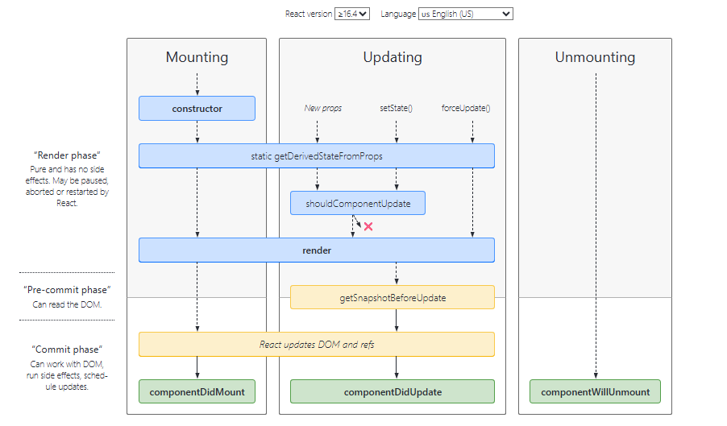

## Functions of each Phase of the Lifecycle


### 1) Mounting Phase :

These methods are called in the following order when an instance of a component is being created and inserted into the DOM:

#### 🔹 `constructor()`

- Used to define initial `props` and `state`.
- Must call `super(props)` before accessing `this`.

In this phase, the developer has to define the props and initial state of the component this is generally done in the constructor of the component. 

    class Clock extends React.Component {
        constructor(props) {

            // Calling the constructor of 
            // Parent Class React.Component
            super(props);

            // Setting the initial state
            this.state = { date: new Date() };
        }
    };

#### 🔹 `static getDerivedStateFromProps()`

The getDerivedStateFromProps method is a static lifecycle method used when the state of a component depends on changes of props. It is a static method that is called just before render() method in both mounting and updating phase in React.
- getDerivedStateFromProps(props, state) 


#### 🔹 `render()`

In React, lifecycle methods manage a component’s behaviour at different stages. The render() method is important for defining the UI, updating it whenever state, props, or context changes, and ensuring the UI stays in sync with the component’s data.
- Only required method in a class component.

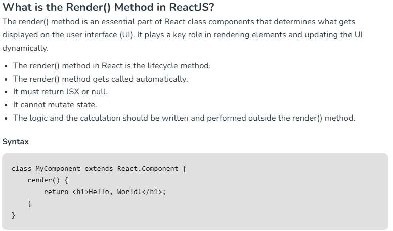

#### 🔹 `componentDidMount()`
In React, componentDidMount() is a lifecycle method in React that is called once a component has been rendered and placed in the DOM. This method is invoked only once during the lifecycle of a component, immediately after the first render, which is why it is useful for operations like fetching data, setting up subscriptions, and interacting with the DOM.

    ```
    Syntax
    componentDidMount(){  
    // code to be executed
    }
    ```
- The method does not take any arguments.
- It doesn’t return anything.
- It is automatically called by React after the initial render.

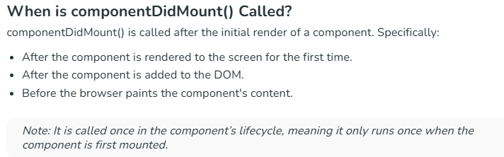

    

### 2) Updating Phase:
An update can be caused by changes to props or state. These methods are called in the following order when a component is being re-rendered:

#### 🔹 `static getDerivedStateFromProps()`
The getDerivedStateFromProps method is a static lifecycle method used when the state of a component depends on changes of props. It is a static method that is called just before render() method in both mounting and updating phase in React.
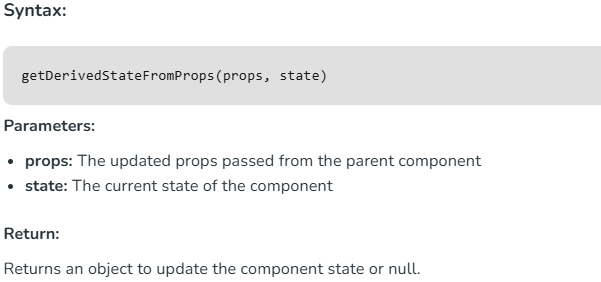

#### 🔹 `shouldComponentUpdate()`
The shouldComponentUpdate() is a lifecycle method used in React class components to determine whether a component should re-render in response to changes in state or props. This method is invoked before every render and allows you to conditionally skip the re-rendering process, which can help optimize performance by preventing unnecessary updates.

- If shouldComponentUpdate() returns true, the component re-renders.
- If it returns false, the component does not re-render.

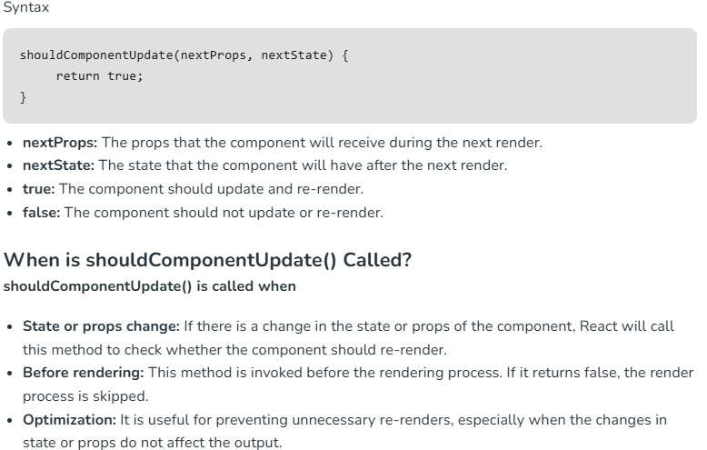
#### 🔹 `render()`
Called again to re-render JSX.

#### 🔹 `getSnapshotBeforeUpdate()`
The getSnapshotBeforeUpdate() method is invoked just before the DOM is being rendered. It is used to store the previous values of the state after the DOM is updated.
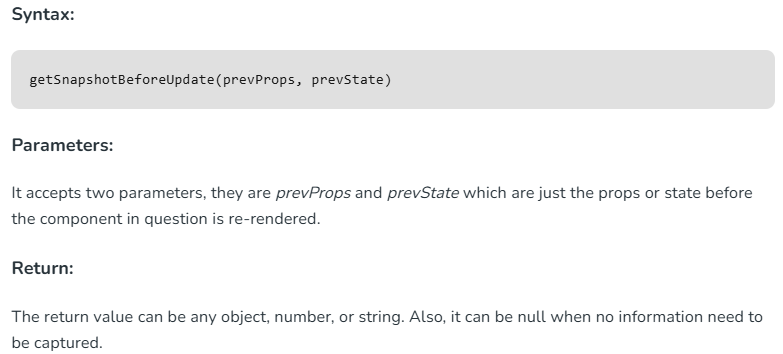

#### 🔹 `componentDidUpdate()`
The componentDidUpdate() method is part of React’s Class Component Lifecycle. It is invoked immediately after a component’s updates are flushed to the DOM. This method is commonly used to perform side effects that depend on the new state or props, such as

- Fetching new data when a prop changes
- Updating the DOM directly after React has rendered changes
- Logging or debugging when a component re-renders
- Triggering additional UI updates or animations after a state change

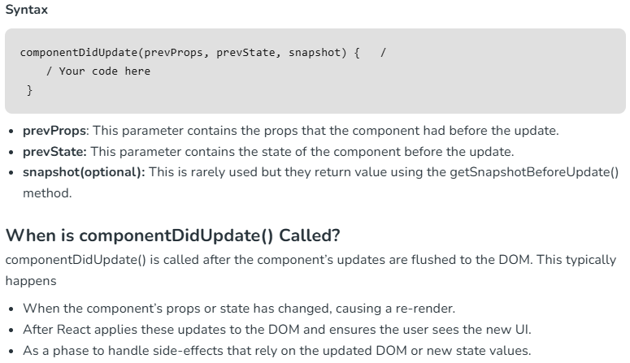

### 3. Unmounting Phase
This method is called when a component is being removed from the DOM:

#### 🔹 `componentWillUnmount()`
The componentWillUnmount() method is part of React’s Class Component Lifecycle. It is invoked just before a component is unmounted and destroyed. This method is the perfect place to perform any necessary cleanup, such as:

- Cancelling network requests
- Clearing timers (like setInterval() or setTimeout())
- Removing event listeners
- Cleaning up subscriptions (such as WebSocket connections)

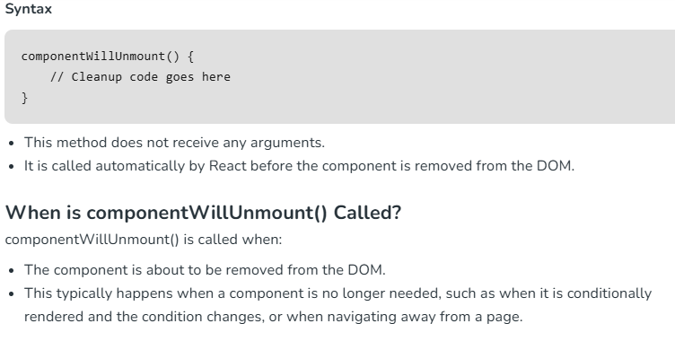

# SUMMARY OF LIFE-CYCLE METHODS

#### 🔹 `1) With Class Component`
``` 
import React, { Component } from 'react';

class FullLifecycleDemo extends Component {
  constructor(props) {
    super(props);
    // Mounting: Initialize state
    this.state = {
      count: 0,
    };
    console.log('🔧 constructor: Initializing state');
  }

  // Mounting + Updating: Sync state from props (rarely needed in practice)
  static getDerivedStateFromProps(nextProps, prevState) {
    console.log('📥 getDerivedStateFromProps: Sync props to state if needed');
    // Example logic (not changing state here)
    return null;
  }

  // Mounting: Render the component
  render() {
    console.log('🖼️ render: Rendering the component');
    return (
      <div style={{ padding: '1rem' }}>
        <h2>🔄 Full React Lifecycle Demo</h2>
        <p>Count: {this.state.count}</p>
        <button onClick={this.handleIncrement}>Increment</button>
      </div>
    );
  }

  // Mounting: Runs after the first render
  componentDidMount() {
    console.log('✅ componentDidMount: Component mounted');
    // Start a timer or fetch data here
  }

  // Updating: Decide whether to re-render the component
  shouldComponentUpdate(nextProps, nextState) {
    console.log('❓ shouldComponentUpdate: Should re-render?', nextState.count);
    return true; // Return false to prevent re-render
  }

  // Updating: Called right before the DOM is updated
  getSnapshotBeforeUpdate(prevProps, prevState) {
    console.log('📸 getSnapshotBeforeUpdate: Capture scroll position or state');
    // Example: return snapshot data to use in componentDidUpdate
    return null;
  }

  // Updating: Runs after the component updates (DOM has re-rendered)
  componentDidUpdate(prevProps, prevState, snapshot) {
    console.log('🔁 componentDidUpdate: Component updated');
    console.log('Previous count:', prevState.count, 'Current count:', this.state.count);
  }

  // Unmounting: Cleanup before the component is removed
  componentWillUnmount() {
    console.log('🧹 componentWillUnmount: Cleanup (e.g., timers, subscriptions)');
  }

  // Event handler to trigger state change
  handleIncrement = () => {
    this.setState((prevState) => ({ count: prevState.count + 1 }));
  };
}

export default FullLifecycleDemo;

```
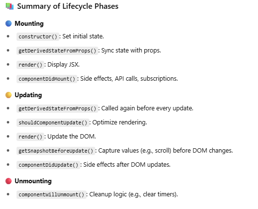

#### 🔹 `2) With Functional Component`
```
import React, { useState, useEffect, useRef } from 'react';

const FullLifecycleDemo = () => {
  // Simulates constructor (initial state)
  const [count, setCount] = useState(0);
  const isFirstRender = useRef(true); // To distinguish mount vs update

  console.log('🔧 Function body (like constructor + render): Rendering component');

  // 📥 getDerivedStateFromProps equivalent (not common in functional components)
  // Normally handled using useEffect + prop change logic if needed

  // ✅ componentDidMount equivalent
  useEffect(() => {
    console.log('📌 useEffect[]: Component mounted (componentDidMount)');
    
    // Setup logic like subscriptions or API calls
    const timer = setInterval(() => {
      console.log('⏰ Interval running...');
    }, 1000);

    // 🧹 componentWillUnmount equivalent
    return () => {
      clearInterval(timer);
      console.log('🧹 Cleanup on unmount (componentWillUnmount)');
    };
  }, []); // Empty array = run once on mount

  // 🔁 componentDidUpdate equivalent for count
  useEffect(() => {
    if (!isFirstRender.current) {
      console.log(`🔁 useEffect[count]: Count updated to ${count} (componentDidUpdate)`);
    }
  }, [count]); // Runs when `count` changes

  // 📸 getSnapshotBeforeUpdate simulation (sort of)
  const prevCountRef = useRef();
  useEffect(() => {
    prevCountRef.current = count;
  }, [count]);
  const prevCount = prevCountRef.current;

  // ❓ shouldComponentUpdate is not available in function components
  // Instead, use React.memo or custom comparison to avoid re-renders

  return (
    <div style={{ padding: '1rem' }}>
      <h2>🔄 React Functional Component Lifecycle (Simulated)</h2>
      <p>Current Count: {count}</p>
      <p>Previous Count (snapshot): {prevCount}</p>
      <button
        onClick={() => {
          if (isFirstRender.current) {
            isFirstRender.current = false;
          }
          setCount((prev) => prev + 1);
        }}
      >
        Increment
      </button>
    </div>
  );
};

export default FullLifecycleDemo;

```
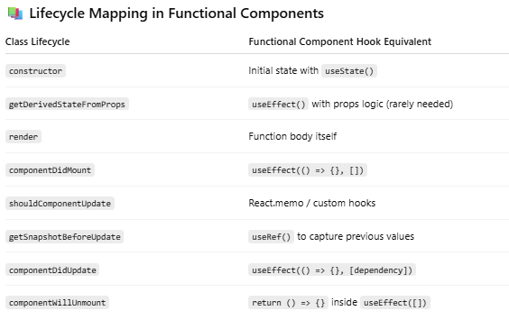

#### React lifecycle method in class component vs functional component

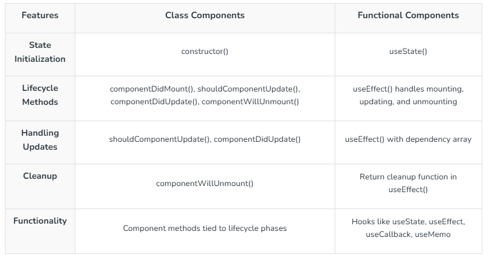


