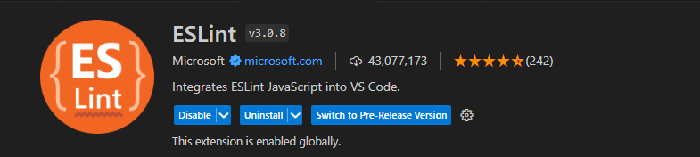
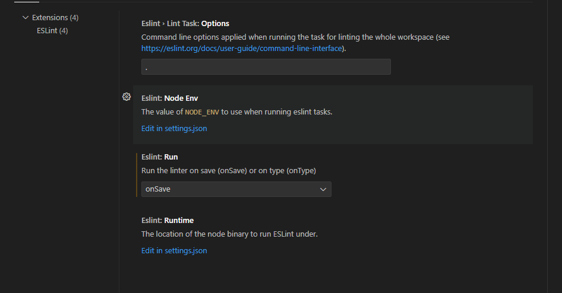
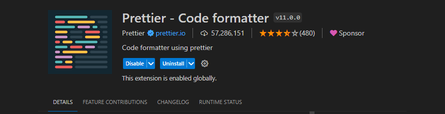
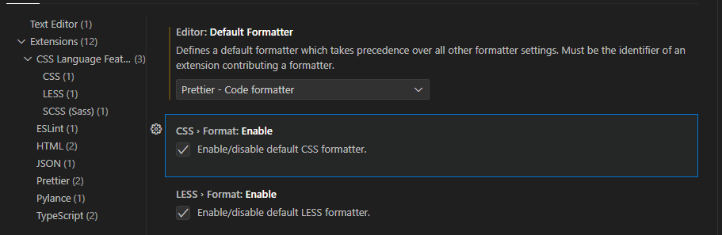
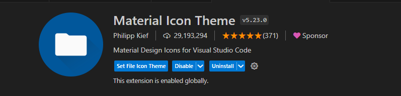
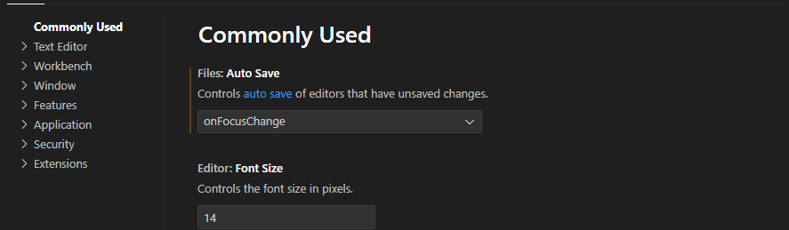
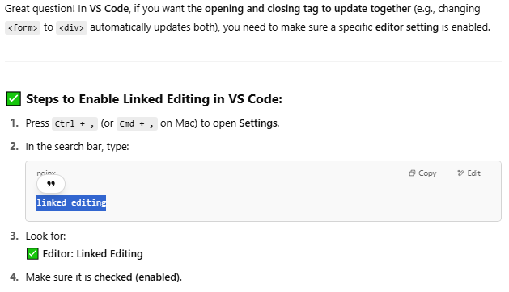
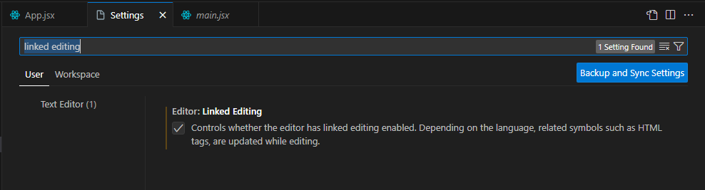

# Neccessay Extension

## ESLint

---

ESLint is a static code analysis tool for identifying and fixing problems in JavaScript/TypeScript code.

---

## Prettier

---

Prettier is an opinionated code formatter that automatically formats your code to ensure a consistent style—regardless of who wrote it.

## Material Icon Theme

Material Icon Theme is a popular Visual Studio Code extension that replaces default file and folder icons with Material Design-inspired icons, making your project structure easier to understand at a glance.

# Linked Tag editing ( opening and closing tag to update together)

