# ⚛️⚛️⚛️⚛️ REACT ⚛️⚛️⚛️⚛️

## Some Javascript Concept may uses in react

#### Array.from()

Array.from() is a built-in JavaScript method that creates a new array from:

- An array-like object (like { length: 5 })

- Or an iterable (like a string, Set, Map, etc.)

- Optionally, you can also transform items while creating the array using a mapping function.

- Array.from(arrayLike, mapFunction);

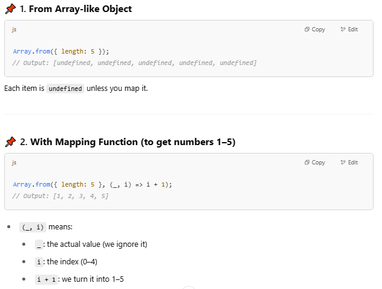

# ⚛️⚛️⚛️⚛️⚛️⚛️⚛️⚛️⚛️⚛️⚛️⚛️⚛️⚛️⚛️⚛️

## Why react came in picture

---

## 🧠 First, Understand Two Styles of Programming

| Style       | What it means                                                    | How it feels                                                            |
| ----------- | ---------------------------------------------------------------- | ----------------------------------------------------------------------- |
| Imperative  | You tell the computer how to do things step-by-step.             | Like giving cooking instructions.                                       |
| Declarative | You tell the computer what you want, and it figures out the how. | Like saying "Make me a pizza"—you care about the result, not the steps. |

---

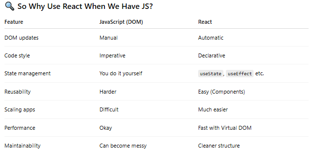
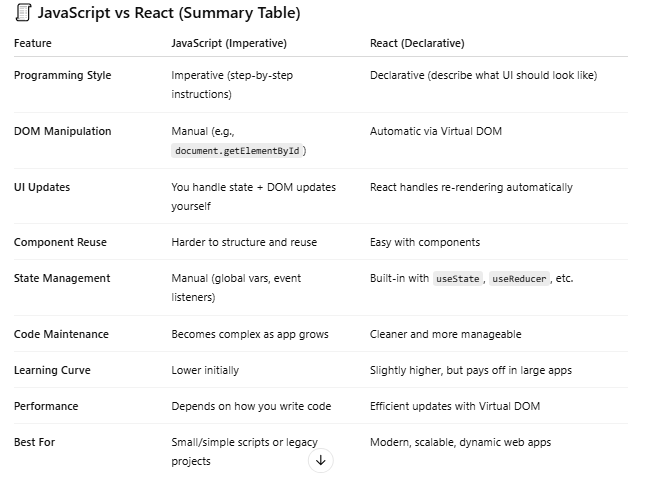

---

# REACT

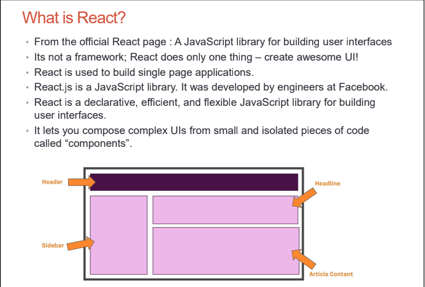

- It uses VirtualDOM instead of RealDOM considering that RealDOM manipulations
  are expensive.
- Supports server-side rendering.
- Follows Unidirectional data flow or data binding.
- Uses reusable/composable UI components to develop the view.

## 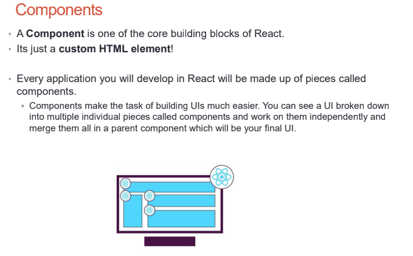

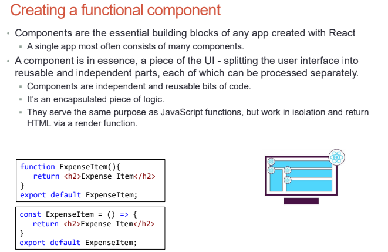
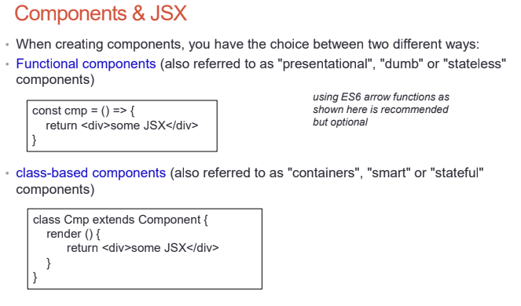

# PROPS

Props (short for "properties") are read-only inputs that you pass from a parent component to a child component in React.

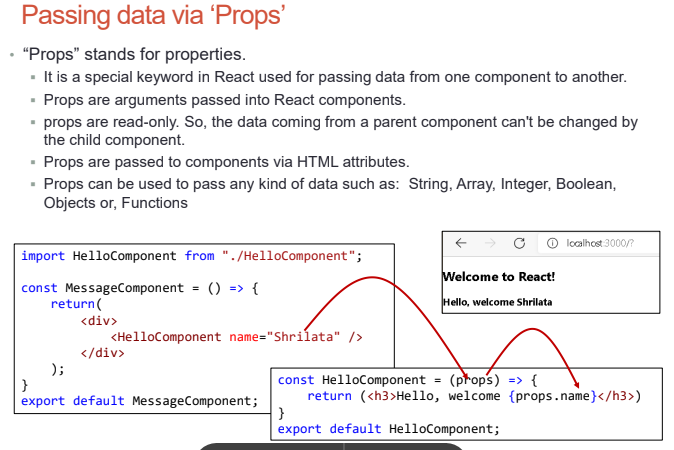

They allow components to be reusable and dynamic by giving them custom data.

💡 Key Points about Props
| Feature | Explanation |
|---------------|--------------------------------------------------------------|
| Read-only | Props cannot be changed inside the child component. |
| Passed down | Always flow from parent → child. |
| Reusable | Make components flexible with different data. |
| Destructuring | Common to use: `function Component({ title }) {}` |

🔒 Can I Modify Props?

- ❌ No — Props are immutable inside the component.
- If you need to change data, you should use state (useState) instead.

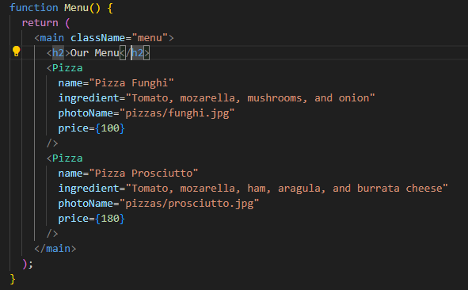
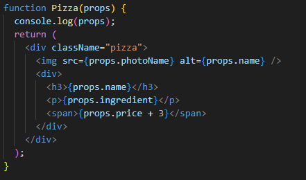

---

# Destructuring Props

Props destructuring in React is the practice of extracting specific properties from the props object directly, so you can access them without repeatedly writing props. in your component.

- Props destructuring makes React components more concise, readable, and maintainable by letting you directly extract needed values from the props object.

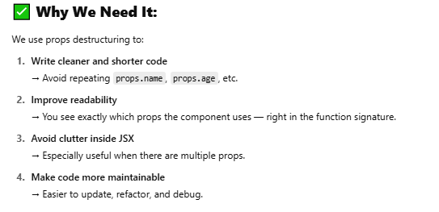
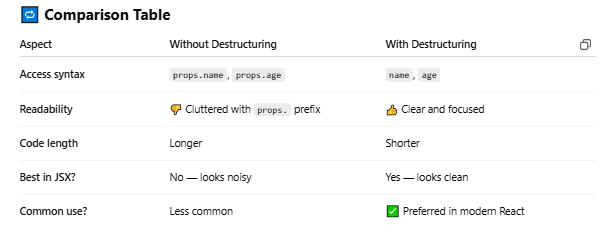

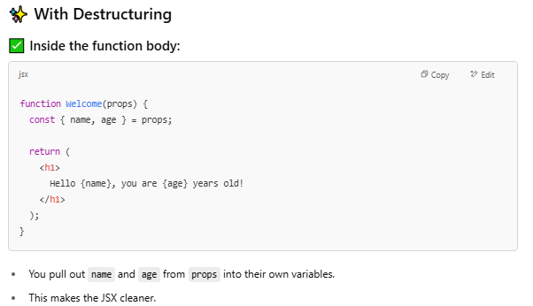
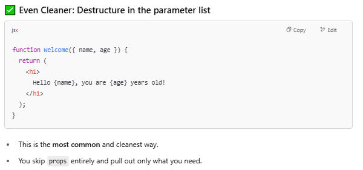

---

# LIST RENDERING

---

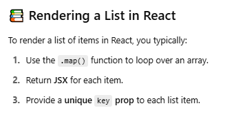

### Why Use a key Prop?

The key helps React identify which items changed, were added, or removed, which improves performance and avoids rendering bugs.

- 🔑 Key should be unique and stable.
- Avoid using index as key if the list can change.

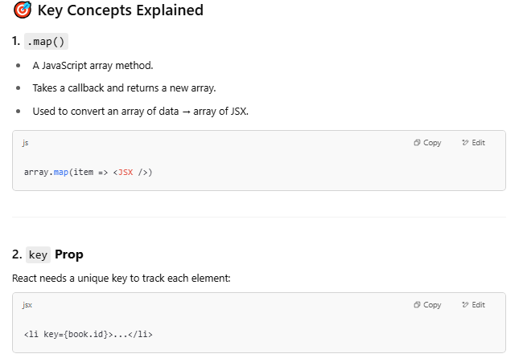
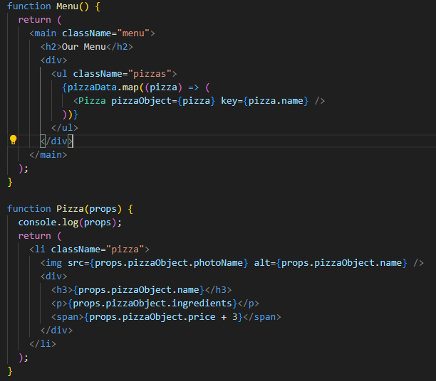
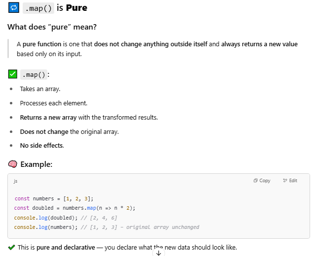
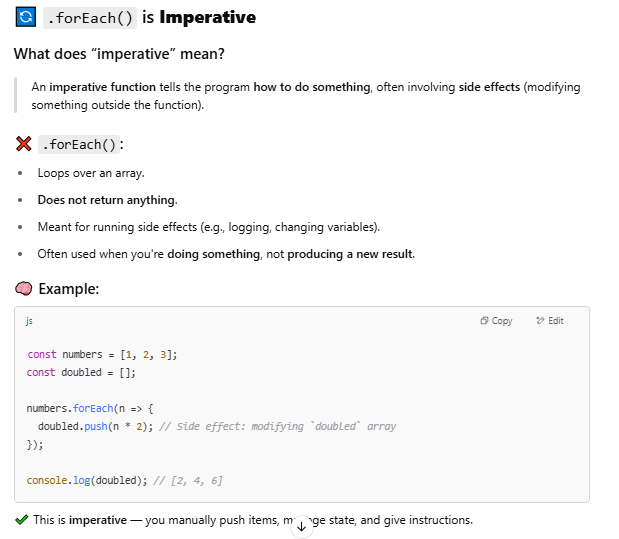

### Why Use map() Instead of forEach() in React for Rendering Lists

Fundamental Difference

- `map()` returns a new array with transformed elements

- `forEach()` returns undefined and only executes a function for each element
- Always use map() when you need to render a list in JSX
- Use forEach only for side effects when you don't need the return value

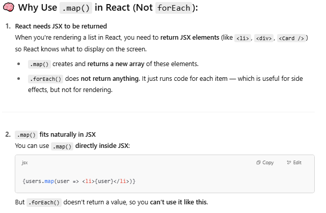
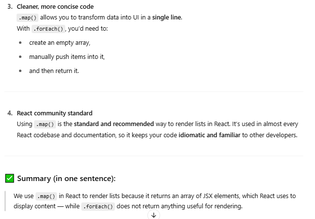

### Conditional Rendering?

Conditional rendering means showing different UI / div / some portion based on a condition — like whether a user is logged in, or if a shop is open.

- React uses JavaScript logic (like if, ?:, &&) inside JSX to decide what to render.

#### 1) Ternary Operator condition ? trueUI : falseUI

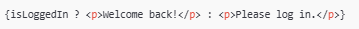

#### 2) Logical AND (&&) — render only if condition is true

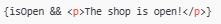

#### 3) if...else (outside JSX)

- Use this if the condition is complex or the JSX is long.

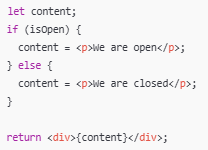

#### 4) Early return (guard clause)

## 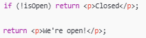

---

# 🧩 What are React Fragments?

A React Fragment lets you group multiple elements without adding an extra node to the DOM.

#### ❓ Why Use Fragments?

Normally in React, components must return a single parent element. If you want to return multiple siblings, you usually wrap them in a `<div>` — but that adds unnecessary HTML to the DOM.
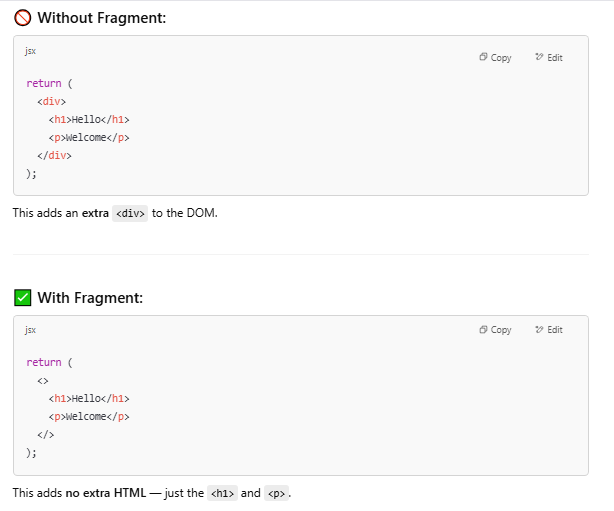

#### 📍 Where to Use Fragments?

1. Inside .map() when rendering a list of elements that don’t need a wrapper

```
const items = ["Pizza", "Pasta"];

return (
  <ul>
    {items.map((item, index) => (
      <React.Fragment key={index}>
        <li>{item}</li>
        <hr />
      </React.Fragment>
    ))}
  </ul>
);

```

2. Inside a component when returning multiple sibling elements.

```
function Welcome() {
  return (
    <>
      <h1>Hi!</h1>
      <p>Welcome to our store.</p>
    </>
  );
}
```

3. In tables, where adding extra <div> would break structure — instead use fragments to return <tr> and <td> properly.

```
function Row() {
  return (
    <div>
      <tr>
        <td>Pizza</td>
        <td>$10</td>
      </tr>
    </div>
  );
}
```

---

# REACT STATE

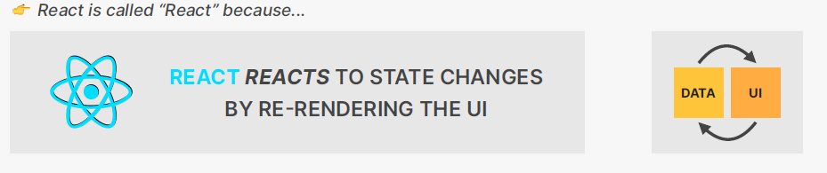

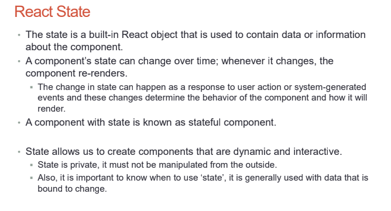
Each component has and manages its
own state, no matter how many times
we render the same component
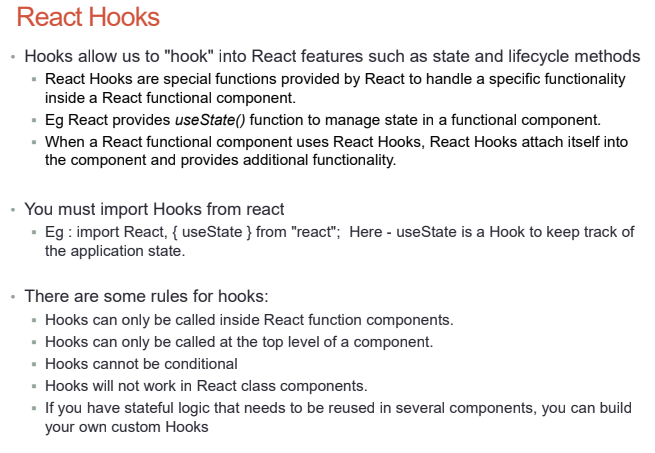
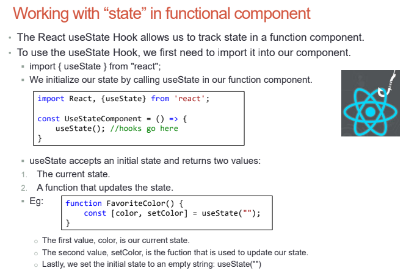
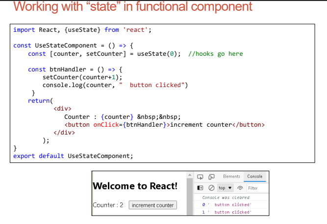

### LOOP HOLE

1.  ✅ const [step, setStep] = useState(1);

    - We use const here because:

      - useState() returns an array with two values: the current state (step) and the updater function (setStep).

      - You are not reassigning the [step, setStep] pair

2.  ❌ let [step, setStep] = useState(1);

    - React state is immutable. Directly updating step like this:

          step = step + 1;

    - Doesn’t work — it just reassigns a local variable.

    - Does not trigger a re-render, so the UI won’t update.

    - Breaks React’s rules, which expect you to use the setStep() function to schedule state changes. pair
      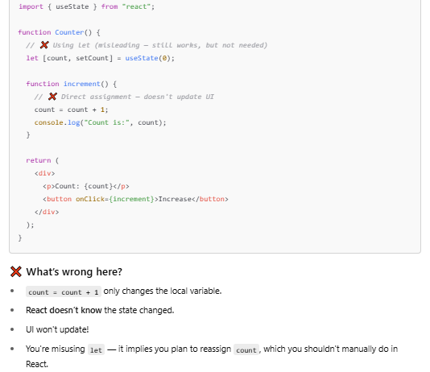

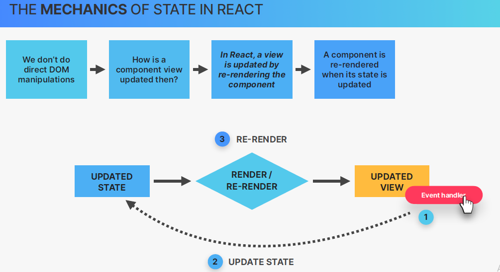

## 🖼️ Differences between the regular form vs functional form of setState in React

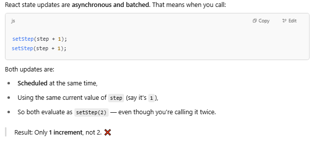
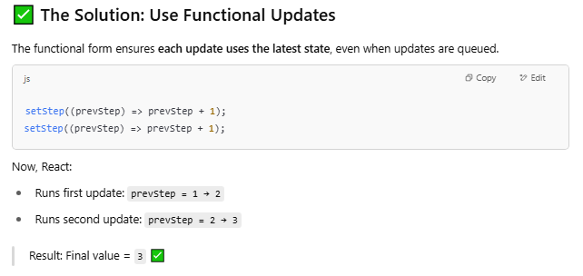

When updating state based on the **previous value**, it's important to use the **functional update form** to avoid stale values.

| Method                | Looks at old value?        | Updates individually?          | Final Result (step from 1) |
| --------------------- | -------------------------- | ------------------------------ | -------------------------- |
| `setStep(step + 1)`   | ❌ (stale value)           | ❌ (same value reused)         | 2 (wrong)                  |
| `setStep(s => s + 1)` | ✅ (fresh state each time) | ✅ (depends on previous state) | 3 (correct)                |

- #### Conclusions

  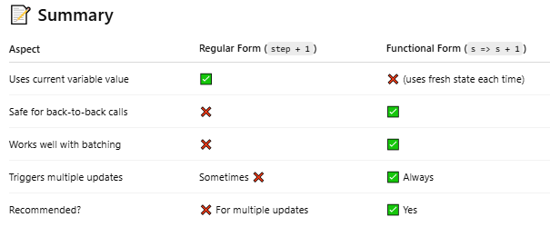
  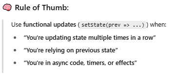

# 📌 Props vs State

Props and State are core concepts in React. They are the only triggers that cause React to re-render components and potentially update the DOM in the browser

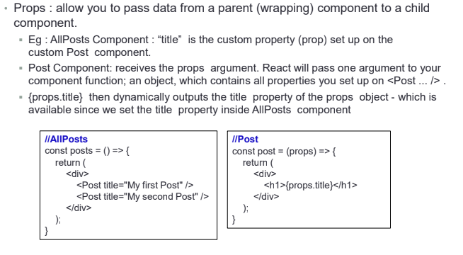
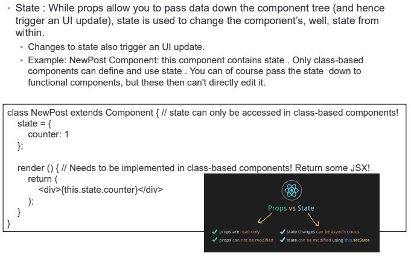
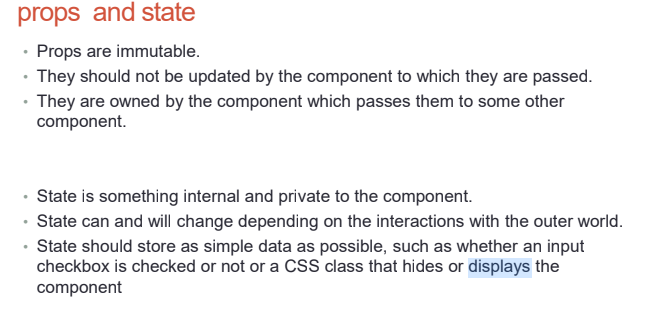

## 🧩 Props vs 🧠 State

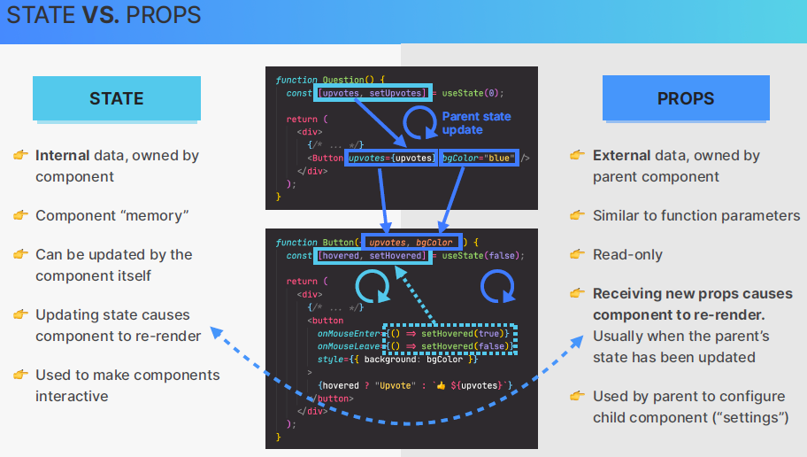

| Feature      | Props                                                    | State                                                       |
| ------------ | -------------------------------------------------------- | ----------------------------------------------------------- |
| Mutability   | Immutable – cannot be changed by the receiving component | Mutable – can be updated using `useState` or similar        |
| Ownership    | Owned by the **parent** component                        | Owned and managed by the **same** component                 |
| Purpose      | Pass data and configuration to child components          | Store dynamic data that may change during lifecycle         |
| Usage        | Passed via JSX: `<Component title="Hello" />`            | Managed internally: `const [count, setCount] = useState(0)` |
| Example Use  | Text, props like `title`, `id`, etc.                     | Form inputs, toggle states, visibility, active tabs, etc.   |
| Modification | Cannot be modified by the child component                | Can be updated by event handlers, API responses, etc.       |

---

## Controlled Elements in React

The `<input>, <select>, or <textarea>` maintain their state in the dom by themselves.

- The value is managed by the DOM, not React.

- React has no idea what the user typed unless you manually query the DOM (like document.querySelector or use a ref).

- This breaks the "React way" of managing everything with state.
  In react we want all state to centralized at one place means inside the react application not in the DOM. To do that we use controlled element

A controlled element is a form element where React fully manages the value via state like `<input>, <select>, or <textarea>`
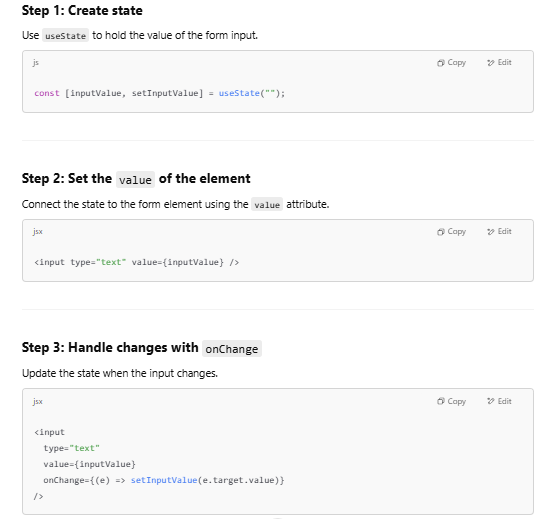
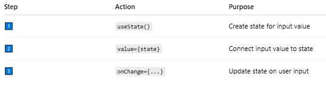

## State Management / Types / When & Where

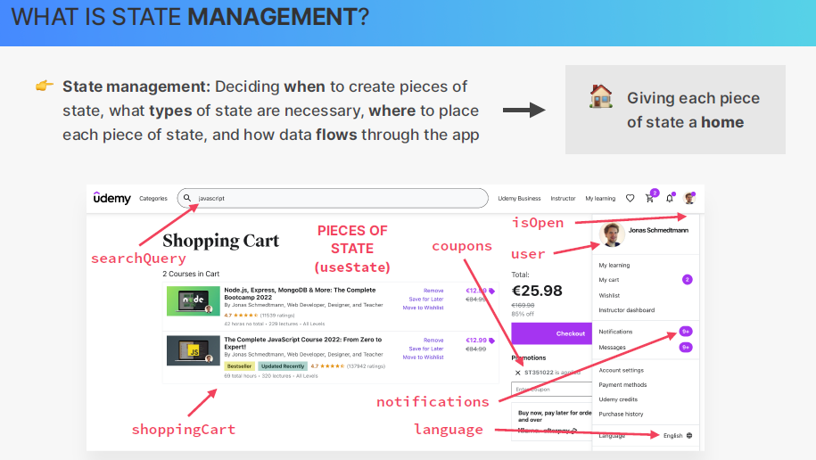
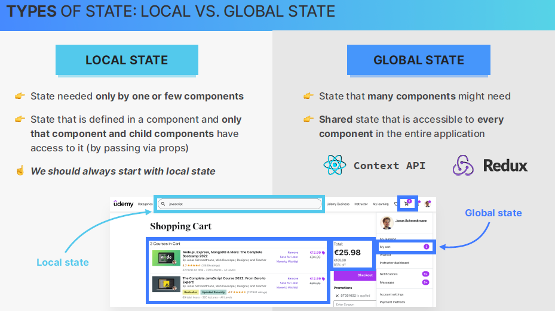
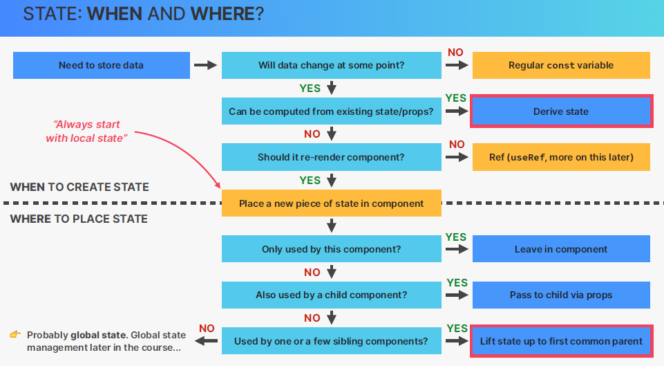

---

# Lifting State Up in React

Lifting State Up means moving state to the closest common parent component so that multiple child components can share and communicate through it.

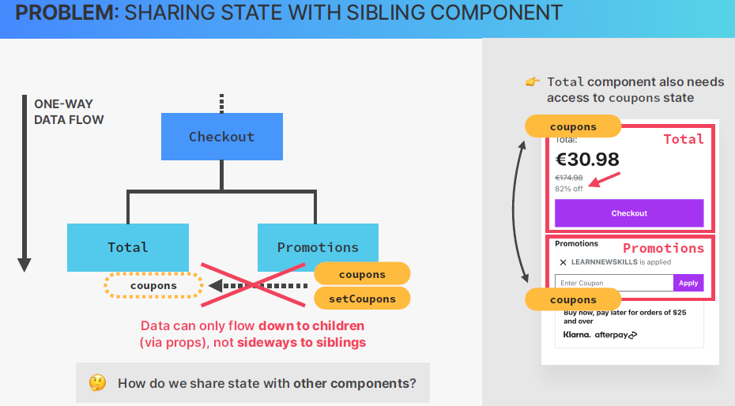
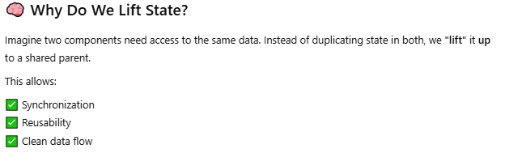
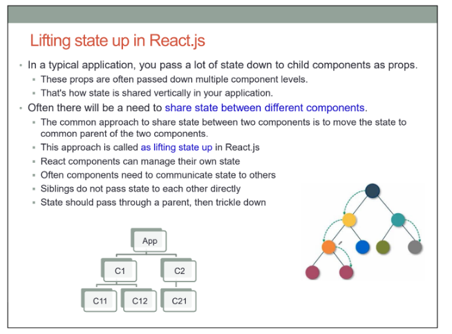
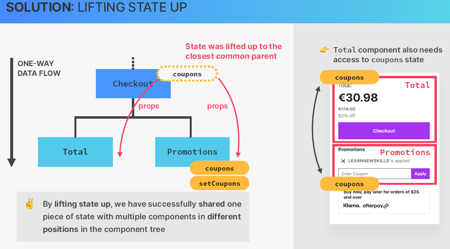
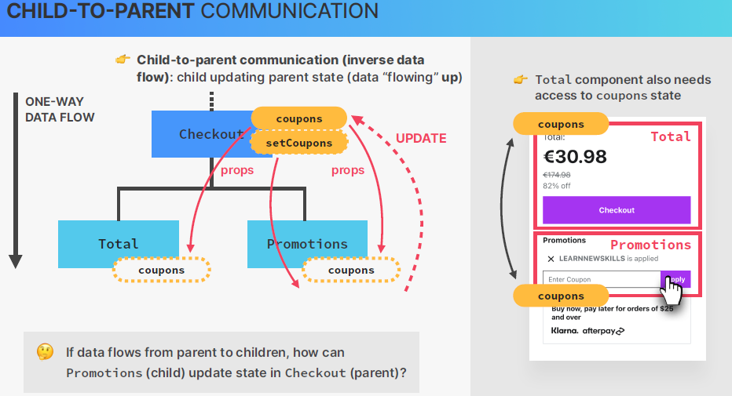
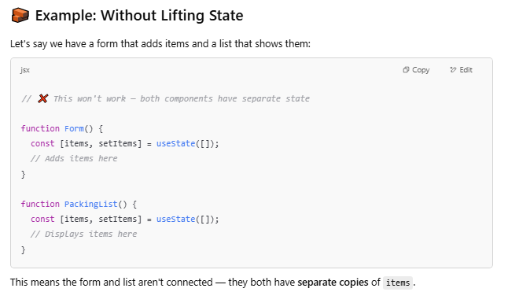
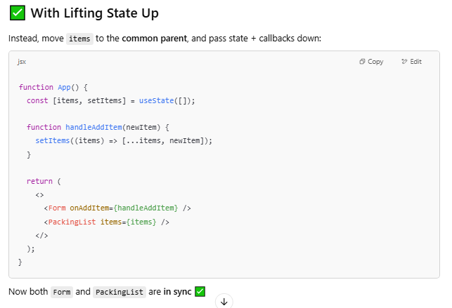
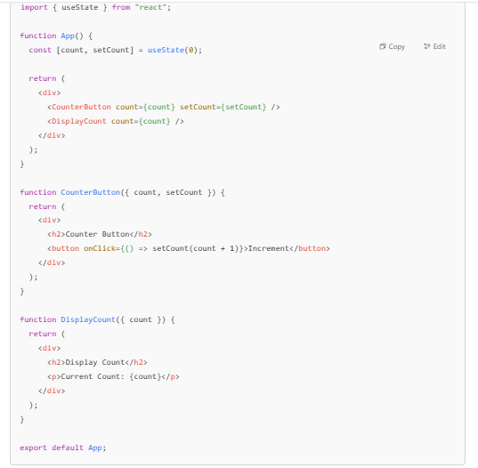

---

# preventDefault()

The preventDefault() method cancels the event if it is cancelable, meaning that the default action that belongs to the event will not occur.

For example, this can be useful when:

- Clicking on a "Submit" button, prevent it from submitting a form
- Clicking on a link, prevent the link from following the URL
- Note: Not all events are cancelable. Use the cancelable property to find out if an event is cancelable.
- Note: The preventDefault() method does not prevent further propagation of an event through the DOM. Use the stopPropagation() method to handle this.

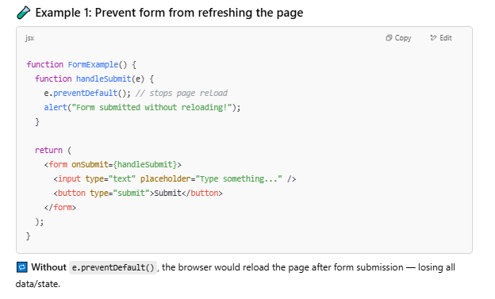
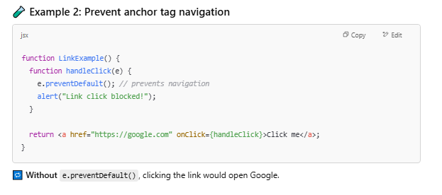

---

# Deriving State

Derived state means a value that is computed based on other state or props, not stored independently.

Instead of storing a duplicate piece of data in useState, you derive it from existing state or props inside the render.

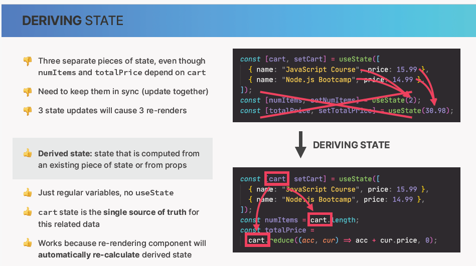

1. Without Derived State (Bad Practice)
   Stores both products and filteredProducts in state — redundant.

```
import React, { useState } from 'react';

const ProductList = () => {
  const [searchQuery, setSearchQuery] = useState('');
  const [products] = useState([
    { id: 1, name: 'Laptop' },
    { id: 2, name: 'Smartphone' }
  ]);
  const [filteredProducts, setFilteredProducts] = useState(products);

  const handleSearch = (e) => {
    const query = e.target.value;
    setSearchQuery(query);
    setFilteredProducts(
      products.filter(p =>
        p.name.toLowerCase().includes(query.toLowerCase())
      )
    );
  };

  return (
    <>
      <input value={searchQuery} onChange={handleSearch} />
      <ul>
        {filteredProducts.map(p => <li key={p.id}>{p.name}</li>)}
      </ul>
    </>
  );
};

export default ProductList;
```

2. ✅ With Derived State (Good Practice)
   Filters products directly during render — cleaner and simpler.

```
import React, { useState } from 'react';

const ProductList = () => {
  const [searchQuery, setSearchQuery] = useState('');
  const products = [
    { id: 1, name: 'Laptop' },
    { id: 2, name: 'Smartphone' }
  ];

  const filteredProducts = products.filter(p =>
    p.name.toLowerCase().includes(searchQuery.toLowerCase())
  );

  return (
    <>
      <input value={searchQuery} onChange={(e) => setSearchQuery(e.target.value)} />
      <ul>
        {filteredProducts.map(p => <li key={p.id}>{p.name}</li>)}
      </ul>
    </>
  );
};

export default ProductList;
```

---

# .sort() method

To sort elements by name in React, you can use JavaScript's .sort()

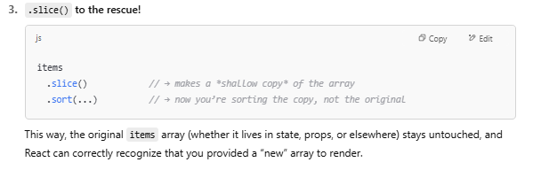
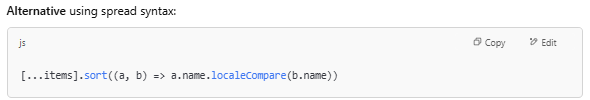
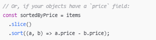
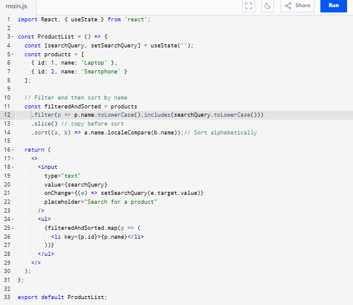

---

# Window: confirm() method

window.confirm() instructs the browser to display a dialog with an optional message, and to wait until the user either confirms or cancels the dialog.
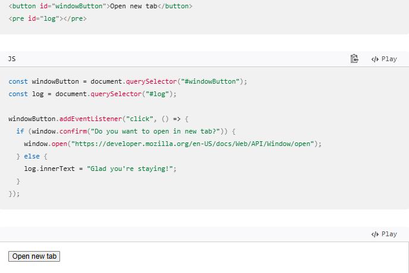
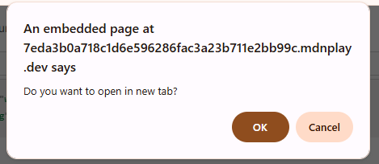

---

# CHILDREN PROPS

The children prop is a special prop automatically provided by React. It allows you to pass content between a component’s opening and closing tags, instead of passing it as a regular prop.

In React, children is a special prop that automatically passes any JSX elements or components nested within a component's opening and closing tags. It provides a way for components to render dynamic content passed down from their parent components.

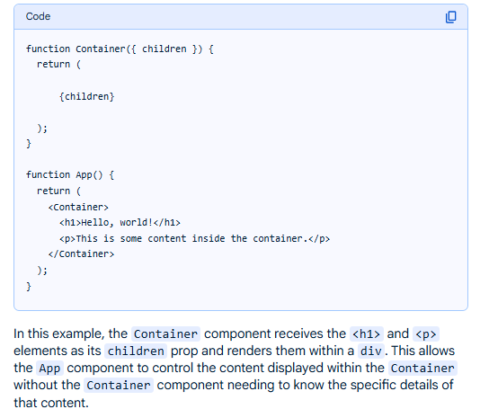

---

# THINKING IN REACT: COMPONENTS COMPOSITION, AND REUSABILITY

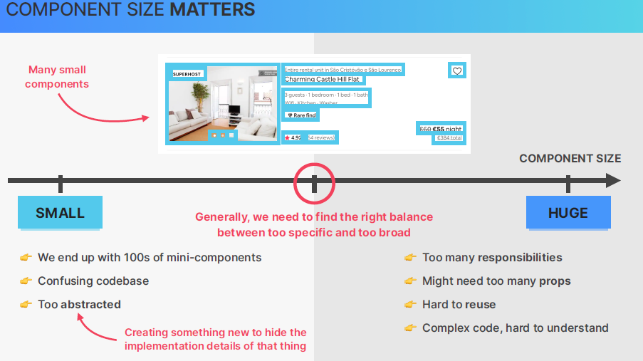
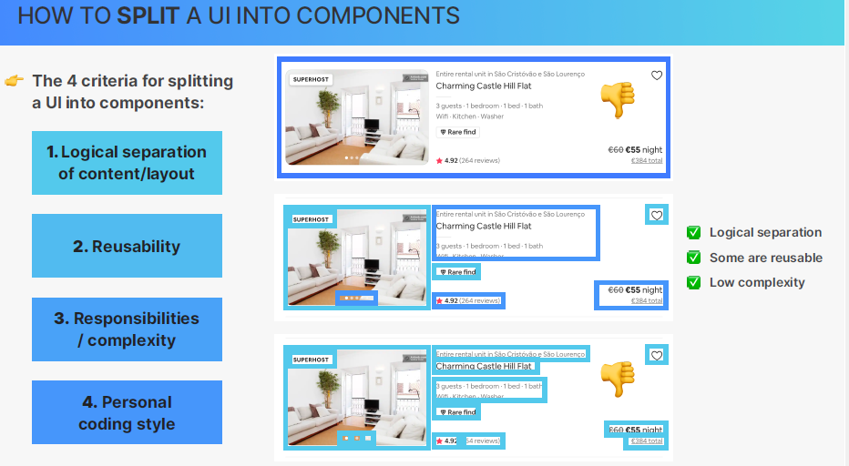
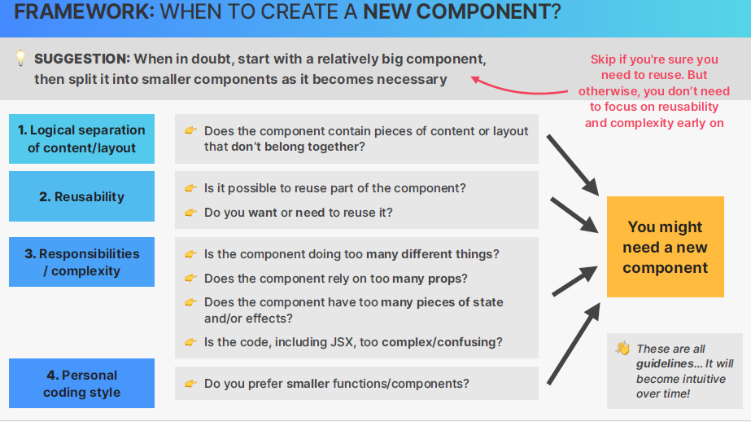

---

# React Component

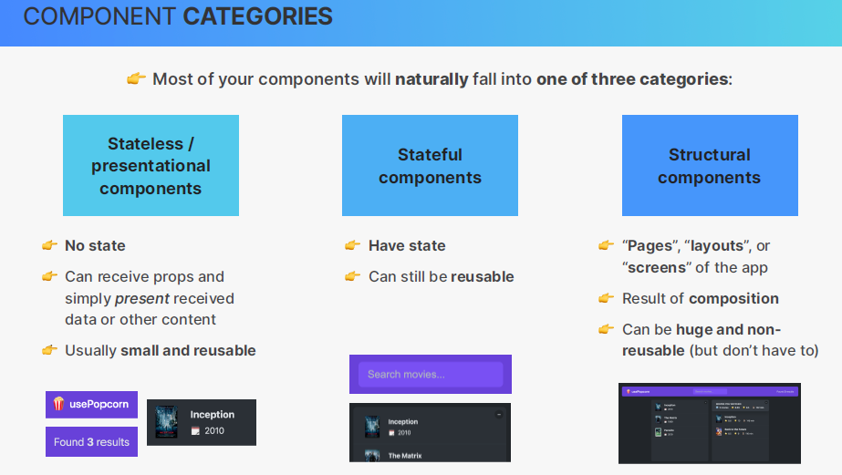

---

# PROP DRILLING

Prop Drilling is when you pass data (props) through many layers of components — even when some components in the middle don't need the data, they just pass it down

```
We need to pass some props to several nested child components in order to get that data into some deeply nested component
```

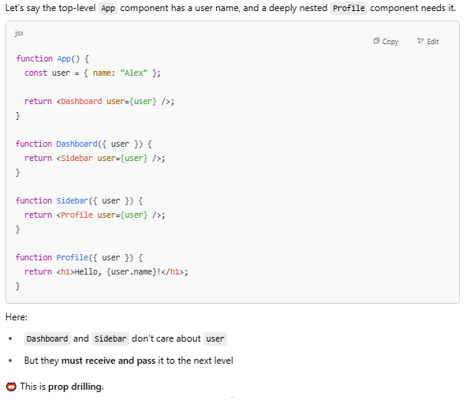

## ❌ Why Prop Drilling Is a Problem

| Problem             | Description                                          |
| ------------------- | ---------------------------------------------------- |
| ❌ Clutter          | Intermediate components get bloated with props       |
| ❌ Hard to maintain | Refactoring becomes tricky and risky                 |
| ❌ Repetition       | Repeating `props.user` at every level                |
| ❌ Tight coupling   | All components are tightly linked by data dependency |

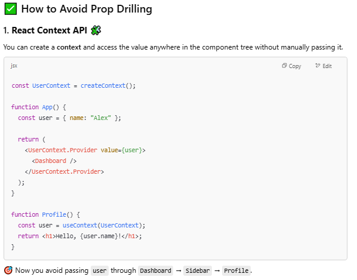

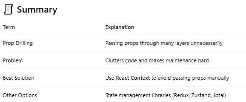

---

# COMPONENT COMPOSITION
