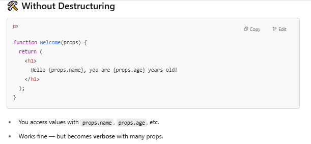
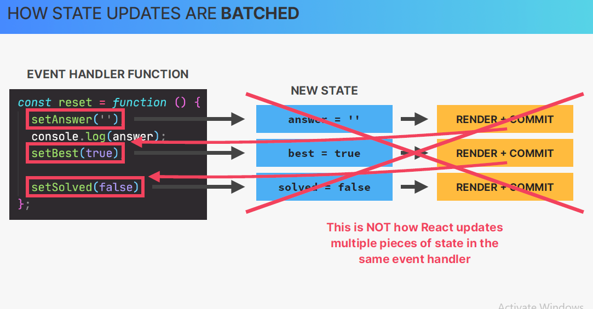

# ⚛️⚛️⚛️⚛️ REACT ⚛️⚛️⚛️⚛️

## Some Javascript Concept may uses in react

#### Array.from()

Array.from() is a built-in JavaScript method that creates a new array from:

- An array-like object (like { length: 5 })

- Or an iterable (like a string, Set, Map, etc.)

- Optionally, you can also transform items while creating the array using a mapping function.

- Array.from(arrayLike, mapFunction);


# ⚛️⚛️⚛️⚛️⚛️⚛️⚛️⚛️⚛️⚛️⚛️⚛️⚛️⚛️⚛️⚛️

## Why react came in picture

---

## 🧠 First, Understand Two Styles of Programming

| Style       | What it means                                                    | How it feels                                                            |
| ----------- | ---------------------------------------------------------------- | ----------------------------------------------------------------------- |
| Imperative  | You tell the computer how to do things step-by-step.             | Like giving cooking instructions.                                       |
| Declarative | You tell the computer what you want, and it figures out the how. | Like saying "Make me a pizza"—you care about the result, not the steps. |

---


---

# REACT


- It uses VirtualDOM instead of RealDOM considering that RealDOM manipulations
  are expensive.
- Supports server-side rendering.
- Follows Unidirectional data flow or data binding.
- Uses reusable/composable UI components to develop the view.

---

# JSX

### What is JSX?

JSX (JavaScript XML) is a syntax extension for JavaScript, used in React to describe what the UI should look like. JSX may remind you of a template language, but it comes with the full power of JavaScript.

### JSX = JavaScript + XML-like syntax.

It looks like HTML, but it’s actually syntactic sugar for React.createElement().

Example:

```
const element = <h1>Hello, world!</h1>;

This compiles to:
const element = React.createElement('h1', null, 'Hello, world!');
```

---

# JSX Rules:


Use Fragments (<> </>) to avoid extra div


# Rendering Elements

Elements are the smallest building blocks of React apps.

React elements are the fundamental building blocks of React applications. They are not the same as browser DOM elements, but rather lightweight descriptions of what you want to appear on screen.

| Key Characteristic       | Description                                                            |
| ------------------------ | ---------------------------------------------------------------------- |
| Plain JavaScript objects | They're cheap to create and manipulate                                 |
| Immutable                | Once created, you can't change them (you create new ones instead)      |
| Describe UI              | They represent what should be rendered, not the actual rendered output |

An element describes what you want to see on the screen:

```
const element = <h1>Hello, world</h1>;


// This JSX compiles to:
const element = React.createElement('h1', null, 'Hello, world');

// Which creates an object like:
{
  type: 'h1',
  props: {
    children: 'Hello, world'
  }
}
```

Unlike browser DOM elements, React elements are plain objects, and are cheap to create. React DOM takes care of updating the DOM to match the React elements.

### Rendering an Element into the DOM

Let’s say there is a div
somewhere in your HTML file:

```
<div id="root"></div>
```

We call this a “root” DOM node because everything inside it will be managed by React DOM.

Applications built with just React usually have a single root DOM node. If you are integrating React into an existing app, you may have as many isolated root DOM nodes as you like.

To render a React element, first pass the DOM element to ReactDOM.createRoot(), then pass the React element to root.render():

```

const root = ReactDOM.createRoot(
  document.getElementById('root')
);
const element = <h1>Hello, world</h1>;
root.render(element);
```

## When you call root.render(element):

React looks at the element object

- Figures out what DOM changes are needed

- Efficiently updates only what's necessary in the actual DOM

- React compares the new element with the previous one and only updates what changed (this is part of React's reconciliation process)

---

## 


# PROPS

Props (short for "properties") are read-only inputs that you pass from a parent component to a child component in React.


They allow components to be reusable and dynamic by giving them custom data.

💡 Key Points about Props
| Feature | Explanation |
|---------------|--------------------------------------------------------------|
| Read-only | Props cannot be changed inside the child component. |
| Passed down | Always flow from parent → child. |
| Reusable | Make components flexible with different data. |
| Destructuring | Common to use: `function Component({ title }) {}` |

🔒 Can I Modify Props?

- ❌ No — Props are immutable inside the component.
- If you need to change data, you should use state (useState) instead.


---

# Destructuring Props

Props destructuring in React is the practice of extracting specific properties from the props object directly, so you can access them without repeatedly writing props. in your component.

- Props destructuring makes React components more concise, readable, and maintainable by letting you directly extract needed values from the props object.





---

# LIST RENDERING

---


### Why Use a key Prop?

The key helps React identify which items changed, were added, or removed, which improves performance and avoids rendering bugs.

- 🔑 Key should be unique and stable.
- Avoid using index as key if the list can change.


### Why Use map() Instead of forEach() in React for Rendering Lists

Fundamental Difference

- `map()` returns a new array with transformed elements

- `forEach()` returns undefined and only executes a function for each element
- Always use map() when you need to render a list in JSX
- Use forEach only for side effects when you don't need the return value


### Conditional Rendering?

Conditional rendering means showing different UI / div / some portion based on a condition — like whether a user is logged in, or if a shop is open.

- React uses JavaScript logic (like if, ?:, &&) inside JSX to decide what to render.

#### 1) Ternary Operator condition ? trueUI : falseUI


#### 2) Logical AND (&&) — render only if condition is true


#### 3) if...else (outside JSX)

- Use this if the condition is complex or the JSX is long.


#### 4) Early return (guard clause)

## 

---

# 🧩 What are React Fragments?

A React Fragment lets you group multiple elements without adding an extra node to the DOM.

#### ❓ Why Use Fragments?

Normally in React, components must return a single parent element. If you want to return multiple siblings, you usually wrap them in a `<div>` — but that adds unnecessary HTML to the DOM.


#### 📍 Where to Use Fragments?

1. Inside .map() when rendering a list of elements that don’t need a wrapper

```
const items = ["Pizza", "Pasta"];

return (
  <ul>
    {items.map((item, index) => (
      <React.Fragment key={index}>
        <li>{item}</li>
        <hr />
      </React.Fragment>
    ))}
  </ul>
);

```

2. Inside a component when returning multiple sibling elements.

```
function Welcome() {
  return (
    <>
      <h1>Hi!</h1>
      <p>Welcome to our store.</p>
    </>
  );
}
```

3. In tables, where adding extra <div> would break structure — instead use fragments to return <tr> and <td> properly.

```
function Row() {
  return (
    <div>
      <tr>
        <td>Pizza</td>
        <td>$10</td>
      </tr>
    </div>
  );
}
```

---

# REACT STATE

State is like a component’s **memory** — it lets a React component **remember values over time**.

### ❓ Why Do We Need State?

When something in a React component changes (such as user input or a button click), the component needs to:

- ✅ Remember that change.
- ✅ Update the UI to reflect the new state.

This is where **state** comes in — it allows React components to **track and manage dynamic data** over time.

### 🧩 Understanding `useState` with Destructuring

The `useState` hook is typically written using **array destructuring** for cleaner and more readable code:

```
const [state, setState] = useState(initialValue);
```

---

### This single line does three things:

1. Calls useState with an initial value (initialValue).
2. Destructures the returned array into two variables:

```
    	state → The current state value.
	    setState → A function to update the state.
```

3. Makes these variables (state and setState) available in the component for use.

---

### What’s Happening Behind the Scenes?

The useState hook returns an array with exactly two elements:

1. First element ([0]) → The current state value.
2. Second element ([1]) → The function to update the state.

### Without Destructuring (Less Common Approach)

```
const stateArray = useState(initialValue);  // Returns [value, setter]
const state = stateArray[0];               // Current state
const setState = stateArray[1];            // State updater function
Destructuring simplifies this into a single, clean line.
```

### Key Takeaways

- State helps components remember and react to changes.
- useState returns [value, setter] as an array.
- Destructuring makes the code shorter and more readable.
- The naming convention (state and setState) is flexible but should be meaningful


State is Snapshot React state behaves more like a snapshot - when you call setState:

It schedules an update for the next render
But the current render's state remains unchanged
What's Happening:

When handleClick runs, name has its current value ("Taylor")
setName('Robin') tells React: "Next time you render, use 'Robin' as the name"
But in this current execution, name remains "Taylor"
Only in the next render will name return "Robin"

---


Each component has and manages its
own state, no matter how many times
we render the same component


### LOOP HOLE

1.  ✅ const [step, setStep] = useState(1);

    - We use const here because:

      - useState() returns an array with two values: the current state (step) and the updater function (setStep).

      - You are not reassigning the [step, setStep] pair

2.  ❌ let [step, setStep] = useState(1);

    - React state is immutable. Directly updating step like this:

          step = step + 1;

    - Doesn’t work — it just reassigns a local variable.

    - Does not trigger a re-render, so the UI won’t update.

    - Breaks React’s rules, which expect you to use the setStep() function to schedule state changes. pair
      


## 🖼️ Differences between the regular form vs functional form of setState in React


When updating state based on the **previous value**, it's important to use the **functional update form** to avoid stale values.

| Method                | Looks at old value?        | Updates individually?          | Final Result (step from 1) |
| --------------------- | -------------------------- | ------------------------------ | -------------------------- |
| `setStep(step + 1)`   | ❌ (stale value)           | ❌ (same value reused)         | 2 (wrong)                  |
| `setStep(s => s + 1)` | ✅ (fresh state each time) | ✅ (depends on previous state) | 3 (correct)                |

- #### Conclusions

  
  

# 📌 Props vs State

Props and State are core concepts in React. They are the only triggers that cause React to re-render components and potentially update the DOM in the browser


## 🧩 Props vs 🧠 State


| Feature      | Props                                                    | State                                                       |
| ------------ | -------------------------------------------------------- | ----------------------------------------------------------- |
| Mutability   | Immutable – cannot be changed by the receiving component | Mutable – can be updated using `useState` or similar        |
| Ownership    | Owned by the **parent** component                        | Owned and managed by the **same** component                 |
| Purpose      | Pass data and configuration to child components          | Store dynamic data that may change during lifecycle         |
| Usage        | Passed via JSX: `<Component title="Hello" />`            | Managed internally: `const [count, setCount] = useState(0)` |
| Example Use  | Text, props like `title`, `id`, etc.                     | Form inputs, toggle states, visibility, active tabs, etc.   |
| Modification | Cannot be modified by the child component                | Can be updated by event handlers, API responses, etc.       |

---

## Controlled Elements in React

The `<input>, <select>, or <textarea>` maintain their state in the dom by themselves.

- The value is managed by the DOM, not React.

- React has no idea what the user typed unless you manually query the DOM (like document.querySelector or use a ref).

- This breaks the "React way" of managing everything with state.
  In react we want all state to centralized at one place means inside the react application not in the DOM. To do that we use controlled element

A controlled element is a form element where React fully manages the value via state like `<input>, <select>, or <textarea>`


## State Management / Types / When & Where


---

# Lifting State Up in React

Lifting State Up means moving state to the closest common parent component so that multiple child components can share and communicate through it.


---

# preventDefault()

The preventDefault() method cancels the event if it is cancelable, meaning that the default action that belongs to the event will not occur.

For example, this can be useful when:

- Clicking on a "Submit" button, prevent it from submitting a form
- Clicking on a link, prevent the link from following the URL
- Note: Not all events are cancelable. Use the cancelable property to find out if an event is cancelable.
- Note: The preventDefault() method does not prevent further propagation of an event through the DOM. Use the stopPropagation() method to handle this.


---

# Deriving State

Derived state means a value that is computed based on other state or props, not stored independently.

Instead of storing a duplicate piece of data in useState, you derive it from existing state or props inside the render.


1. Without Derived State (Bad Practice)
   Stores both products and filteredProducts in state — redundant.

```
import React, { useState } from 'react';

const ProductList = () => {
  const [searchQuery, setSearchQuery] = useState('');
  const [products] = useState([
    { id: 1, name: 'Laptop' },
    { id: 2, name: 'Smartphone' }
  ]);
  const [filteredProducts, setFilteredProducts] = useState(products);

  const handleSearch = (e) => {
    const query = e.target.value;
    setSearchQuery(query);
    setFilteredProducts(
      products.filter(p =>
        p.name.toLowerCase().includes(query.toLowerCase())
      )
    );
  };

  return (
    <>
      <input value={searchQuery} onChange={handleSearch} />
      <ul>
        {filteredProducts.map(p => <li key={p.id}>{p.name}</li>)}
      </ul>
    </>
  );
};

export default ProductList;
```

2. ✅ With Derived State (Good Practice)
   Filters products directly during render — cleaner and simpler.

```
import React, { useState } from 'react';

const ProductList = () => {
  const [searchQuery, setSearchQuery] = useState('');
  const products = [
    { id: 1, name: 'Laptop' },
    { id: 2, name: 'Smartphone' }
  ];

  const filteredProducts = products.filter(p =>
    p.name.toLowerCase().includes(searchQuery.toLowerCase())
  );

  return (
    <>
      <input value={searchQuery} onChange={(e) => setSearchQuery(e.target.value)} />
      <ul>
        {filteredProducts.map(p => <li key={p.id}>{p.name}</li>)}
      </ul>
    </>
  );
};

export default ProductList;
```

---

# .sort() method

To sort elements by name in React, you can use JavaScript's .sort()


---

# Window: confirm() method

window.confirm() instructs the browser to display a dialog with an optional message, and to wait until the user either confirms or cancels the dialog.


---

# CHILDREN PROPS

The children prop is a special prop automatically provided by React. It allows you to pass content between a component’s opening and closing tags, instead of passing it as a regular prop.

In React, children is a special prop that automatically passes any JSX elements or components nested within a component's opening and closing tags. It provides a way for components to render dynamic content passed down from their parent components.


---

# THINKING IN REACT: COMPONENTS COMPOSITION, AND REUSABILITY


---

# React Component


---

# PROP DRILLING

Prop Drilling is when you pass data (props) through many layers of components — even when some components in the middle don't need the data, they just pass it down

```
We need to pass some props to several nested child components in order to get that data into some deeply nested component
```


## ❌ Why Prop Drilling Is a Problem

| Problem             | Description                                          |
| ------------------- | ---------------------------------------------------- |
| ❌ Clutter          | Intermediate components get bloated with props       |
| ❌ Hard to maintain | Refactoring becomes tricky and risky                 |
| ❌ Repetition       | Repeating `props.user` at every level                |
| ❌ Tight coupling   | All components are tightly linked by data dependency |


---

# Component Composition

Component composition is a design pattern in React where components are built by combining other components, typically by passing them as children or props, to promote reusability, flexibility, and separation of concerns.


## 1) using children prop


🔍 What’s happening:

- Modal acts as a wrapper or container.
- children is a special prop that automatically includes whatever is passed between the component’s opening and closing tags.

💡 Benefits:

- Highly reusable: you can pass any content inside `<Modal>...</Modal>`

- Follows the composition model — React favors composition over inheritance.

🧠 Use Case:

- Use this when you want Modal to be a generic layout, and the content inside can vary (success, error, form, etc.)

## 2) using element prop


## 3) Difference

## 

# COMPONENT VS. INSTANCE VS. ELEMENT

## 🧱 1. Component


A Component is a function or class that defines what should appear on the screen or returns / renders React elements.
It can be reusable and stateful (if a class or using hooks).

Two types:

1. Functional Component (a JavaScript function).

2. Class Component (a JavaScript class extending React.Component).

- 🧠 Think of it as a blueprint or Template.

  ```
  function Button() {
    return <button>Click me</button>;
  }
  ```

- Type: Function (or Class)
- Purpose: Describes how the UI should look.
- Not rendered yet!

## 🧍 2. Instance


A Component Instance is the actual result of rendering a component — the real thing on screen, with internal state and lifecycle (if any).

- 🧠 Think of it as the live running version of a component.
- Happens when React calls the component function and renders it.
- May include local state, effects, and hooks.
- If a class component: it’s the instance of that class.
- If a function component: it’s "re-instantiated" every render.

## 🧩 3. Element


A React element is a JavaScript object that describes what you want to render on the screen.

- It is immutable (cannot be changed after creation).

- It represents a **_virtual DOM node_** (not the actual DOM element)............

- Created using React.createElement() or JSX

- 🧠 Think of it as a JS object representation of the UI, created by calling the component.

  ```
  const element = <Button />;
  Or:
  const element = React.createElement(Button);
  ```

- Type: Plain JavaScript object
- Purpose: Tells React what to render
- Not a DOM node! It's a description of a component and its props.

## 4. SUMMARY


---

# HOW RENDERING WORKS


## THE RENDER PHASE


The render phase is the first part of React's update process. It's when React figures out what the UI should look like, based on the current props and state.
But — it doesn’t touch the DOM yet. It’s purely calculating what should change.
React is "thinking" about what the UI should look like — but hasn’t done anything visible yet.


🛠️ What Happens During the Render Phase?

1. React calls your component functions (or class render() method).

2. It builds a tree of React elements (virtual DOM).

3. It compares the new tree to the previous tree (diffing).

4. It decides what needs to change (minimal updates).


---

# VIRTUAL DOM

The Virtual DOM (VDOM) is a lightweight copy of the real DOM that React uses to optimize updates to the UI.

It's a JavaScript object representation of the actual DOM elements you see in the browser.

```
1) JSX → React elements → Virtual DOM tree.
2) Components return JSX → each JSX element becomes a node in the tree.
3) React builds and compares these trees to update the UI efficiently.
```


## RECONCILIATION

Reconciliation is the process React uses to update the UI when:

1. State changes (useState, setState)
2. Props change
3. Context changes

```
🔁 Reconciliation = Virtual DOM Comparison + DOM Update
```

When your component renders again:

- React rebuilds a new Virtual DOM tree from JSX.
- It compares the new tree with the previous one (this is Diffing).
- Then React updates only the changed parts of the real DOM — no full re-render

## DIFFING

Diffing is the process React uses to compare the old and new Virtual DOM trees during a re-render, to figure out what actually changed.

⚡ How Does React Make Diffing Fast?

- React avoids slow full-tree comparisons (which would be O(n³)) by using a heuristic algorithm with a few key rules
- Diffing is how React compares what you had vs. what you now want, and changes only what’s necessary in the DOM — quickly and smartly.

### HEURISTIC ALGORITHM


- Agar element ka type badal gaya ho (jaise div se span),
  React purane element ko hata kar naya banaata hai.
- Type alag hai → puri tarah se naya element create hoga.


- Agar element ka type same hai (jaise dono button hain),
  to React sirf properties (jaise className, disabled) ko update karta hai.
- Same tag → attributes badlenge, puri node nahi.


- Jab list banate ho (map se), to har item ko unique key dena zaroori hai.
- Ye React ko help karta hai ye samajhne mein:
  "Kaunsa item same hai, kaunsa naya hai, kaunsa hata diya gaya hai."
- Agar key na do to React confuse ho jaata hai aur shayad poori list ko dobara render kar de.


### RECONCILER


## THE COMMIT PHASE


## 🧭 React Render Lifecycle – Detailed Step-by-Step

| 🧩 Step                     | 🧠 What Happens                               | 📘 Description                                                         |
| --------------------------- | --------------------------------------------- | ---------------------------------------------------------------------- |
| 1️⃣ Component Re-Renders     | `setState()` or new props trigger a re-render | Your component function runs again and returns updated JSX             |
| 2️⃣ React Builds Virtual DOM | JSX → React elements (Virtual DOM)            | React creates a lightweight object representation of your UI           |
| 3️⃣ New Fiber Tree is Built  | React creates a new Fiber Tree                | Fiber is a data structure that tracks components, state, effects, etc. |
| 4️⃣ Reconciler Diffing       | Compare old Fiber Tree to new one             | React identifies exactly what has changed (add/update/remove)          |
| 5️⃣ Effect List is Created   | React lists the necessary updates             | A queue of changes to apply: DOM changes, lifecycle hooks, etc.        |
| 6️⃣ Commit Phase             | DOM updates + effects run                     | Real DOM is updated, and React runs `useEffect`, `ref`, etc.           |

    ✅ Key Notes:
    - Steps 1–5 are called the Render Phase (pure & no DOM mutations).

    - Step 6 is the Commit Phase (real DOM updates happen).

## 

---

# LOGIC IN REACT COMPONENTS





---

# DOM REFRESHER: EVENT PROPAGATION AND DELEGATION


## 1. Event Propagation: Bubbling & Capturing

DOM events follow a three-phase lifecycle:

1. Phase 1: Capturing (Top-Down)
   The event travels from the window → target element.
   - Rarely used ({ capture: true } must be explicitly set).
2. Phase 2: Target
   The event reaches the actual clicked element.
3. Phase 3: Bubbling (Bottom-Up)
   The event bubbles up from the target → window.

   - Default behavior (used in most cases).

   ```
   <div id="grandparent">
     <div id="parent">
       <button id="child">Click Me</button>
     </div>
   </div>

   Clicking <button> logs:
   - grandparent (if capture: true)
   - parent (if capture: true)
   - child (target)
   - parent (bubbling)
   - grandparent (bubbling)
   ```

## 2. Stopping Propagation

- e.stopPropagation() stops the event from reaching other phases.

  ```
  button.addEventListener('click', (e) => {
    e.stopPropagation(); // Prevents bubbling/capturing
  });

  ```

- e.stopImmediatePropagation() , also prevents other listeners on the same element from running.

## 3. Event Delegation

Event delegation is a technique for handling events efficiently by adding a single event listener to a parent element rather than to each individual element.

Example : You want to handle clicks on each li item, but instead of attaching a separate event listener to every item, you attach one to their parent ul.


```
🔍 How it works
- You add one event listener to the <ul> (parent).
- When you click any <li>, the event bubbles up to the <ul>.
- Inside the listener, event.target tells you which element was actually clicked.
- You check if it's an <li>, and handle it accordingly.
```


---

# IMPORTANT KEY POINT TILL NOW THAT WE COVERED

- 🧩 A component is like a blueprint for a piece of UI that will eventually exist on the screen. When we
  “use” a component, React creates a component instance, which is like an actual physical
  manifestation of a component, containing props, state, and more. A component instance, when
  rendered, will return a React element
- ☎ “Rendering” only means calling component functions and calculating what DOM elements need
  to be inserted, deleted, or updated. It has nothing to do with writing to the DOM. Therefore, each
  time a component instance is rendered and re-rendered, the function is called again
- 🔁 Only the initial app render and state updates can cause a render, which happens for the entire
  application, not just one single component
- 👪 When a component instance gets re-rendered, all its children will get re-rendered as well. This
  doesn’t mean that all children will get updated in the DOM, thanks to reconciliation, which checks
  which elements have actually changed between two renders. But all this re-rendering can still
  have an impact on performance
- 🧬 Diffing is how React decides which DOM elements need to be added or modified. If, between
  renders, a certain React element stays at the same position in the element tree, the
  corresponding DOM element and component state will stay the same. If the element changed to a
  different position, or if it’s a different element type, the DOM element and state will be destroyed
- 🔑 Giving elements a key prop allows React to distinguish between multiple component instances.
  When a key stays the same across renders, the element is kept in the DOM. This is why we need
  to use keys in lists. When we change the key between renders, the DOM element will be
  destroyed and rebuilt. We use this as a trick to reset state
- 🔥 Never declare a new component inside another component! Doing so will re-create the nested
  component every time the parent component re-renders. React will always see the nested
  component as new, and therefore reset its state each time the parent state is updated
- 🔮 The logic that produces JSX output for a component instance (“render logic”) is not allowed to
  produce any side effects: no API calls, no timers, no object or variable mutations, no state
  updates. Side effects are allowed in event handlers and useEffect
- 📱 The DOM is updated in the commit phase, but not by React, but by a “renderer” called ReactDOM.
  That’s why we always need to include both libraries in a React web app project. We can use other
  renderers to use React on different platforms, for example to build mobile or native apps
- 🗂 Multiple state updates inside an event handler function are batched, so they happen all at once,
  causing only one re-render. This means we can not access a state variable immediately after
  updating it: state updates are asynchronous. Since React 18, batching also happens in timeouts,
  promises, and native event handlers.
- 🌐 When using events in event handlers, we get access to a synthetic event object, not the
  browser’s native object, so that events work the same way across all browsers. The difference is
  that most synthetic events bubble, including focus, blur, and change, which do not bubble as
  native browser events. Only the scroll event does not bubble
- 🛠 React is a library, not a framework. This means that you can assemble your application using your
  favorite third-party libraries. The downside is that you need to find and learn all these additional
  libraries.

---

# 🧠 USE EFFECT

### 📌 What is Effects?

Effects let you run some code after rendering so that you can synchronize your component with some system outside of React.
useEffect is a React Hook that lets you run code after the component renders, so you can sync your component with the outside world — like fetching data, setting up event listeners, or updating the DOM.

What it means:

- "run some code after rendering" → React shows your component on screen, then runs your effect code.
- "synchronize" → Keep your component in sync with something external.
- "some system outside of React" → For example:
  - Fetching data from a server
  - Using the browser’s local storage
  - Setting a timer
  - Adding event listeners (like window.addEventListener)


---
