# Why does React render twice in Strict Mode?

React’s StrictMode is designed to help you detect bugs early, especially those related to:
Side effects inside useEffect, useState, useRef, etc.

- Incorrect cleanup

- Accidental state mutations

- Unsafe lifecycle methods

So, in development, React intentionally renders components twice:

- Mount → Unmount

- Mount again

This is only to simulate re-renders and help you make your components resilient and free from unwanted side effects."React jaan bujh ke component ko do baar render karta hai (sirf development mein), taaki aapke component ke code mein koi galti ya bug ho to wo jaldi pakad mein aa jaye."

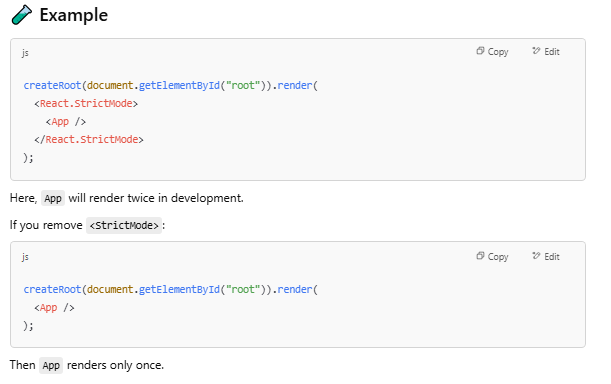


---

# UseEffect

The useEffect Hook allows you to perform side effects in your components.A React Hook for handling side effects in functional components.
Effect are executed are the browser painted the component instance on the screen, not immediatly after render. Thats why effect run async after the reder has already painted
Side effects = anything that affects things outside the component:

- Some examples of side effects are: API calls,fetching data,Subscriptions, directly updating the DOM, and timers.
- useEffect accepts two arguments. The second argument is optional.
  useEffect(function, dependency array)

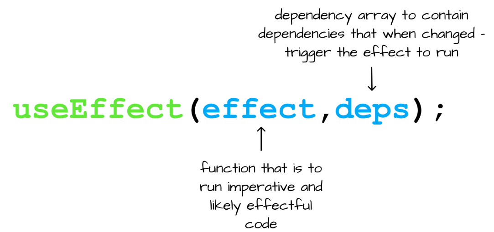

## 1. No dependency passed:

```
useEffect(() => {
  //Runs on every render
});
```

## 2. An empty array : Run Only on Mount (componentDidMount)

```
useEffect(() => {
  //Runs only on the first render
}, []);

```

## 3. Props or state values : Run on Mount + When Dependencies Change (componentDidUpdate)

```
useEffect(() => {
  //Runs on the first render
  //And any time any dependency value changes
}, [prop, state]);
```

## 4.Cleanup Logic (componentWillUnmount):

```
useEffect(() => {
  const timer = setInterval(() => {
    console.log('Running...');
  }, 1000);

  return () => {
    clearInterval(timer);
    console.log('Cleanup: component unmounted or dependencies changed');
  };
}, []);
```

## 5.Fetch API Data + Cleanup:

### Effect Cleanup

Some effects require cleanup to reduce memory leaks.

Timeouts, subscriptions, event listeners, and other effects that are no longer needed should be disposed.

We do this by including a return function at the end of the useEffect Hook.

```
useEffect(() => {
  const controller = new AbortController();

  fetch('/data.json', { signal: controller.signal })
    .then(res => res.json())
    .then(data => console.log(data))
    .catch(err => {
      if (err.name === 'AbortError') {
        console.log('Fetch aborted');
      }
    });

  return () => {
    controller.abort(); // Cancel fetch on unmount
  };
}, []);
```

## 6.Multiple Effects:

You can use useEffect more than once in a component:

```
useEffect(() => {
  console.log('Fetch users');
}, []);

useEffect(() => {
  console.log('Log whenever count changes');
}, [count]);
```

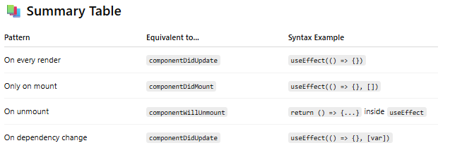
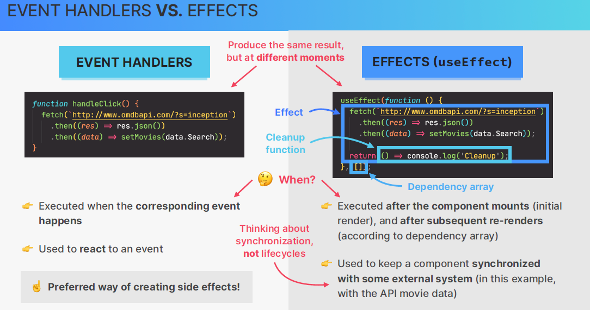

---

# What is the useEffect Dependency Array?

The dependency array is the second argument you pass to useEffect:

```
useEffect(() => {
  // effect code here
}, [/* dependencies */]);
```

It tells React when to run the effect by specifying variables that the effect depends on.
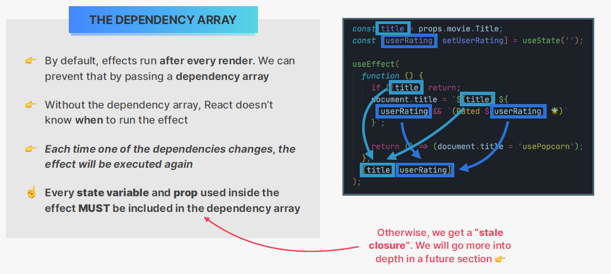

## How It Works

1. **Empty array `[]`:**  
   Runs the effect only **once** after the first render (similar to `componentDidMount`).

2. **No array (no second argument):**  
   Runs the effect **after every render** — on every update and mount.

3. **Array with dependencies `[dep1, dep2]`:**  
   Runs the effect **only when any dependency changes** since the last render.

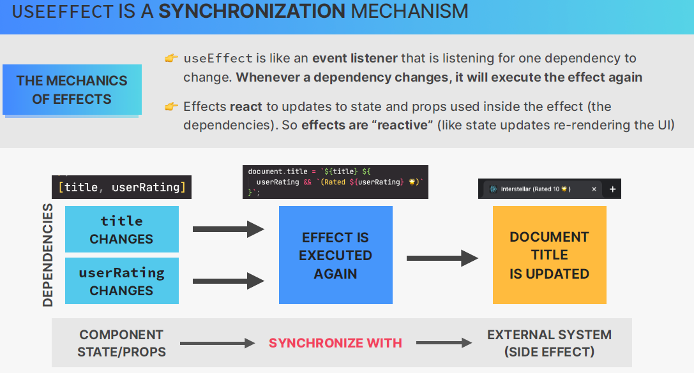
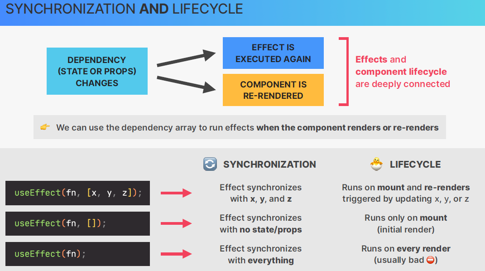
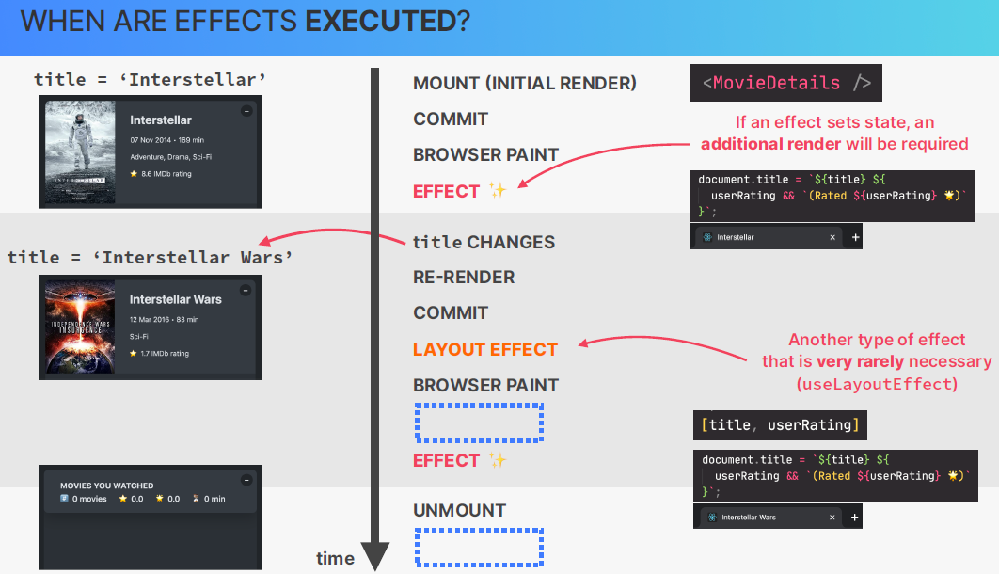

### UseEffect with Promise/then vs Async-await

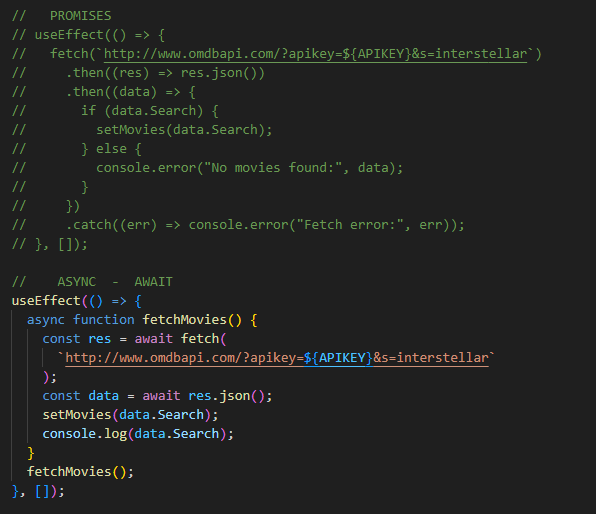
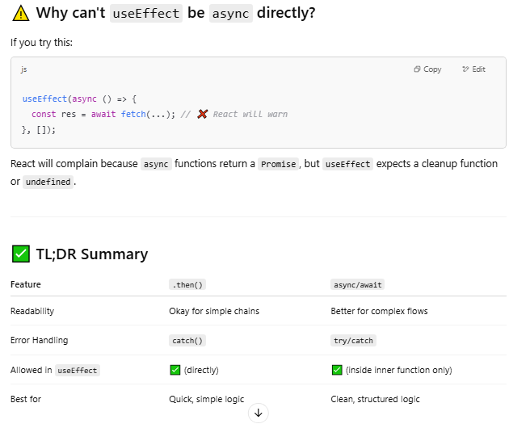

# useLayoutEffect : Layout effect

`useLayoutEffect`: Like useEffect, but it runs synchronously after DOM updates but before the browser paints.
The React JS useLayoutEffect works similarly to useEffect but rather works asynchronously like the useEffect hook, it fires synchronously after all DOM loading is done loading. This is useful for synchronously re-rendering the DOM and also to read the layout from the DOM. But to prevent blocking the page loading, we should always use the useEffect hook.

Use it when you need to:

- Measure layout (e.g., element size)
- Make DOM changes that should happen before the user sees them
- Avoid flickering UI updates

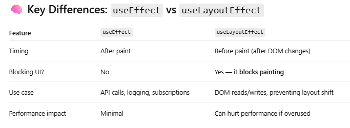

Example :-

## Make DOM Changes Before User Sees Them

Use case: Modify styles immediately to prevent layout shifts.
here Without useLayoutEffect, the component might briefly appear gray before turning gold.

```
import React, { useLayoutEffect, useRef } from 'react';

const InstantStyle = () => {
  const ref = useRef();

  useLayoutEffect(() => {
    if (ref.current) {
      ref.current.style.backgroundColor = 'gold'; // change before paint
      ref.current.style.padding = '20px';
    }
  }, []);

  return (
    <div
      ref={ref}
      style={{ transition: 'background 1s ease', backgroundColor: 'lightgray' }}
    >
      Background updated instantly (no flash)
    </div>
  );
};

export default InstantStyle;
```

# useRef

useRef ek React ka hook hai jo ek mutable object deta hai, jisme hum kuch bhi store kar sakte hain bina re-render kiye.

```
const myRef = useRef(initialValue);
```

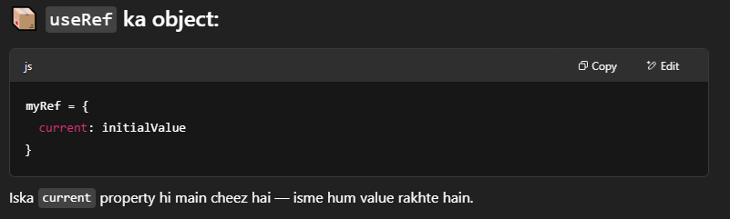

- The useRef Hook allows you to persist values between renders.

  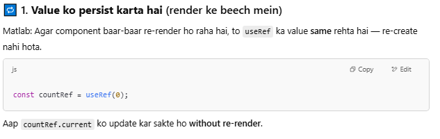

- It can be used to store a mutable value that does not cause a re-render when updated.
  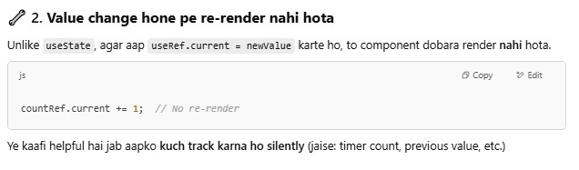
- It can be used to access a DOM element directly.

  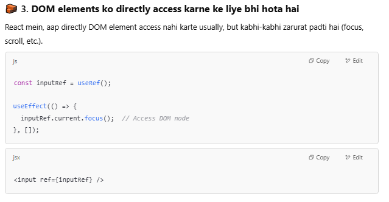

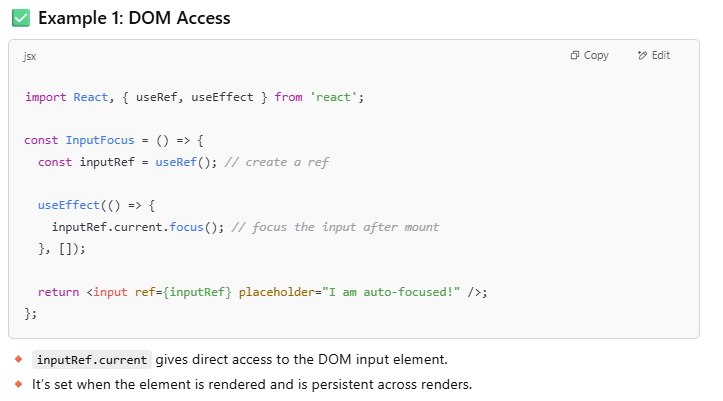
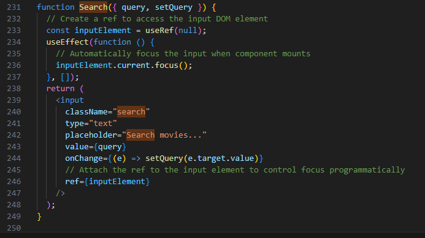
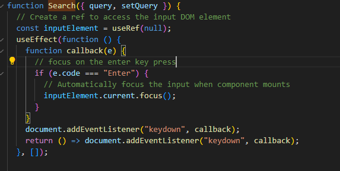
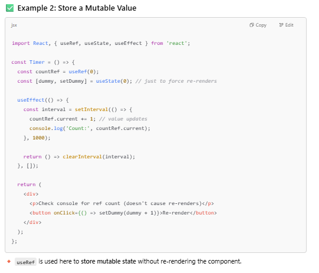

For example :-
If we tried to count how many times our application renders using the useState Hook, we would be caught in an infinite loop since this Hook itself causes a re-render.

To avoid this, we can use the useRef Hook.

```
import { useState, useEffect, useRef } from "react";
import ReactDOM from "react-dom/client";

function App() {
  const [inputValue, setInputValue] = useState("");
  const count = useRef(0);

  useEffect(() => {
    count.current = count.current + 1;
  });

  return (
    <>
      <input
        type="text"
        value={inputValue}
        onChange={(e) => setInputValue(e.target.value)}
      />
      <h1>Render Count: {count.current}</h1>
    </>
  );
}
```

### ❓ Why you shouldn't mutate a ref inside render logic in React

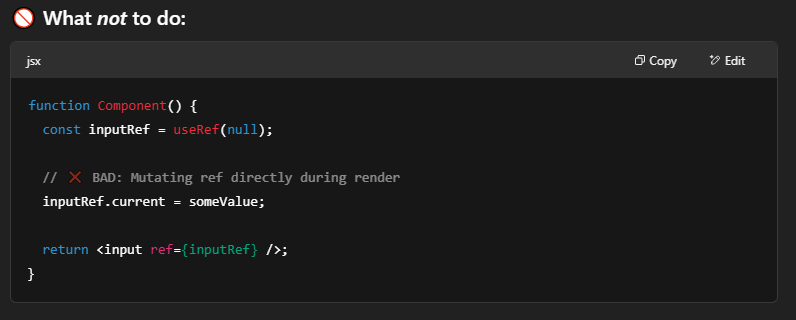

- ref.current is null on the initial render.

- React sets ref.current after the render phase, during the commit phase.

- So trying to access or mutate ref.current during render can lead to unexpected bugs, like trying to modify a DOM node that doesn’t exist yet.

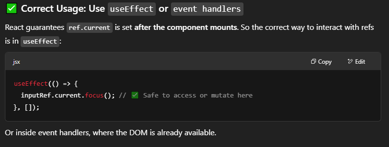
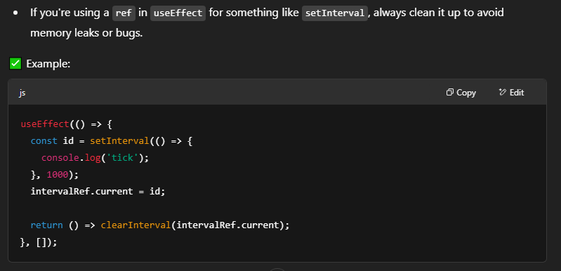
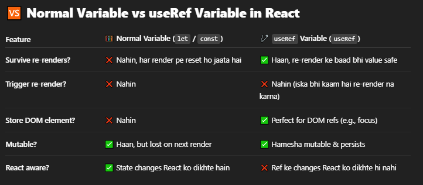
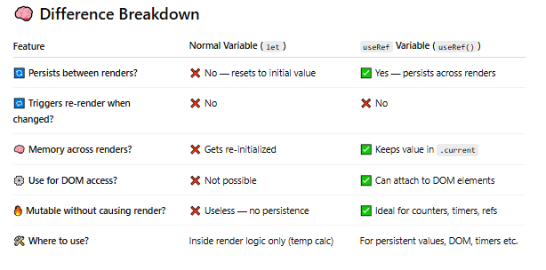

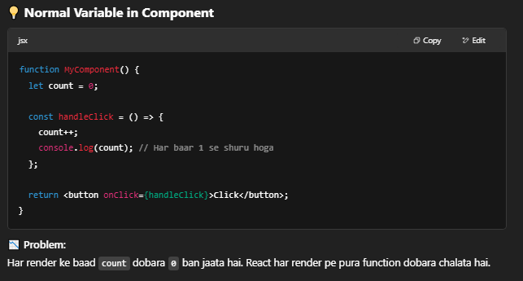
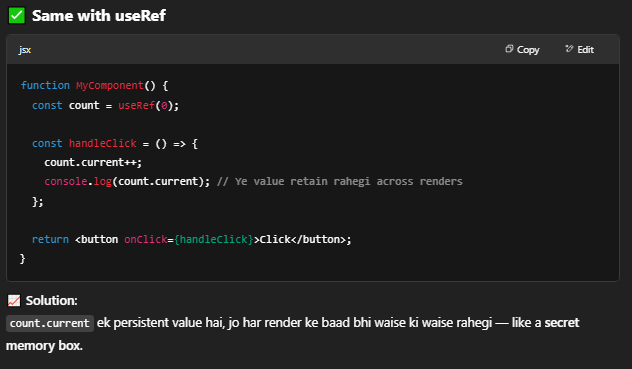
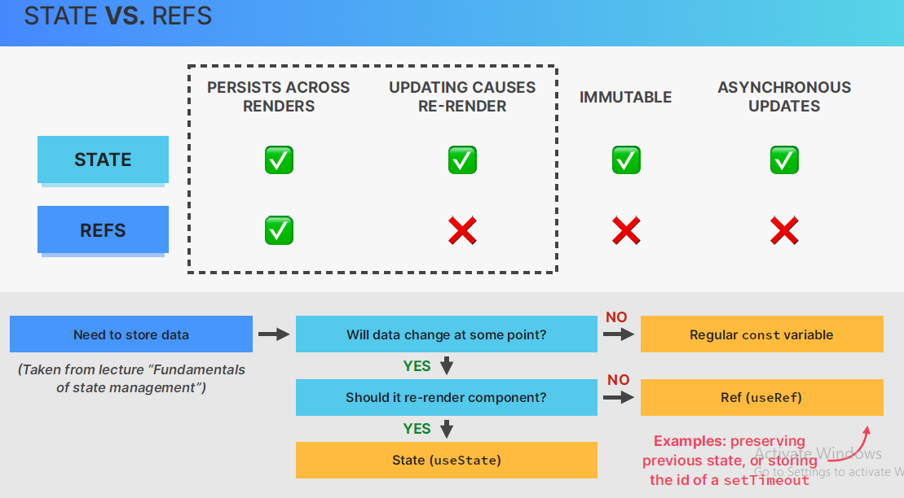
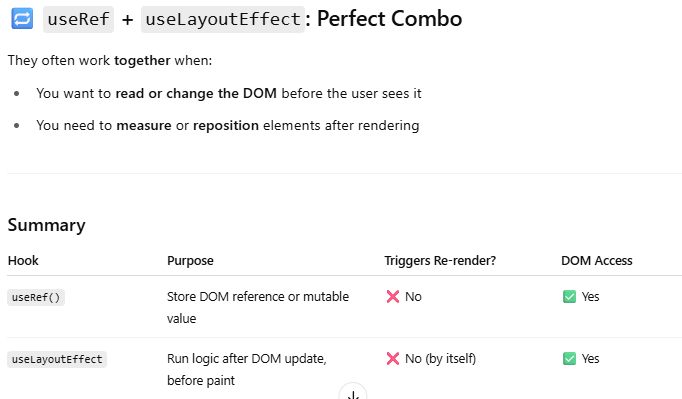

## CLEANUP FUNCTION

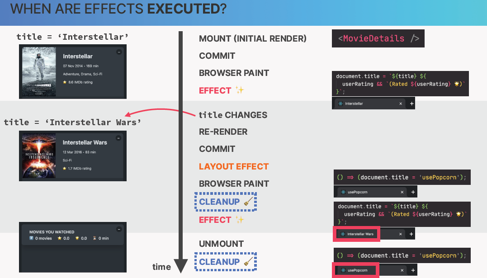
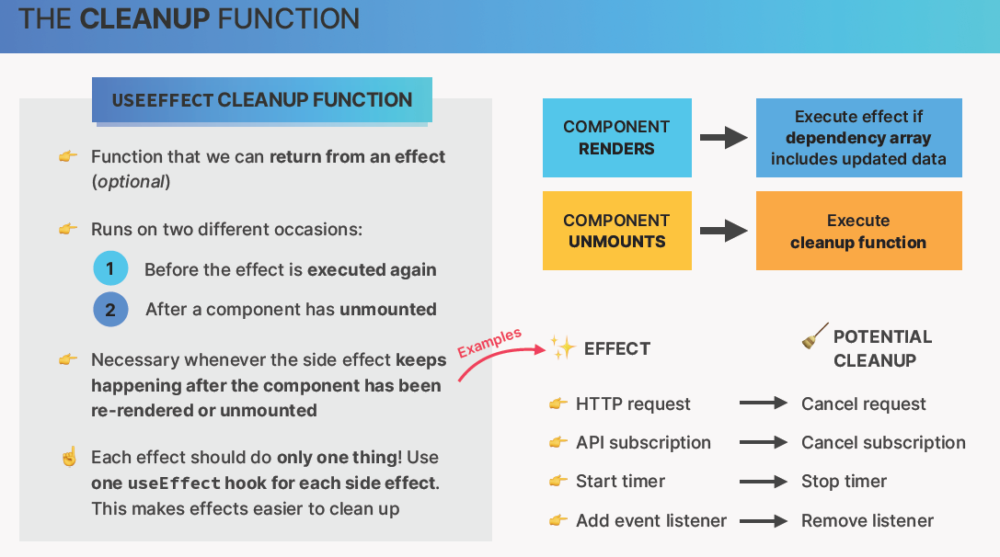

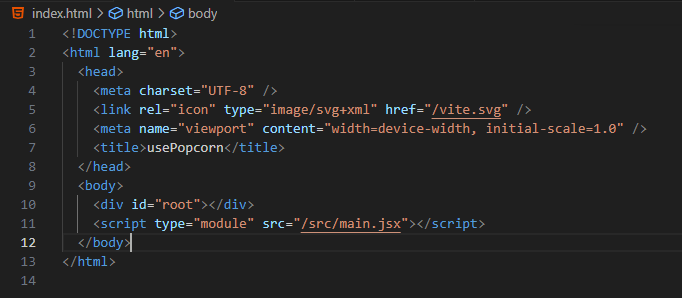

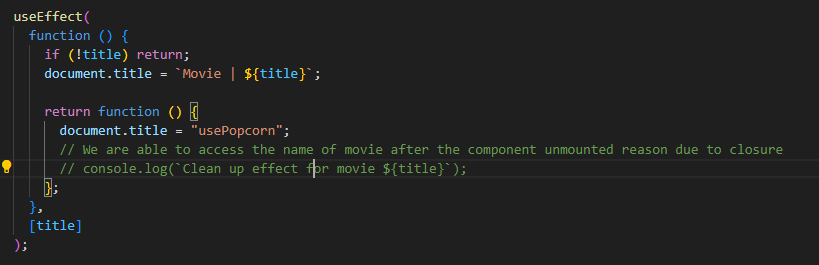

## AbortController

When a user types a new query quickly, multiple fetch requests can fire. AbortController allows you to cancel previous fetches so only the latest one runs. This prevents race conditions and memory leaks.

```
useEffect(
    function () {
      const controller = new AbortController();
      async function getMovieDetails() {
        // Fetch movie data from OMDb API with abort signal attached
        const res = await fetch(
          `http://www.omdbapi.com/?apikey=${APIKEY}&i=${selectedId}`,
          { signal: controller.signal }
        );
        if (!res.ok) throw new Error("Something went wrong.");
        const data = await res.json();
        setMovie(data);
      }
      getMovieDetails();
      // Cleanup function: abort fetch if component unmounts or selectedId changes
      return function () {
        controller.abort();
      };
    },
    [selectedId]
  );

```

# Custom Hooks

A custom hook is a JavaScript function that starts with use and allows you to reuse stateful logic or non visual logic among diffrent components.
It’s not a new feature — it’s just a convention for organizing and reusing logic that uses React hooks (useState, useEffect, etc.).

## 🎯 Naming Rule:

Custom hooks must start with use — like useAuth, useTheme, useForm, etc.

This tells React that the function follows hook rules (like not calling it conditionally).

## Key Characteristics of Custom Hooks:

- Naming Convention: Must start with use (e.g., useFetch, useLocalStorage).
- Can Use Built-in Hooks: Can call useState, useEffect, useContext, etc.

- No JSX: Unlike components, they don’t return UI elements.

- Reusable: Share logic between components without prop drilling or HOCs.

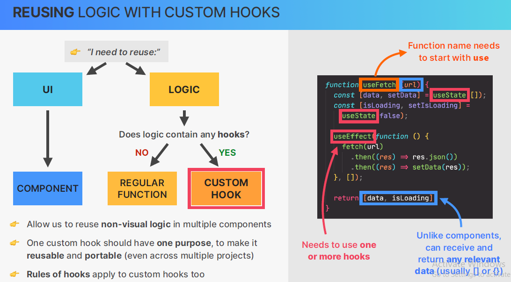
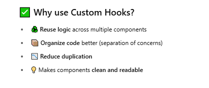
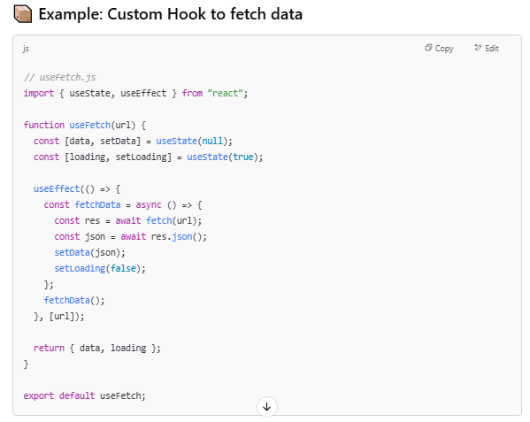
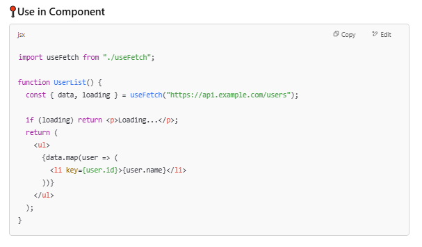

## Component vs Custom Hooks

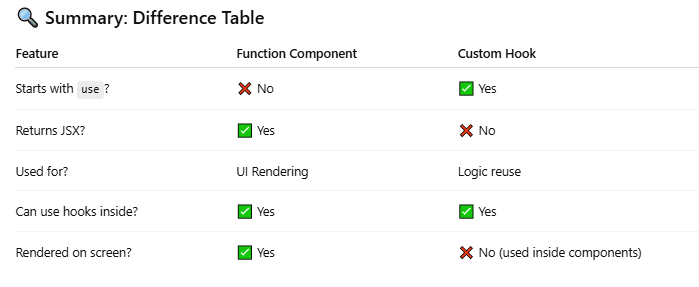

# React Components vs Custom Hooks

| Feature               | Component                                                       | Custom Hook                                                                            |
| --------------------- | --------------------------------------------------------------- | -------------------------------------------------------------------------------------- |
| **Purpose**           | Renders UI (JSX)                                                | Encapsulates reusable logic (no UI)                                                    |
| **Returns**           | JSX elements                                                    | State, functions, or values                                                            |
| **Usage**             | `<Component />` in JSX                                          | `useHook()` inside components/hooks                                                    |
| **Hooks Usage**       | Can use hooks                                                   | Can only use hooks (no rendering)                                                      |
| **Reusability**       | UI + logic                                                      | Logic only (decoupled from UI)                                                         |
| **Example**           | `jsx\nfunction Button() {\n  return <button>Click</button>;\n}` | `jsx\nfunction useCounter() {\n  const [count] = useState(0);\n  return { count };\n}` |
| **Side Effects**      | Manages effects + renders UI                                    | Manages effects without rendering                                                      |
| **Naming Convention** | PascalCase (`Button`)                                           | `use` prefix (`useFetch`)                                                              |

## Key Differences

- 🖼️ **Components** = UI + Logic (when you need to render something)
- ♻️ **Custom Hooks** = Logic only (when extracting reusable state/effects)

## When to Use Which?

| Use Case               | Solution    |
| ---------------------- | ----------- |
| Buttons, Cards, Modals | Component   |
| API calls, form logic  | Custom Hook |
| Theme/state management | Custom Hook |

## Can We Make a Custom Hook Without useState or useEffect or inbuilt hooks

Yes, we can create a custom React hook without using useState, useEffect, or any other inbuilt React hooks, but it's important to understand what this means and what limitations it introduces.

- **🚫 No Built-in Hooks?**
- Then It’s Just a Function
  Hooks in React are typically used to manage state, side effects, context, etc., using built-in hooks like useState, useEffect, useContext, etc. If you don't use any built-in hooks, you're essentially writing a plain JavaScript function that follows the hook naming convention (useSomething) — but it won't have any reactive behavior.

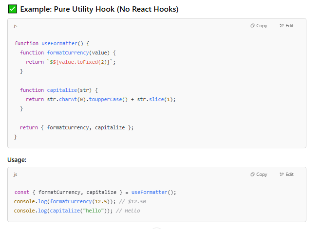

- **🔍 So... Is This Really a Hook?**
- Technically no — it’s just a function. The "hook" name suggests it should interact with React’s reactivity system. If it doesn’t use any React state or lifecycle management, then it's not taking advantage of what hooks are for — but it’s still allowed.
