# UseReducer

The useReducer hook is an alternative to the useState hook that is preferred when you have complex state logic. It is useful when the state transitions depend on previous state values or when you need to handle actions that can update the state differently.
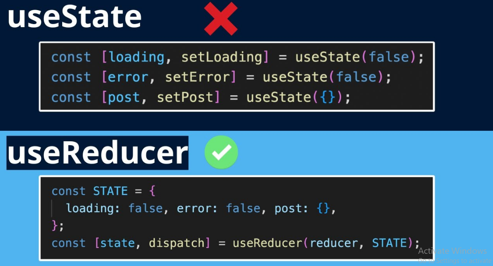

```
const [state, dispatch] = useReducer(reducer, initialState);
```

- REDUCER : A function that defines how the state should be updated based on the action. It takes two parameters: the current state and the action. Ek function jo decide karta hai ki next state kya hogi.

  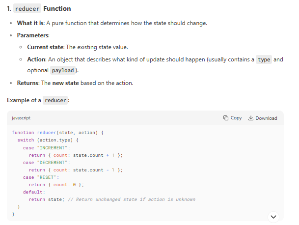

- INITIAL STATE: The initial value of the state.

  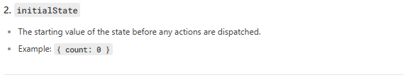

- STATE: The current state returned from the useReducer hook.

  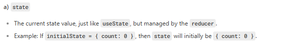

- DISPATCH : A function used to send an action to the reducer to update the state. Function jisse hum action bhejte hain like setState.

  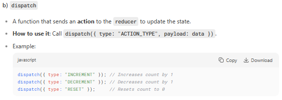

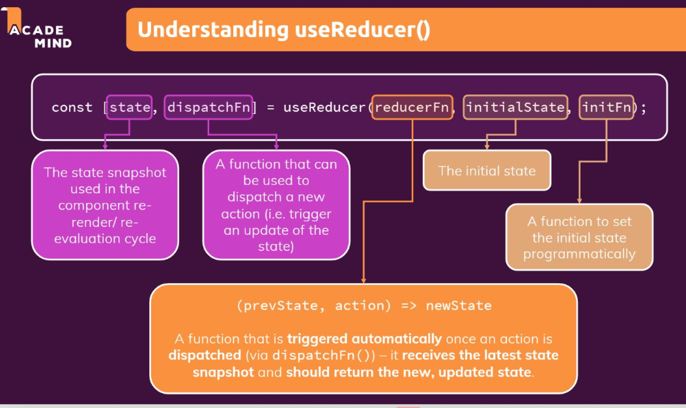
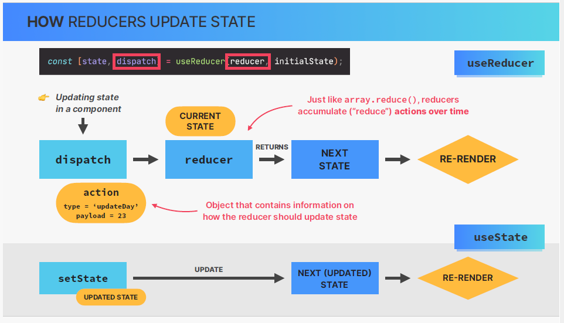

## EXAMPLE 1: Ek Simple Counter

```
import React, { useReducer } from 'react';

const initialState = 0;

function reducer(state, action) {
  console.log('🔄 Reducer called with:', { currentState: state, action });

  switch (action.type) {
    case 'increment':
      const incrementedState = state + 1;
      console.log('➕ Increment:', state, '→', incrementedState);
      return incrementedState;
    case 'decrement':
      const decrementedState = state - 1;
      console.log('➖ Decrement:', state, '→', decrementedState);
      return decrementedState;
    case 'reset':
      console.log('🔄 Reset:', state, '→', initialState);
      return initialState;
    default:
      console.log('❓ Unknown action type:', action.type);
      return state;
  }
}

function Counter() {
  const [count, dispatch] = useReducer(reducer, initialState);

  console.log('🏠 Component rendered with count:', count);

  const handleIncrement = () => {
    console.log('🖱️ Increment button clicked');
    dispatch({ type: 'increment' });
  };

  const handleDecrement = () => {
    console.log('🖱️ Decrement button clicked');
    dispatch({ type: 'decrement' });
  };

  const handleReset = () => {
    console.log('🖱️ Reset button clicked');
    dispatch({ type: 'reset' });
  };

  return (
    <div className="p-6 max-w-m shadow-md">
      <h1 className="textb-6">Count: {count}</h1>
      <div className="flecenter">
        <button
          onClick={handleIncrement}
          className="px-4 pyors"
        >
          +
        </button>
        <button
          onClick={handleDecrement}
          className="px-4 pors"
        >
          -
        </button>
        <button
          onClick={handleReset}
          className="px-4 -colors"
        >
          Reset
        </button>
      </div>
      <div className="mt-center">
        Open your browser's developer console (F12) to see the useReducer logs
      </div>
    </div>
  );
}

export default Counter;
```

## When to use UseReducer

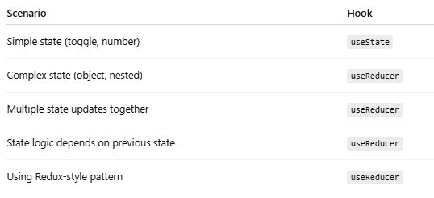
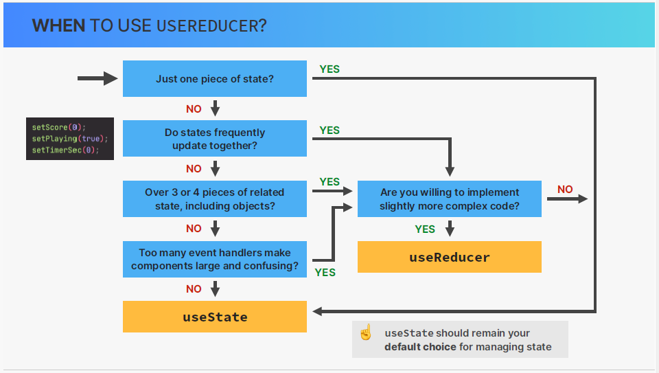

## UseState VS UseReducer

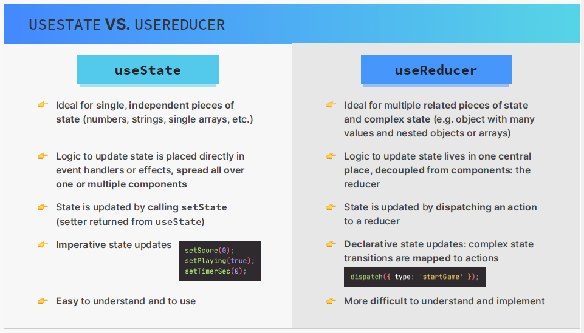

## EXAMPLE 2 :

```
import { useReducer, useState } from "react";

const initialState = { count: 0, step: 1 };

// RETURN SINGLE VALE
// function reducer(state, action) {
//   switch (action.type) {
//     case "increment":
//       return state + 1;
//     case "decrement":
//       return state - 1;
//     case "setCount":
//       return action.payload;
//     default:
//       return state;
//   }
// }

// RETURN OBJECT HAVING COUNT AND STEP AS WE ARE DEALING WITH MULTIPLE STATE
function reducer(state, action) {
  switch (action.type) {
    case "increment":
      return { ...state, count: state.count + state.step };
    case "decrement":
      return { ...state, count: state.count - state.step };
    case "setCount":
      return { ...state, count: action.payload };
    case "setStep":
      return { ...state, step: action.payload };
    case "setReset":
      return initialState;
    default:
      return state;
  }
}

function DateCounter() {
  const [state, dispatch] = useReducer(reducer, initialState);
  const { count, step } = state;

  // This mutates the date object.
  const date = new Date("june 21 2027");
  date.setDate(date.getDate() + count);

  function dec() {
    return dispatch({ type: "decrement" });
  }

  function inc() {
    return dispatch({ type: "increment" });
  }

  function defineCount(e) {
    return dispatch({ type: "setCount", payload: Number(e.target.value) });
  }

  function defineStep(e) {
    return dispatch({ type: "setStep", payload: Number(e.target.value) });
  }

  function reset() {
    return dispatch({ type: "setReset" });
  }

  return (
    <div className="counter">
      <div>
        <input
          type="range"
          min="0"
          max="10"
          value={step}
          onChange={defineStep}
        />
        <span>{step}</span>
      </div>

      <div>
        <button onClick={dec}>-</button>
        <input value={count} onChange={defineCount} />
        <button onClick={inc}>+</button>
      </div>

      <p>{date.toDateString()}</p>

      <div>
        <button onClick={reset}>Reset</button>
      </div>
    </div>
  );
}
export default DateCounter;

```

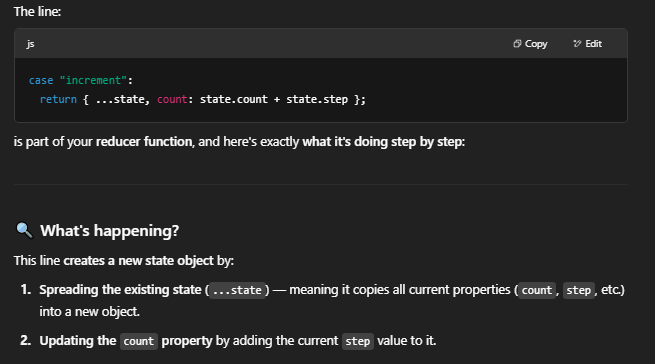
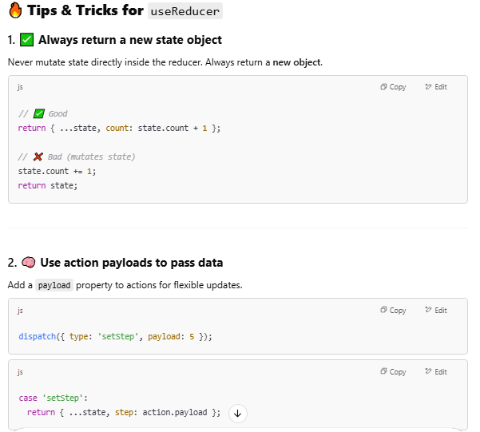
